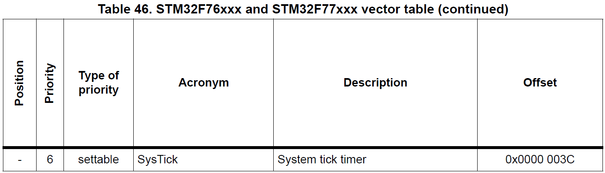
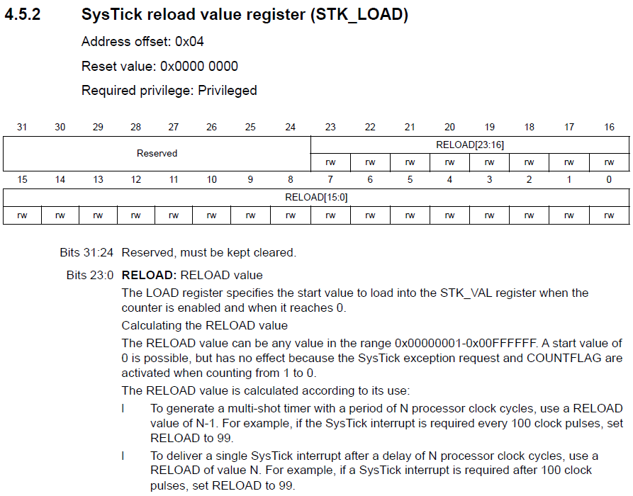
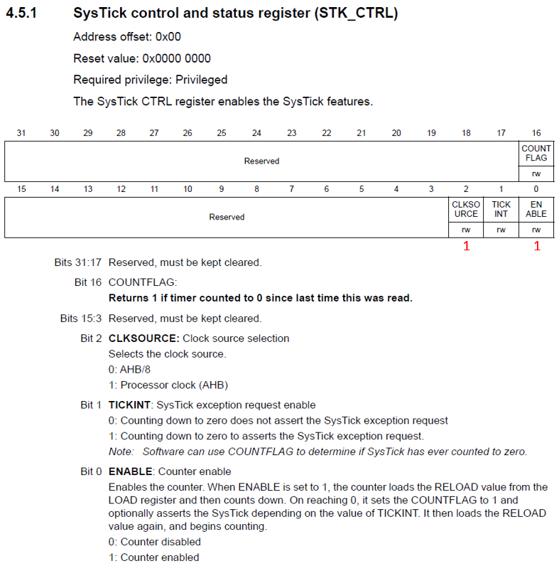
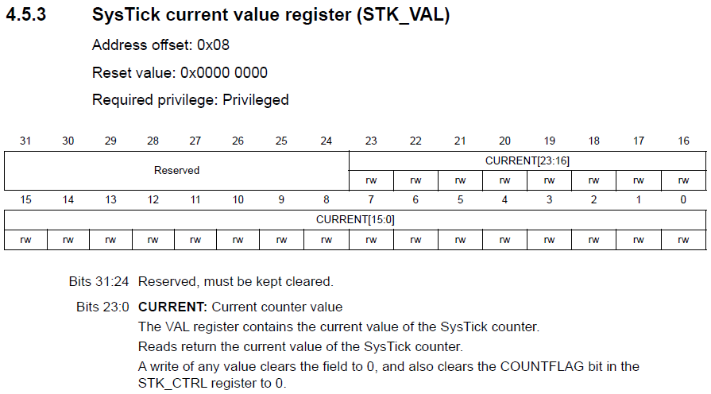

<h1>Aula 11</h1>

Esta clase consiste en programar el temporizador (`systick`) en tiempo real para generar <i>delays</i>

<h2>Systick</h2>

Es un temporizador en tiempo real descendente de 24 bits desde el valor de carga (Systick_LOAD) a cero, el cual genera una interrupción cuando el temporizador alcanza el valor de cero. El valor actual del contador es realizado a través del registro Systick_VAL. El systick puede ser utilizado como <i>delays</i> y como interrupciones periodicas.

<div align="center">

<br>
<figcaption>Fuente: Manual de referencia</figcaption>
</div>

<!--
El valor de calibración por defecto es 18750, dando un tiempo de referencia de 1 ms hasta llegar a cero con el reloj de SisTick configurado a 18.75 MHz
-->

<h3>Ejemplo 1</h3>

```c++
//Ejemplo Systick delay
//Fabián Barrera Prieto
//Universidad ECCI
//STM32F767ZIT6U
//operation 'or' (|) for set bit and operation 'and' (&) for clear bit

#include <stdio.h>
#include "stm32f7xx.h"

void SysTick_Wait(uint32_t n){
	SysTick->LOAD = n - 1; //15999 is loaded into the SysTick->VAL register when the counter is enabled
	SysTick->VAL = 0; //Clear the count flag
	while ((SysTick->CTRL & 0x00010000) == 0); //Check the count flag until it's 1 
}

void SysTick_ms(uint32_t x){
	for (uint32_t i = 0; i < x; i++){//x ms
		SysTick_Wait(16000); //1ms
	}
}

int main(){

	RCC->AHB1ENR |= (1<<1); 
	GPIOB->MODER &= ~(0b11<<0);
	GPIOB->MODER |= (1<<0); 	
	GPIOB->OTYPER &= ~(1<<0);  
	GPIOB->OSPEEDR |= ((1<<1)|(1<<0));
	GPIOB->PUPDR &= ~(0b11<<0);
	
	//Systick
	SysTick->LOAD = 0x00FFFFFF; //Initializing with the maximum value to 24 bits and load the SysTick->VAL register when the counter is enabled
	SysTick->CTRL |= (0b101); //Clock source is processor clock (AHB) and counter enable
	
	while(1){
		GPIOB->ODR |= 1<<0; 
		SysTick_ms(1000);
		GPIOB->ODR &= ~(1<<0);
		SysTick_ms(1000);
	}
}
```

<h3>Registro STK_LOAD</h3>

<div align="center">

<br>
<figcaption>Fuente: Manual de referencia</figcaption>
</div>

<h3>Registro STK_CTRL</h3>

<div align="center">

<br>
<figcaption>Fuente: Manual de referencia</figcaption>
</div>

<h3>Registro STK_VAL</h3>

<div align="center">

<br>
<figcaption>Fuente: Manual de referencia</figcaption>
</div>