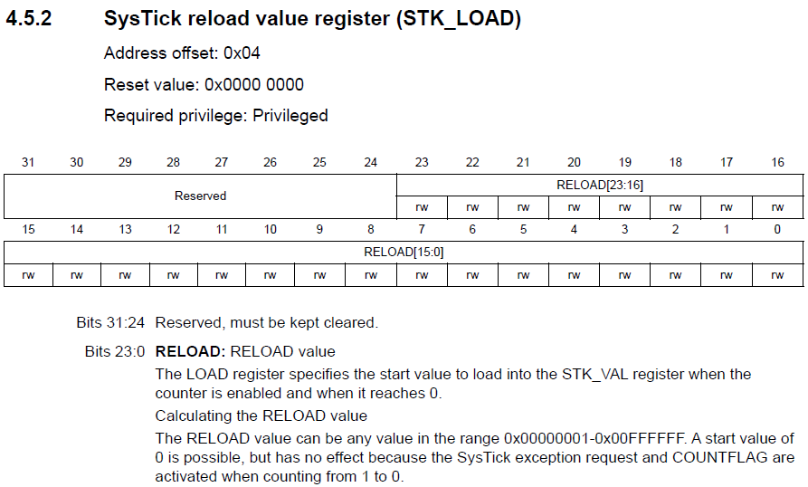

<h1>Aula 11</h1>

Esta clase consiste en programar el temporizador (`systick`) en tiempo real para generar <i>delays</i>

<h2>Systick</h2>

Es un temporizador en tiempo real descendente de 24 bits, el cual genera una interrupción cuando el temporizador alcanza el valor de cero. El systick puede ser utilizado como <i>delays</i> y como interrupciones periodicas.

<div align="center">

<br>
<figcaption>Fuente: Manual de referencia</figcaption>
</div>

El valor de calibración por defecto es 18750, dando un tiempo de referencia de 1 ms hasta llegar a cero con el reloj de SisTick configurado a 18.75 MHz

<h3>Ejemplo 1</h3>

```c++
//Ejemplo Systick
//Fabián Barrera Prieto
//Universidad ECCI
//STM32F767ZIT6U
//operation 'or' (|) for set bit and operation 'and' (&) for clear bit

#include <stdio.h>
#include "stm32f7xx.h"

void SysTick_Wait(uint32_t n){
	SysTick->LOAD = n - 1;
	SysTick->VAL = 0;
	while ((SysTick->CTRL & 0x00010000) == 0);
}

void SysTick_ms(uint32_t delay){
	for (uint32_t i = 0; i < delay; i++){
		SysTick_Wait(16000);
	}
}

int main(){

	RCC->AHB1ENR |= (1<<1); 
	GPIOB->MODER &= ~(0b11<<0);
	GPIOB->MODER |= (1<<0); 	
	GPIOB->OTYPER &= ~(1<<0);  
	GPIOB->OSPEEDR |= ((1<<1)|(1<<0));
	GPIOB->PUPDR &= ~(0b11<<0);
	
	//Systick
	SysTick->LOAD = 0x00FFFFFF;
	SysTick->CTRL = 0x00000005; 
	
	while(1){
		//GPIOB->BSRR |= (1<<0); // Set the Pin PB0
		GPIOB->ODR |= 1<<0; // Set the Pin PB0
		SysTick_ms(1000);
		//GPIOB->BSRR |= (1<<16); // Reset the Pin PB0
		GPIOB->ODR &= ~(1<<0); // Reset the Pin PB0
		SysTick_ms(1000);
	}
}
```

<h3>Registro STK_LOAD</h3>

<div align="center">

<br>
<figcaption>Fuente: Manual de referencia</figcaption>
</div>

<h3>Registro STK_CTRL</h3>

<div align="center">

<br>
<figcaption>Fuente: Manual de referencia</figcaption>
</div>

<h3>Registro STK_VAL</h3>

<div align="center">

<br>
<figcaption>Fuente: Manual de referencia</figcaption>
</div>