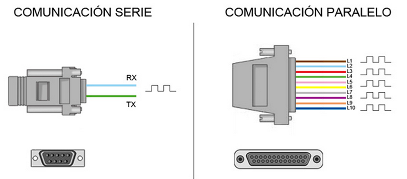
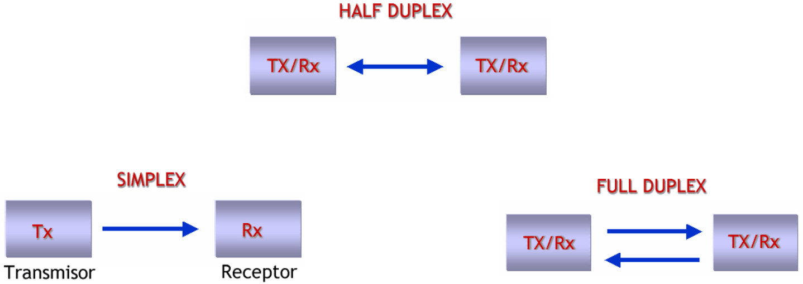
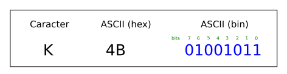
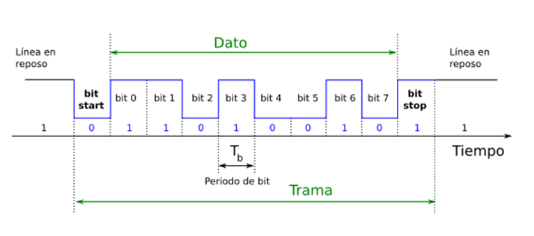
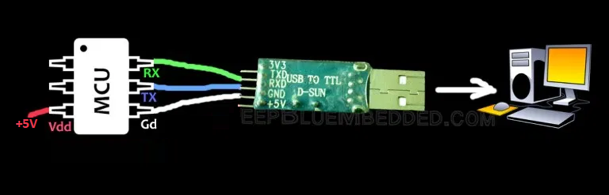
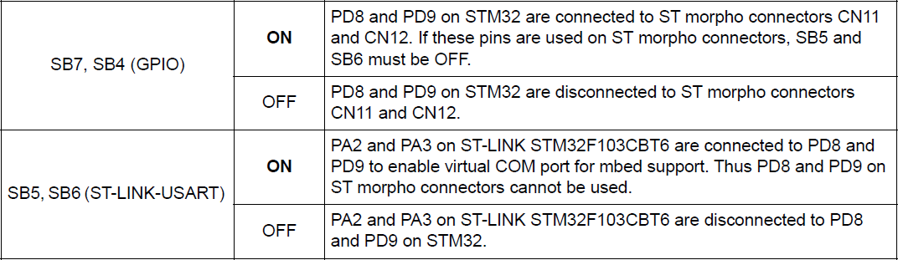
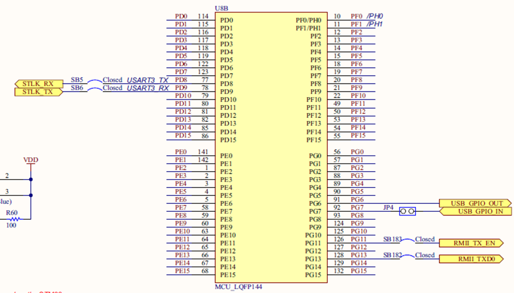
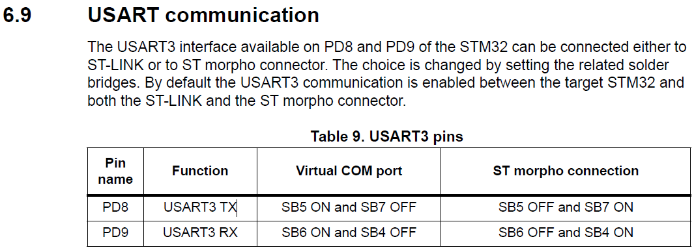
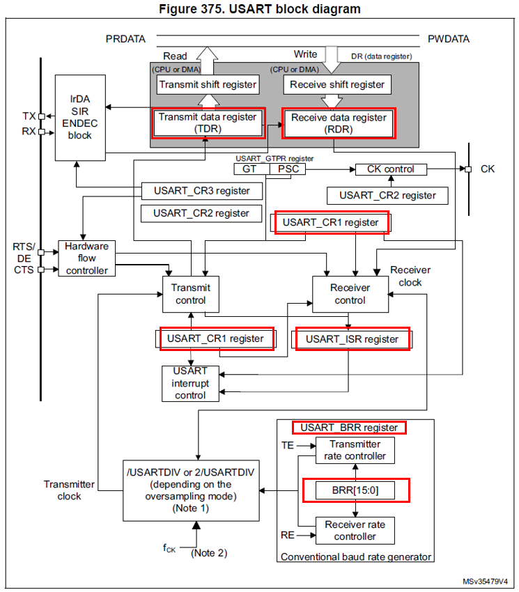
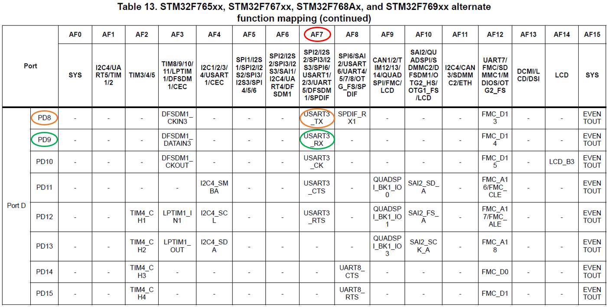

<h1>Aula 12</h1>

Esta clase consiste en comprender la comunicación serial (UART) y utilizarla en la tarjeta NUCLEO STM32F767ZI

<h2>Comunicación serial (UART)</h2>

La comunicación serial (simplex, half o full duplex) permite transmitir y/o recibir datos bit a bit, punto a punto (microcontroladores, PC, sistema embebido) de forma asíncrona (UART) o síncrona (USART). 

<div align="center">

<br>
<figcaption>Fuente: http://tutosrafaz.blogspot.com/2015/06/comunicacion-serial-rs232-pic16f887a.html</figcaption>
</div>

<h3>Tipos de comunicación serial</h3>

Modos simplex, half duplex y full duplex

<div align="center">

<br>
<figcaption>Fuente: http://eveliux.com/mx/curso/modos-simplex-half-duplex-y-full-duplex.html</figcaption>
</div>

<h3>Trama de comunicación UART</h3>

RS232 y RS485 son dos comunicaciones seriales de tipo asíncrona (UART), las cuales tienen el estándar de transmisión serie que define la trama más conocida como 8N1 (8 bits de datos, Ninguno de paridad y 1 bit de stop).

<div align="center">

<br>
<figcaption>Fuente: https://github.com/Obijuan/open-fpga-verilog-tutorial/wiki/Cap%C3%ADtulo-21:-Baudios-y-transmisi%C3%B3n</figcaption>
</div>

<div align="center">

<br>
<figcaption>Fuente: https://github.com/Obijuan/open-fpga-verilog-tutorial/wiki/Cap%C3%ADtulo-21:-Baudios-y-transmisi%C3%B3n</figcaption>
</div>

$$T_b=\frac{1}{V_t}$$

$$T_b=\frac{1}{9600 bits/s}$$

$$T_b=104.167 \mu s$$

<h3>FTDI</h3>

El conversor de USB a TTL o también conocido como FTDI (CH340 o CP2102) permite realizar comunicación serial UART de un microcontrolador (TTL) a un PC (USB).

<div align="center">

<br>
<figcaption>Fuente: https://deepbluembedded.com/usb-ttl-converter-tutorial-pc-control-for-microcontrollers/</figcaption>
</div>

<h3>HC-05</h3>

<div align="center">

<br>
<figcaption>Fuente: https://deepbluembedded.com/usb-ttl-converter-tutorial-pc-control-for-microcontrollers/</figcaption>
</div>

<h3>Comunicación UART en la tarjeta NUCLEO STM32F767ZI</h3>

Es un protocolo de comunicación del microcontrolador STM32F767ZI que tiene una salida y una entrada, Tx (Transmisión) y Rx (Recepción), respectivamente. TDR y RDR son registros del modulo USART del microcontrolador STM32F767ZI para cargar el byte a transmitir y para guardar el byte recibido, respectivamente. En la tarjeta NUCLEO STM32F767ZI hay cuatro canales de UART () y cuatro canales de USART (). 

<div align="center">

<br>
<figcaption>Fuente: Manual de usuario</figcaption>
</div>

<div align="center">

<br>
<figcaption>Fuente: Manual de usuario</figcaption>
</div>

<div align="center">

<br>
<figcaption>Fuente: Manual de usuario</figcaption>
</div>

<div align="center">

<br>
<figcaption>Fuente: Manual de referencia</figcaption>
</div>

<div align="center">

<br>
<figcaption>Fuente: Manual de referencia</figcaption>
</div>

<h3>BRR</h3>

$$Tx/Rx baud = \frac{f_{CK}}{USARTDIV}$$

$$BRR = USARTDIV = \frac{f_{CK}}{Tx/Rx baud}$$

$$BRR = USARTDIV = \frac{16MHz}{9600 baud} = 1667_{10} = 683_{16}$$


<h3>Ejemplo 1</h3>

```c++
//Ejemplo Interrupciones con led de usuario de la tarjeta
//Fabián Barrera Prieto
//Universidad ECCI
//STM32F767ZIT6U
//operation 'or' (|) for set bit and operation 'and' (&) for clear bit

#include <stdio.h>
#include "stm32f7xx.h"
#include <string.h>

uint8_t flag = 0, i, cont = 0;
unsigned char d;
char name[7] = "Fabian", text[10];

void SysTick_Wait(uint32_t n){
	SysTick->LOAD = n - 1; //15999
	SysTick->VAL = 0; //Clean the value of Systick counter
	while ((SysTick->CTRL & 0x00010000) == 0); //Check the count flag until it's 1 
}

void SysTick_ms(uint32_t x){
	for (uint32_t i = 0; i < x; i++){//x ms
		SysTick_Wait(16000); //1ms
	}
}

extern "C"{
	void EXTI15_10_IRQHandler(void){
		EXTI->PR |= 1; //Down flag
		if(((GPIOC->IDR & (1<<13)) >> 13) == 1){
			flag = 1;
		}
	}
	
	void USART3_IRQHandler(void){ //Receive interrupt
		if(((USART3->ISR & 0x20) >> 5) == 1){//Received data is ready to be read (flag RXNE = 1)
			d = USART3->RDR;//Read the USART receive buffer 
		}
	}
}

int main(){
	//GPIOs
	RCC->AHB1ENR |= ((1<<1)|(1<<2)); 
	
	GPIOB->MODER &= ~((0b11<<0)|(0b11<<14));
	GPIOB->MODER |= ((1<<0)|(1<<14)); 
	GPIOC->MODER &= ~(0b11<<26);
	
	GPIOB->OTYPER &= ~((1<<0)|(1<<7));
	GPIOB->OSPEEDR |= (((1<<1)|(1<<0)|(1<<15)|(1<<14)));
	GPIOC->OSPEEDR |= ((1<<27)|(1<<26));
	GPIOB->PUPDR &= ~((0b11<<0)|(0b11<<14));
	GPIOC->PUPDR &= ~(0b11<<26);
	GPIOC->PUPDR |= (1<<27);
	
	//Systick
	SysTick->LOAD = 0x00FFFFFF; 
	SysTick->CTRL |= (0b101);
	
	//Interrupt
	RCC->APB2ENR |= (1<<14); 
	SYSCFG->EXTICR[3] &= ~(0b1111<<4); 
	SYSCFG->EXTICR[3] |= (1<<5); 
	EXTI->IMR |= (1<<13); 
	EXTI->RTSR |= (1<<13);
	NVIC_EnableIRQ(EXTI15_10_IRQn); 
		
	//UART
	RCC->AHB1ENR |= (1<<3); //Enable the GPIOD clock (UART3 is connected on PD9 (RX) and PD8 (TX))
	GPIOD->MODER &= ~((0b11<<18)|(0b11<<16)); //Clear (00) pins PD9 (bits 19:18) and PD8 (bits 17:16)
	GPIOD->MODER |= (1<<19)|(1<<17); //Set (10) pins PD9=RX (bits 19:18) and PD8=TX (bits 17:16) as alternant function
	GPIOD->AFR[1] &= ~((0b1111<<4)|(0b1111<<0)); //Clear (0000) alternant functions for pins PD9 (bits 7:4) and PD8 (bits 3:0)
	GPIOD->AFR[1] |= (0b111<<4)|(0b111<<0); //Set the alternant function AF7 for pins PD9=RX (bits 19:18) and PD8=TX (bits 17:16)
	RCC->APB1ENR |= (1<<18); //Enable the USART3 clock
	USART3->BRR = 0x683; //Set the baud rate on 9600 baud to 16 MHz (HSI)
	USART3->CR1 |= ((1<<5)|(0b11<<2)); //RXNE interrupt enable, transmitter enable and receiver enable
	USART3->CR1 |= (1<<0); //USART enable
	NVIC_EnableIRQ(USART3_IRQn); //Enable the interrupt function on the NVIC module
	
	while(1){
      GPIOB->ODR |= 1<<0; 
			SysTick_ms(1000);
			GPIOB->ODR &= ~(1<<0);
			SysTick_ms(1000);
			if(flag == 1){
				flag = 0;
				cont++;
				sprintf(text,"%s %d\n",name, cont);
				for(i=0; i<strlen(text); i++){
					USART3->TDR = text[i]; //Data transmitted
					while((USART3->ISR & 0x80)==0){}; //Wait until the data is transferred to the shift register (flag TXE=0)
				}
				//USART3->TDR = 0x0A; //Send end line
				//while((USART3->ISR & 0x80)==0){};
				USART3->TDR = 0x0D; //Send carry return
				while((USART3->ISR & 0x80)==0){};
			}
			if(d == 'a'){
				GPIOB->ODR |= 1<<7;
			}else if(d == 'b'){
				GPIOB->ODR &= ~(1<<7);
			}
	}
}
```