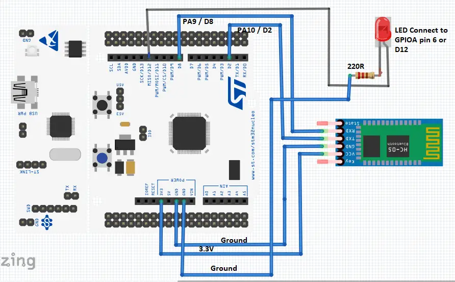

<h1>Aula 12</h1>

Esta clase consiste en comprender la comunicación serial (UART) y utilizarla en la tarjeta NUCLEO STM32F767ZI

<h2>Comunicación serial (UART)</h2>

La comunicación serial (simplex, half o full duplex) permite transmitir y/o recibir datos bit a bit, punto a punto (microcontroladores, PC, sistema embebido) de forma asíncrona (UART) o síncrona (USART). 

<div align="center">

<br>
<figcaption>Fuente: http://tutosrafaz.blogspot.com/2015/06/comunicacion-serial-rs232-pic16f887a.html</figcaption>
</div>

<h3>Tipos de comunicación serial</h3>

Modos simplex, half duplex y full duplex

<div align="center">

<br>
<figcaption>Fuente: http://eveliux.com/mx/curso/modos-simplex-half-duplex-y-full-duplex.html</figcaption>
</div>

<h3>Trama de comunicación UART</h3>

RS232 y RS485 son dos comunicaciones seriales de tipo asíncrona (UART), las cuales tienen el estándar de transmisión serie que define la trama más conocida como 8N1 (8 bits de datos, Ninguno de paridad y 1 bit de stop).

<div align="center">

<br>
<figcaption>Fuente: https://github.com/Obijuan/open-fpga-verilog-tutorial/wiki/Cap%C3%ADtulo-21:-Baudios-y-transmisi%C3%B3n</figcaption>
</div>

<div align="center">

<br>
<figcaption>Fuente: https://github.com/Obijuan/open-fpga-verilog-tutorial/wiki/Cap%C3%ADtulo-21:-Baudios-y-transmisi%C3%B3n</figcaption>
</div>

$$T_b=\frac{1}{V_t}$$

$$T_b=\frac{1}{9600 bits/s}$$

$$T_b=104.167 \mu s$$

<h3>FTDI</h3>

El conversor de USB a TTL (FTDI), puede alimentar +5V del PIC puede conectarse a una fuente externa o a los +5V del FTDI

<div align="center">

<br>
<figcaption>Fuente: https://deepbluembedded.com/usb-ttl-converter-tutorial-pc-control-for-microcontrollers/</figcaption>
</div>

<h3>HC-05</h3>

<div align="center">

<br>
<figcaption>Fuente: https://deepbluembedded.com/usb-ttl-converter-tutorial-pc-control-for-microcontrollers/</figcaption>
</div>

<h3>Comunicación UART en la tarjeta NUCLEO STM32F767ZI</h3>

Es un protocolo de comunicación del microcontrolador STM32F767ZI, 


<h3>Ejemplo 1</h3>

```c++

```