<h1>Aula 14</h1>

Esta clase consiste en comprender la Conversión Análogo Digital (ADC) y utilizarla en la tarjeta NUCLEO STM32F767ZI

<h2>Señal análoga</h2>

Una señal análoga se caracteriza por ser continua en función del tiempo, sin embargo es variable en amplitud y periodo (frecuencia).

<div align="center">

<br>
<figcaption>Fuente: https://alejandrocbba.wordpress.com/</figcaption>
</div>

<h2>Conversión análoga a digital</h2>

Para el procesamiento de información en circuitos electrónicos digitales y sistemas embebidos (Arduino, Microcontroladores, STM32, Raspberry, FPGA, entre otros), es indispensable tener la información digital debido a la lógica booleana de los procesadores digitales.

<div align="center">
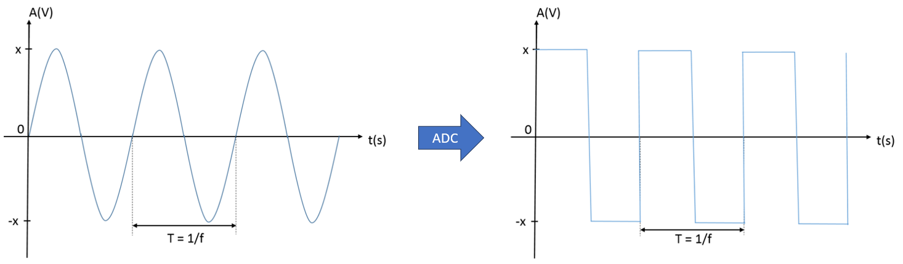
<br>
<figcaption>Fuente: </figcaption>
</div>

<h2>Conversor Análogo Digital (ADC)</h2>

Un Conversor Análogo Digital (ADC) permite convertir una señal análoga en una señal digital equivalente, donde cada valor de muestra de la señal análoga está representado por una cantidad de bits. 

<div align="center">
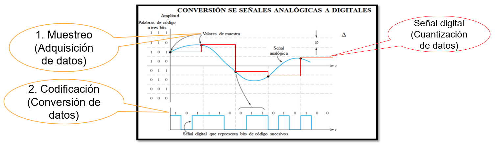
<br>
<figcaption>Fuente: https://alejandrocbba.wordpress.com/</figcaption>
</div>

<h3>Resolución ADC</h3>

<div align="center">
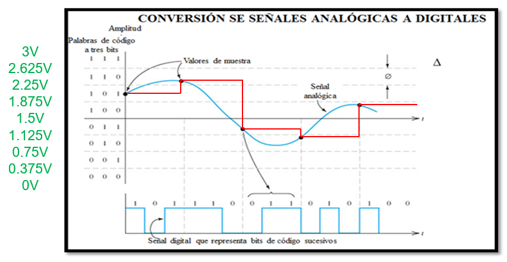
<br>
<figcaption>Fuente: https://alejandrocbba.wordpress.com/</figcaption>
</div>

$$Rango análogico = V_{máx} - V_{mín} = 3V - 0V = 3V$$

$$Resolución = \frac{Rango análogico}{2^n} = \frac{3V}{2^3} = 0.375V$$

<h2>ADC en la STM32F767ZI</h2>

El microcontrolador STM32F767ZI tiene internamente tres módulos ADC con resolución configurable de 6, 8, 10 o 12 bits. Las conversiones de análogo a digital de los diferentes canales se pueden realizar de dos modos: 1) individualmente o 2) secuencialmente sobre un grupo de entradas análogas. La ubicación de los pines análogos se encuentra en la tabla 11 del datasheet del microcontrolador STM32F767ZI.

<div align="center">
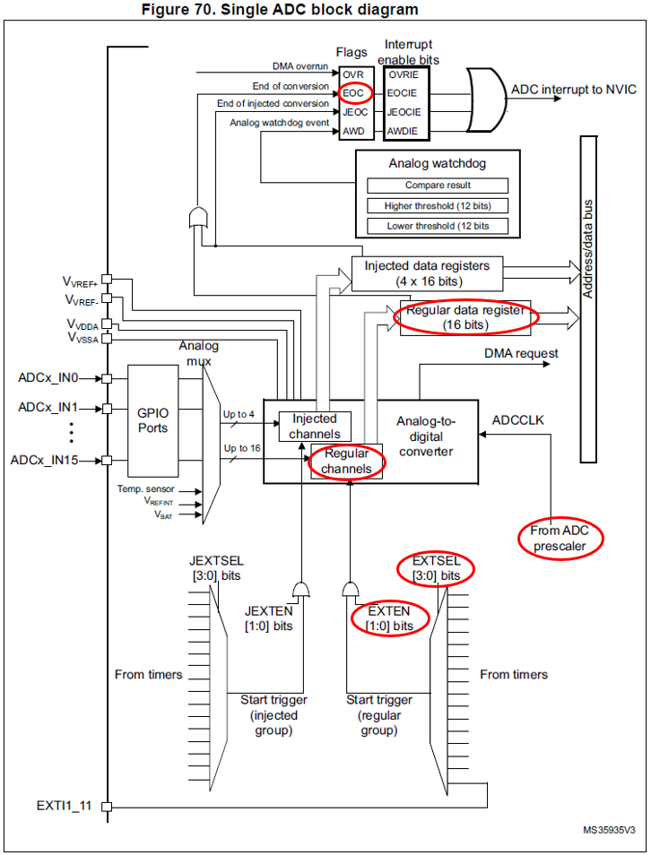
<br>
<figcaption>Fuente: Manual de referencia</figcaption>
</div>

Cada uno de los tres módulos tiene la posibilidad de conectar hasta 16 pines análogos externos, 2 fuentes internas y 1 canal VBAT, pero alguno de los pines externos están compartidos entre los tres módulos. Así mismo, es posible utilizar dos o tres módulos de ADC de forma paralela.

<div align="center">
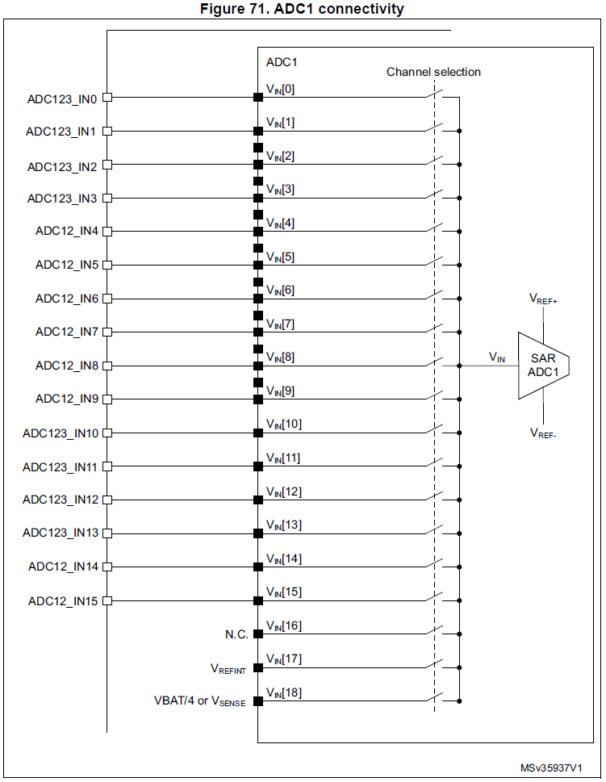
<br>
<figcaption>Fuente: Manual de referencia</figcaption>
</div>

<div align="center">

<br>
<figcaption>Fuente: Manual de referencia</figcaption>
</div>

<div align="center">
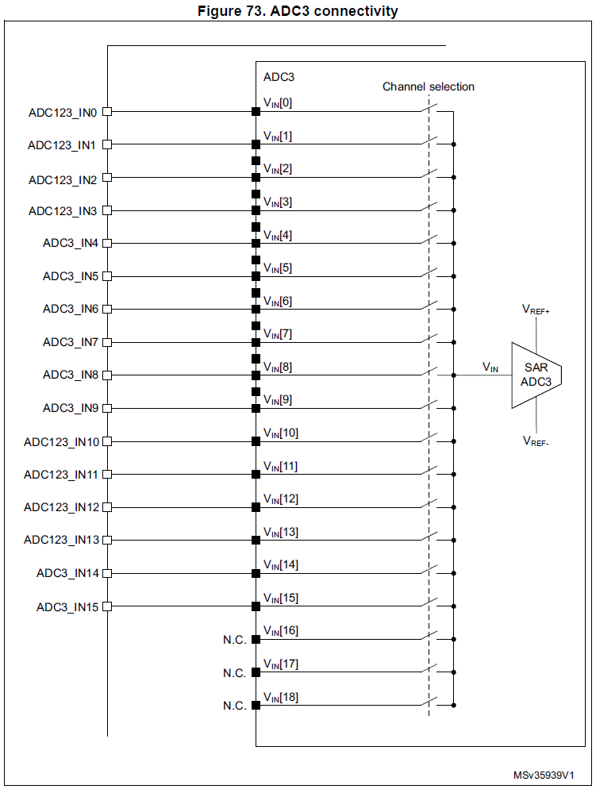
<br>
<figcaption>Fuente: Manual de referencia</figcaption>
</div>

<div align="center">
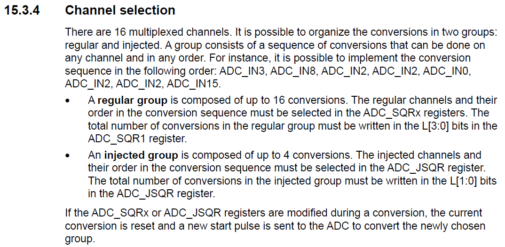
<br>
<figcaption>Fuente: Manual de referencia</figcaption>
</div>

<div align="center">s

<br>
<figcaption>Fuente: Manual de referencia</figcaption>
</div>

<div align="center">
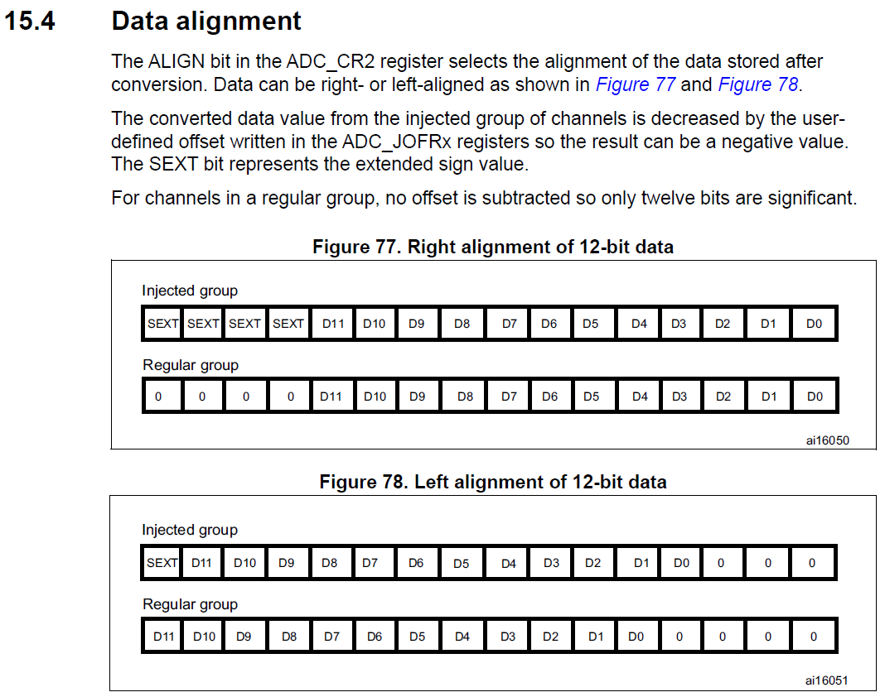
<br>
<figcaption>Fuente: Manual de referencia</figcaption>
</div>

<div align="center">
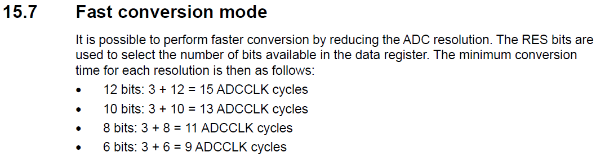
<br>
<figcaption>Fuente: Manual de referencia</figcaption>
</div>

<h3>Ejemplo</h3>

```c++
//Ejemplo ADC2 canal 10
//Fabián Barrera Prieto
//Universidad ECCI
//STM32F767ZIT6U
//operation 'or' (|) for set bit and operation 'and' (&) for clear bit

#include <stdio.h>
#include "stm32f7xx.h"
#include <string.h>

uint8_t flag = 0, i;
unsigned char d;
char text[10];
uint16_t digital;
float voltaje;

void SysTick_Wait(uint32_t n){
    SysTick->LOAD = n - 1; 
    SysTick->VAL = 0; 
    while (((SysTick->CTRL & 0x00010000) >> 16) == 0); 
}

void SysTick_ms(uint32_t x){
    for (uint32_t i = 0; i < x; i++){
        SysTick_Wait(16000); 
    }
}

extern "C"{
    void EXTI15_10_IRQHandler(void){
        EXTI->PR |= 1;
        if(((GPIOC->IDR & (1<<13)) >> 13) == 1){
            flag = 1;
        }
    }

    void USART3_IRQHandler(void){ 
        if(((USART3->ISR & 0x20) >> 5) == 1){
            d = USART3->RDR;
            if(d == 'a'){
                flag = 1;
            }
        }
    }
}

int main(){
    //GPIOs
    RCC->AHB1ENR |= ((1<<1)|(1<<2)); 

    GPIOB->MODER &= ~((0b11<<0)|(0b11<<14));
    GPIOB->MODER |= ((1<<0)|(1<<14)); 
    GPIOC->MODER &= ~(0b11<<26);

    GPIOB->OTYPER &= ~((1<<0)|(1<<7));
    GPIOB->OSPEEDR |= (((1<<1)|(1<<0)|(1<<15)|(1<<14)));
    GPIOC->OSPEEDR |= ((1<<27)|(1<<26));
    GPIOB->PUPDR &= ~((0b11<<0)|(0b11<<14));
    GPIOC->PUPDR &= ~(0b11<<26);
    GPIOC->PUPDR |= (1<<27);

    //Systick
    SysTick->LOAD = 0x00FFFFFF; 
    SysTick->CTRL |= (0b101);

    //Interrupt
    RCC->APB2ENR |= (1<<14); 
    SYSCFG->EXTICR[3] &= ~(0b1111<<4); 
    SYSCFG->EXTICR[3] |= (1<<5); 
    EXTI->IMR |= (1<<13); 
    EXTI->RTSR |= (1<<13);
    NVIC_EnableIRQ(EXTI15_10_IRQn); 
        
    //UART
    RCC->AHB1ENR |= (1<<3); 
    GPIOD->MODER &= ~((0b11<<18)|(0b11<<16)); 
    GPIOD->MODER |= (1<<19)|(1<<17); 
    GPIOD->AFR[1] &= ~((0b1111<<4)|(0b1111<<0));
    GPIOD->AFR[1] |= (0b111<<4)|(0b111<<0); 
    RCC->APB1ENR |= (1<<18); 
    USART3->BRR = 0x683; 
    USART3->CR1 |= ((1<<5)|(0b11<<2)); 
    NVIC_EnableIRQ(USART3_IRQn); 
        
    //ADC
    GPIOC->MODER |= (0b11<<0); //Set the bit PC0 (ADC123_IN10) as analog mode		
    RCC->APB2ENR |= (1<<9); //Enable the ADC2 clock 
    ADC2->CR2 |= (0b11<<0); //Enable the A/D converter and set the continuous conversion mode
    ADC2->CR1 &= ~(0b11<<24); //Clear the A/D resolution bits 
    ADC2->CR1 |= (1<<24); //Set the A/D resolution on 10 bits (minimum 13 ADCCLK cycles)
    ADC2->SMPR1 |= (1<<0); //15 ADCCLK cycles on channel 10 (PC0)
    ADC2->SQR3 &= ~(0b11111<<0); //Clear the regular sequence bits 
    ADC2->SQR3 |= (0b1010<<0); //Set the channel 10 on 1st conversion in regular sequence 

    //UART
    USART3->CR1 |= (1<<0);
        
    while(1){
        GPIOB->ODR |= 1<<0; 
        SysTick_ms(500);
        GPIOB->ODR &= ~(1<<0);
        SysTick_ms(500);
        if(flag == 1){
            flag = 0;
            ADC2->CR2 |= (1<<30); // Start A/D conversion on ADC2 module for channel 10 on ADC2->SQR3 register
            while(((ADC2->SR & (1<<1)) >> 1) == 0){} //Check if the A/D conversion is complete
            digital = ADC2->DR;
            voltaje = (float)digital*(3.3/1023.0);
            sprintf(text,"pot: %.2f\n", voltaje);
            for(i=0; i<strlen(text); i++){
                USART3->TDR = text[i]; 
                while(((USART3->ISR & 0x80) >> 7) == 0){}
            }
            //USART3->TDR = 0x0A; //Send end line
            //while((USART3->ISR & 0x80)==0){};
            USART3->TDR = 0x0D;
            while(((USART3->ISR & 0x80) >> 7) == 0){}
        }  
    }
}
```

<div align="center">
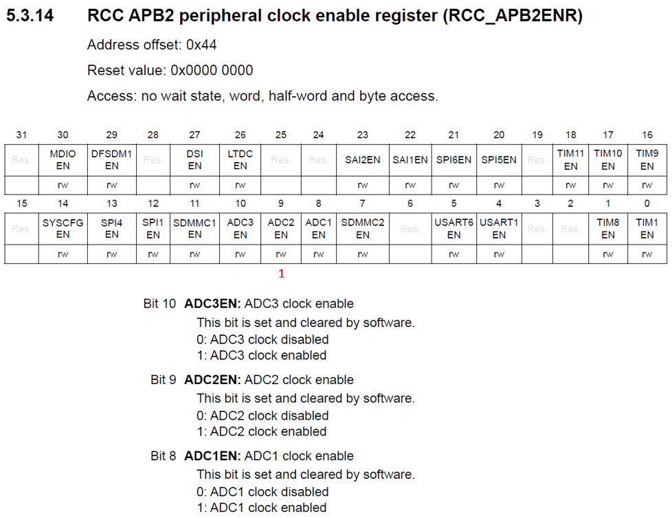
<br>
<figcaption>Fuente: Manual de referencia</figcaption>
</div>

<div align="center">
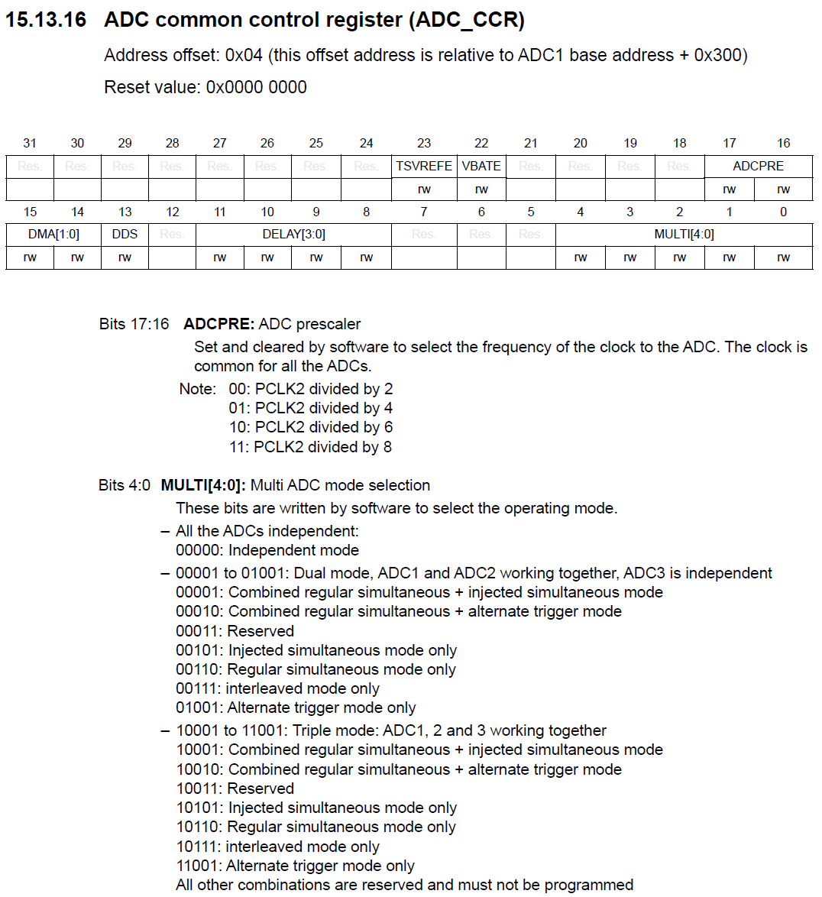
<br>
<figcaption>Fuente: Manual de referencia</figcaption>
</div>

<div align="center">
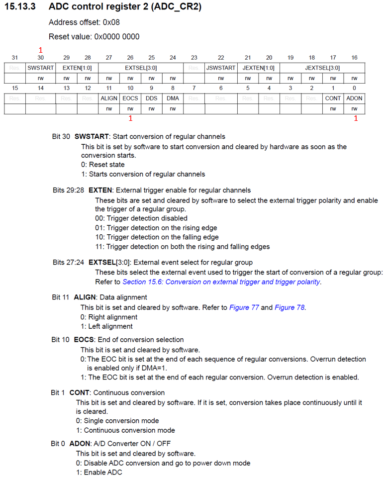
<br>
<figcaption>Fuente: Manual de referencia</figcaption>
</div>

<div align="center">
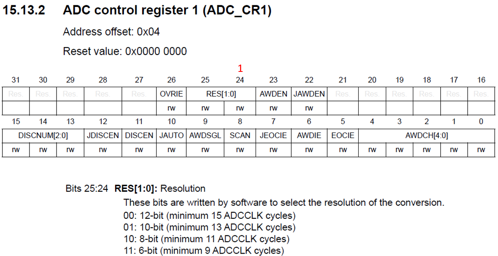
<br>
<figcaption>Fuente: Manual de referencia</figcaption>
</div>

<div align="center">
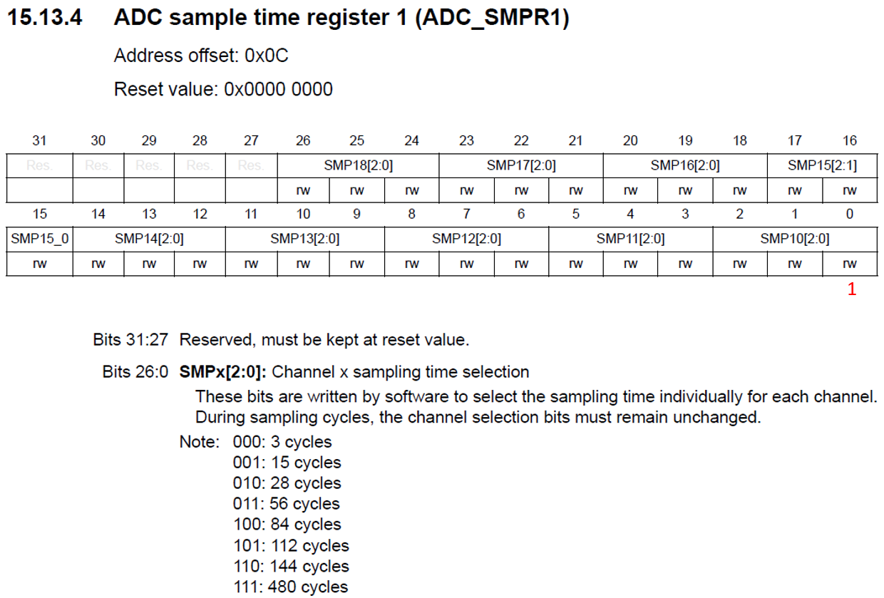
<br>
<figcaption>Fuente: Manual de referencia</figcaption>
</div>

<div align="center">

<br>
<figcaption>Fuente: Manual de referencia</figcaption>
</div>

<div align="center">
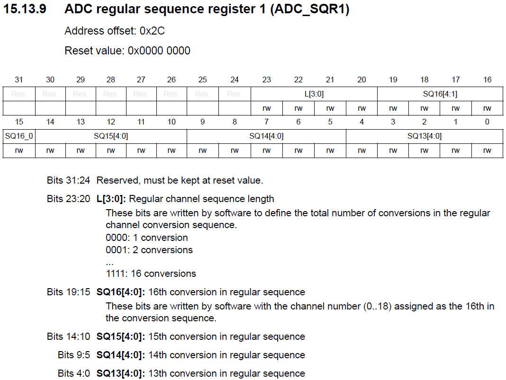
<br>
<figcaption>Fuente: Manual de referencia</figcaption>
</div>

<div align="center">
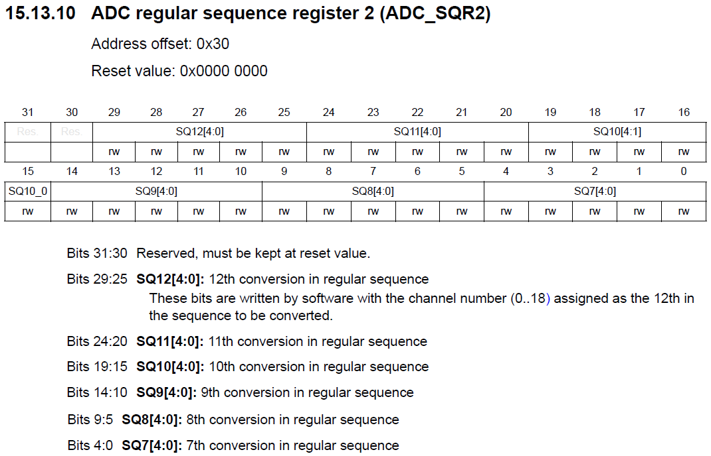
<br>
<figcaption>Fuente: Manual de referencia</figcaption>
</div>

<div align="center">
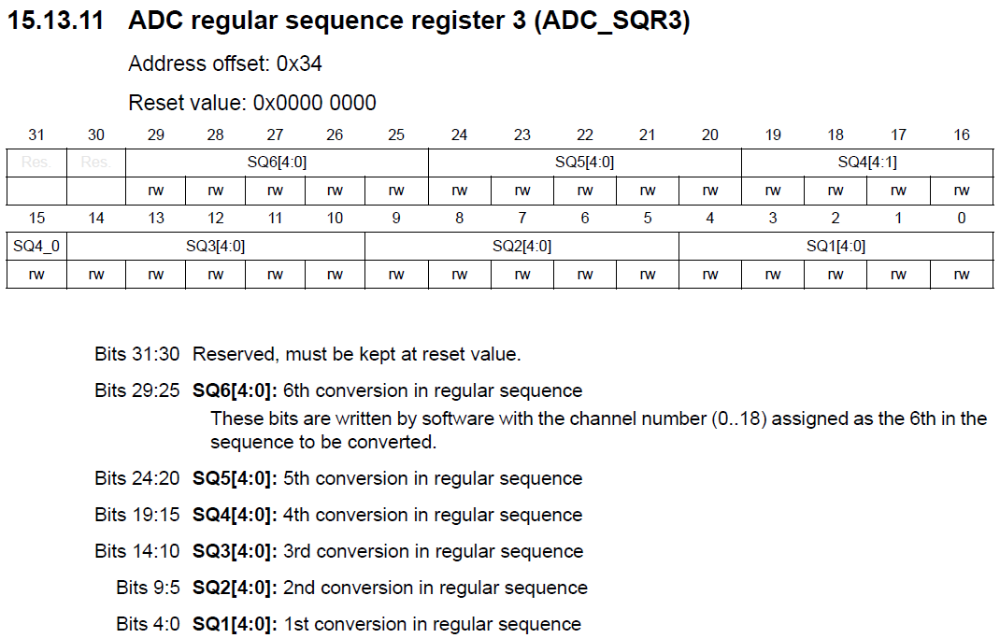
<br>
<figcaption>Fuente: Manual de referencia</figcaption>
</div>

<div align="center">
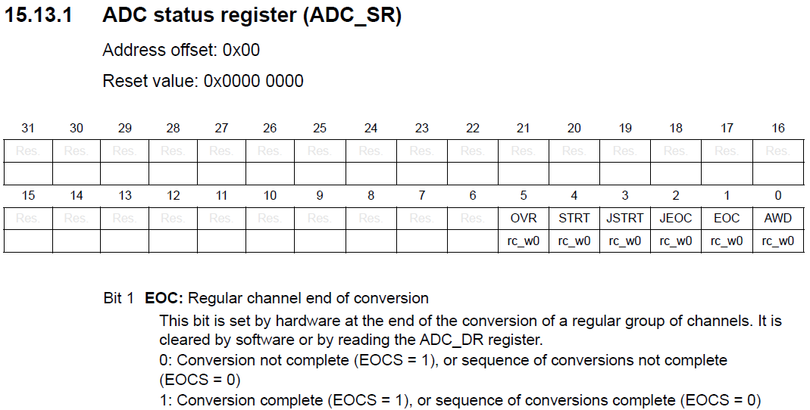
<br>
<figcaption>Fuente: Manual de referencia</figcaption>
</div>

<div align="center">
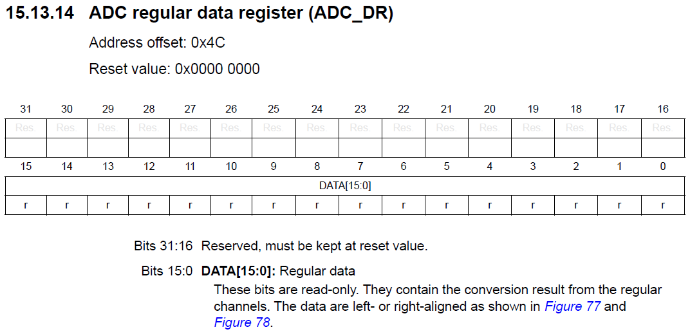
<br>
<figcaption>Fuente: Manual de referencia</figcaption>
</div>