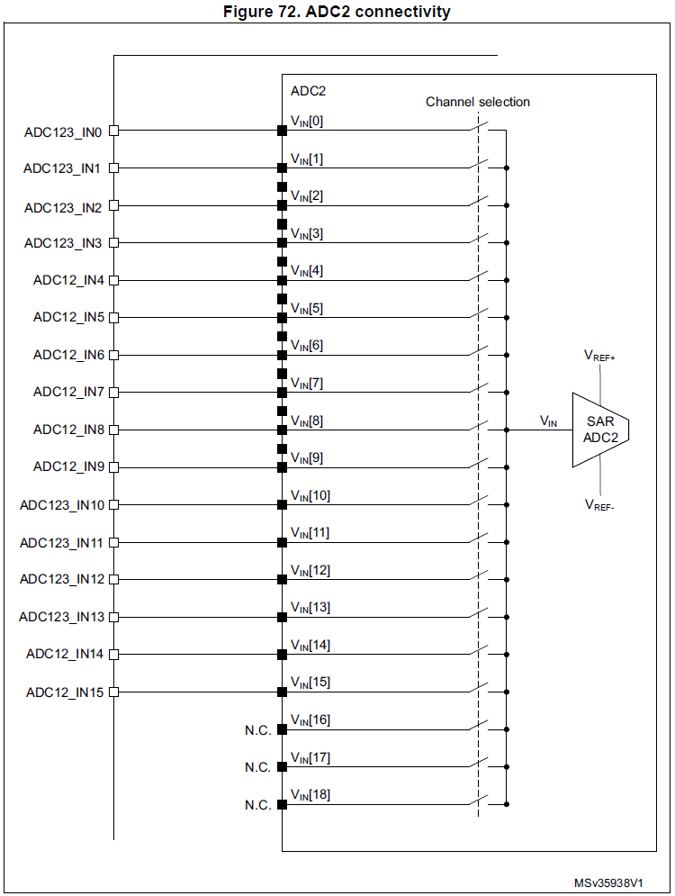
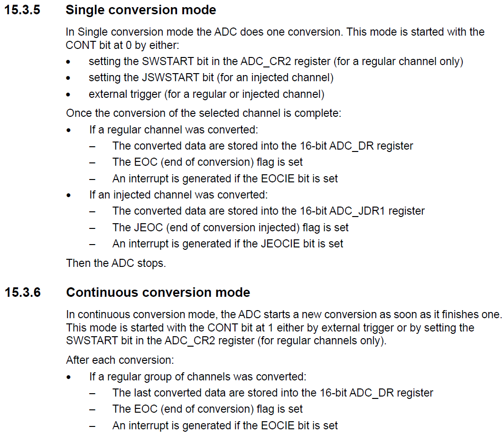
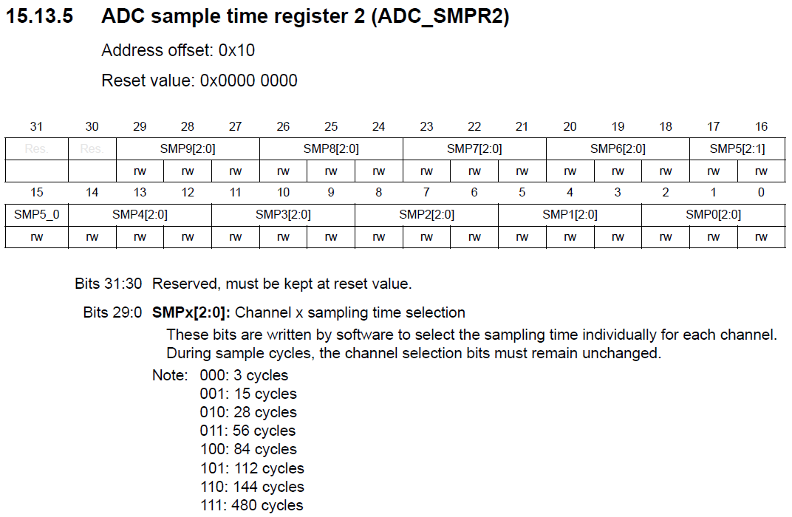

<h1>Aula 14</h1>

Esta clase consiste en comprender la Conversión Análogo Digital (ADC) y utilizarla en la tarjeta NUCLEO STM32F767ZI

<h2>Señal análoga</h2>

Una señal análoga se caracteriza por ser continua en función del tiempo, sin embargo es variable en amplitud y periodo (frecuencia).

<div align="center">

<br>
<figcaption>Fuente: https://alejandrocbba.wordpress.com/</figcaption>
</div>

<h2>Conversión análoga a digital</h2>

Para el procesamiento de información en circuitos electrónicos digitales y sistemas embebidos (Arduino, Microcontroladores, STM32, Raspberry, FPGA, entre otros), es indispensable tener la información digital debido a la lógica booleana de los procesadores digitales.

<div align="center">

<br>
<figcaption>Fuente: </figcaption>
</div>

<h2>Conversor Análogo Digital (ADC)</h2>

Un Conversor Análogo Digital (ADC) permite convertir una señal análoga en una señal digital equivalente, donde cada valor de muestra de la señal análoga está representado por una cantidad de bits. 

<div align="center">

<br>
<figcaption>Fuente: https://alejandrocbba.wordpress.com/</figcaption>
</div>

<h3>Resolución ADC</h3>

<div align="center">

<br>
<figcaption>Fuente: https://alejandrocbba.wordpress.com/</figcaption>
</div>

$$Rango análogico = V_{máx} - V_{mín} = 3V - 0V = 3V$$

$$Resolución = \frac{Rango análogico}{2^n} = \frac{3V}{2^3} = 0.375V$$

<h2>ADC en la STM32F767ZI</h2>

El microcontrolador STM32F767ZI tiene internamente tres módulos ADC con resolución configurable de 6, 8, 10 o 12 bits. Las conversiones de análogo a digital de los diferentes canales se pueden realizar de dos modos: 1) individualmente o 2) secuencialmente sobre un grupo de entradas análogas. La ubicación de los pines análogos se encuentra en la tabla 11 del datasheet del microcontrolador STM32F767ZI.

<div align="center">

<br>
<figcaption>Fuente: Manual de referencia</figcaption>
</div>

Cada uno de los tres módulos tiene la posibilidad de conectar hasta 16 pines análogos externos, 2 fuentes internas y 1 canal VBAT, pero alguno de los pines externos están compartidos entre los tres módulos. Así mismo, es posible utilizar dos o tres módulos de ADC de forma paralela.

<div align="center">

<br>
<figcaption>Fuente: Manual de referencia</figcaption>
</div>

<div align="center">

<br>
<figcaption>Fuente: Manual de referencia</figcaption>
</div>

<div align="center">

<br>
<figcaption>Fuente: Manual de referencia</figcaption>
</div>

<div align="center">

<br>
<figcaption>Fuente: Manual de referencia</figcaption>
</div>

<div align="center">

<br>
<figcaption>Fuente: Manual de referencia</figcaption>
</div>

<div align="center">

<br>
<figcaption>Fuente: Manual de referencia</figcaption>
</div>

<div align="center">

<br>
<figcaption>Fuente: Manual de referencia</figcaption>
</div>

<div align="center">

<br>
<figcaption>Fuente: Manual de referencia</figcaption>
</div>

<h3>Ejemplo</h3>

```c++
//Ejemplo UART3 ST-LINK
//Fabián Barrera Prieto
//Universidad ECCI
//STM32F767ZIT6U
//operation 'or' (|) for set bit and operation 'and' (&) for clear bit

#include <stdio.h>
#include "stm32f7xx.h"
#include <string.h>

uint8_t flag = 0, i, cont = 0;
unsigned char d;
char name[7] = "Fabian", text[10];

void SysTick_Wait(uint32_t n){
    SysTick->LOAD = n - 1; //15999
    SysTick->VAL = 0; //Clean the value of Systick counter
    while (((SysTick->CTRL & 0x00010000) >> 16) == 0); //Check the count flag until it's 1 
}

void SysTick_ms(uint32_t x){
    for (uint32_t i = 0; i < x; i++){//x ms
        SysTick_Wait(16000); //1ms
    }
}

extern "C"{
    void EXTI15_10_IRQHandler(void){
        EXTI->PR |= 1; //Down flag
        if(((GPIOC->IDR & (1<<13)) >> 13) == 1){
            flag = 1;
        }
    }

    void USART3_IRQHandler(void){ //Receive interrupt
        if(((USART3->ISR & 0x20) >> 5) == 1){//Received data is ready to be read (flag RXNE = 1)
            d = USART3->RDR;//Read the USART receive buffer 
        }
    }
}

int main(){
    //GPIOs
    RCC->AHB1ENR |= ((1<<1)|(1<<2)); 

    GPIOB->MODER &= ~((0b11<<0)|(0b11<<14));
    GPIOB->MODER |= ((1<<0)|(1<<14)); 
    GPIOC->MODER &= ~(0b11<<26);

    GPIOB->OTYPER &= ~((1<<0)|(1<<7));
    GPIOB->OSPEEDR |= (((1<<1)|(1<<0)|(1<<15)|(1<<14)));
    GPIOC->OSPEEDR |= ((1<<27)|(1<<26));
    GPIOB->PUPDR &= ~((0b11<<0)|(0b11<<14));
    GPIOC->PUPDR &= ~(0b11<<26);
    GPIOC->PUPDR |= (1<<27);

    //Systick
    SysTick->LOAD = 0x00FFFFFF; 
    SysTick->CTRL |= (0b101);

    //Interrupt
    RCC->APB2ENR |= (1<<14); 
    SYSCFG->EXTICR[3] &= ~(0b1111<<4); 
    SYSCFG->EXTICR[3] |= (1<<5); 
    EXTI->IMR |= (1<<13); 
    EXTI->RTSR |= (1<<13);
    NVIC_EnableIRQ(EXTI15_10_IRQn); 
        
    //UART
    RCC->AHB1ENR |= (1<<3); //Enable the GPIOD clock (UART3 is connected on PD9 (RX) and PD8 (TX))
    GPIOD->MODER &= ~((0b11<<18)|(0b11<<16)); //Clear (00) pins PD9 (bits 19:18) and PD8 (bits 17:16)
    GPIOD->MODER |= (1<<19)|(1<<17); //Set (10) pins PD9=RX (bits 19:18) and PD8=TX (bits 17:16) as alternant function
    GPIOD->AFR[1] &= ~((0b1111<<4)|(0b1111<<0)); //Clear (0000) alternant functions for pins PD9 (bits 7:4) and PD8 (bits 3:0)
    GPIOD->AFR[1] |= (0b111<<4)|(0b111<<0); //Set the USART3 (AF7) alternant function for pins PD9=RX (bits 7:4) and PD8=TX (bits 3:0)
    RCC->APB1ENR |= (1<<18); //Enable the USART3 clock
    USART3->BRR = 0x683; //Set the baud rate on 9600 baud to 16 MHz (HSI)
    USART3->CR1 |= ((1<<5)|(0b11<<2)); //RXNE interrupt enable, transmitter enable and receiver enable
    USART3->CR1 |= (1<<0); //USART enable
    NVIC_EnableIRQ(USART3_IRQn); //Enable the interrupt function on the NVIC module

    while(1){
        GPIOB->ODR |= 1<<0; 
        SysTick_ms(500);
        GPIOB->ODR &= ~(1<<0);
        SysTick_ms(500);
        if(flag == 1){
            flag = 0;
            cont++;
            sprintf(text,"%s %d\n",name, cont);
            for(i=0; i<strlen(text); i++){
                USART3->TDR = text[i]; //Data transmitted
                while(((USART3->ISR & 0x80) >> 7) == 0){} //Wait until the data is transferred to the shift register (flag TXE=0)
            }
            //USART3->TDR = 0x0A; //Send end line
            //while((USART3->ISR & 0x80)==0){};
            USART3->TDR = 0x0D; //Send carry return
            while(((USART3->ISR & 0x80) >> 7) == 0){}
        }
        if(d == 'a'){
            GPIOB->ODR |= 1<<7;
        }else if(d == 'b'){
            GPIOB->ODR &= ~(1<<7);
        }
    }
}
```

<div align="center">

<br>
<figcaption>Fuente: Manual de referencia</figcaption>
</div>

<div align="center">

<br>
<figcaption>Fuente: Manual de referencia</figcaption>
</div>

<div align="center">

<br>
<figcaption>Fuente: Manual de referencia</figcaption>
</div>

<div align="center">

<br>
<figcaption>Fuente: Manual de referencia</figcaption>
</div>

<div align="center">

<br>
<figcaption>Fuente: Manual de referencia</figcaption>
</div>

<div align="center">

<br>
<figcaption>Fuente: Manual de referencia</figcaption>
</div>

<div align="center">

<br>
<figcaption>Fuente: Manual de referencia</figcaption>
</div>

<div align="center">

<br>
<figcaption>Fuente: Manual de referencia</figcaption>
</div>

<div align="center">

<br>
<figcaption>Fuente: Manual de referencia</figcaption>
</div>

<div align="center">

<br>
<figcaption>Fuente: Manual de referencia</figcaption>
</div>

<div align="center">

<br>
<figcaption>Fuente: Manual de referencia</figcaption>
</div>