<h1>Aula 16</h1>

Esta clase consiste en comprender los TIMERS (temporizadores) y utilizarlos en la tarjeta NUCLEO STM32F767ZI

<h2>Temporizadores</h2>

Los temporizadores en un microcontrolador son controlados por software para contar tiempos, generar atrasos (delays), conteo de eventos (captura de flancos), generación de señales cuadradas (PWM).

<div align="center">
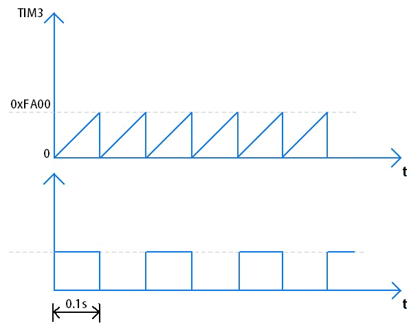
<br>
<figcaption>Fuente: https://www.electronicwings.com/pic/pic18f4550-timer</figcaption>
</div>

<div align="center">
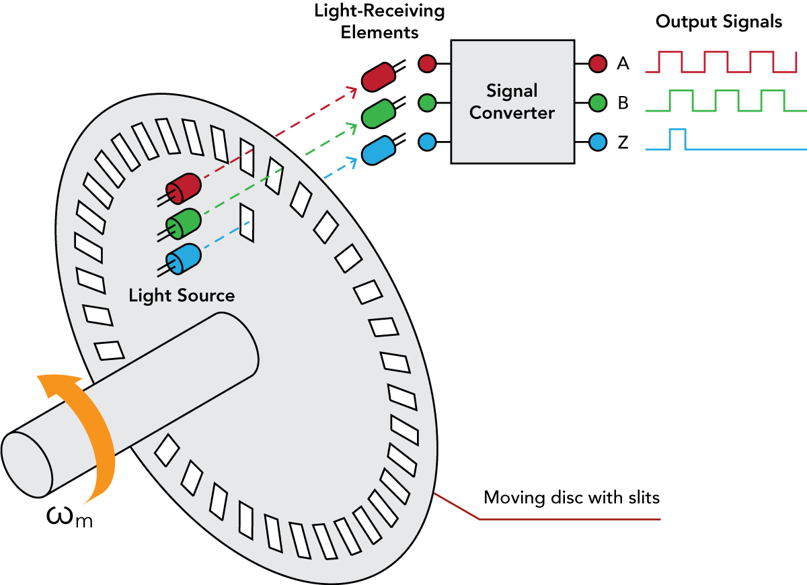
<br>
<figcaption>Fuente: https://www.futek.com/incremental-encoder-signal-converter</figcaption>
</div>

<div align="center">
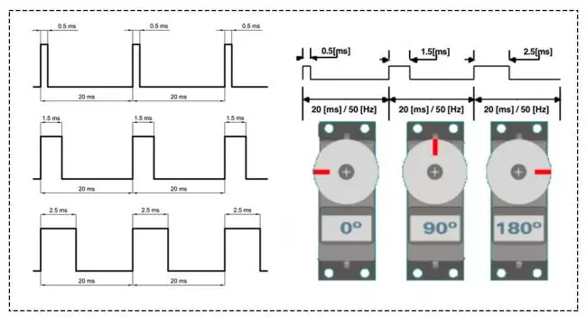
<br>
<figcaption>Fuente: https://www.zonamaker.com/servo-motores</figcaption>
</div>

<h3>Temporizadores en el STM32F767ZI</h3>

El microcontrolador STM32F767ZI cuenta con 15 temporizadores internos, a) 2 temporizadores de control avanzado de 16 bits (TMR1 y TMR8) que permite reconteo, b) 10 temporizadores de propósito general de 16 o 32 bits (TMR2, TMR3, TMR4, TMR5, TMR9, TMR10, TMR11, TMR12, TMR13 y TMR14), c) 2 temporizadores básicos (TMR6 y TMR7).

<div align="center">

<br>
<figcaption>Fuente: Manual de referencia</figcaption>
</div>

<div align="center">
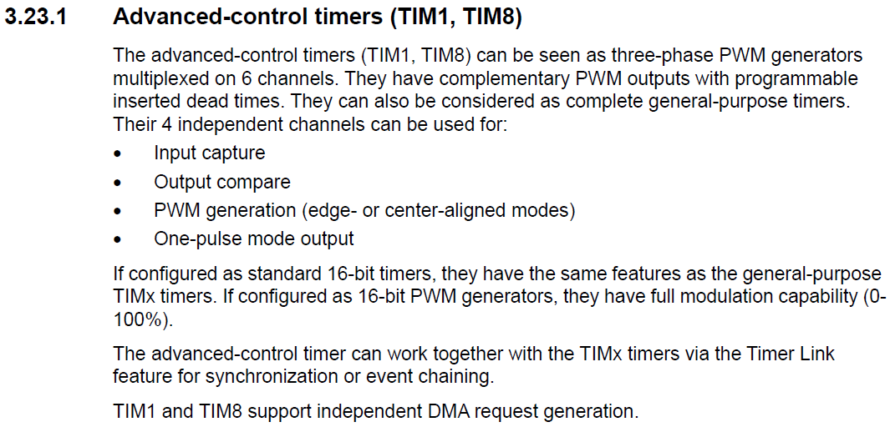
<br>
<figcaption>Fuente: Datasheet STM32F767ZI</figcaption>
</div>

<div align="center">
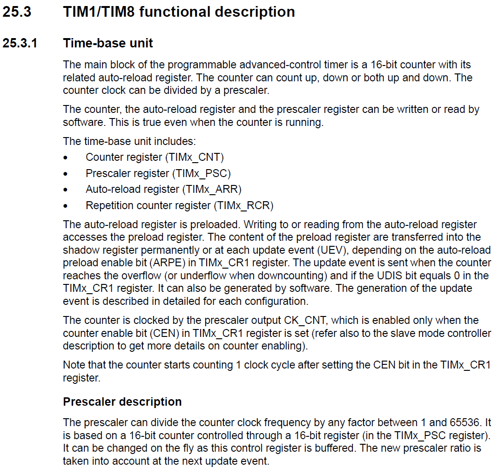
<br>
<figcaption>Fuente: Manual de referencia</figcaption>
</div>

<div align="center">
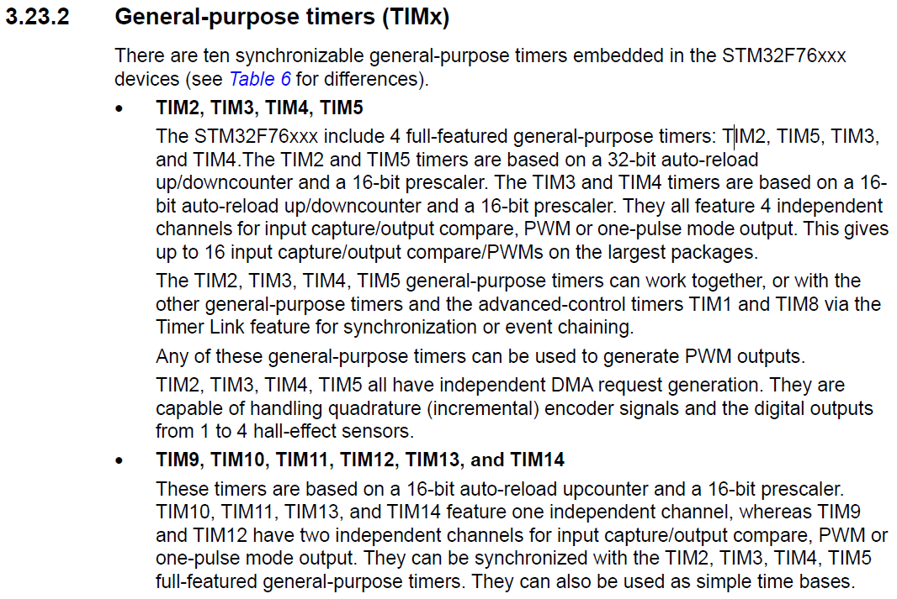
<br>
<figcaption>Fuente: Datasheet STM32F767ZI</figcaption>
</div>

<div align="center">
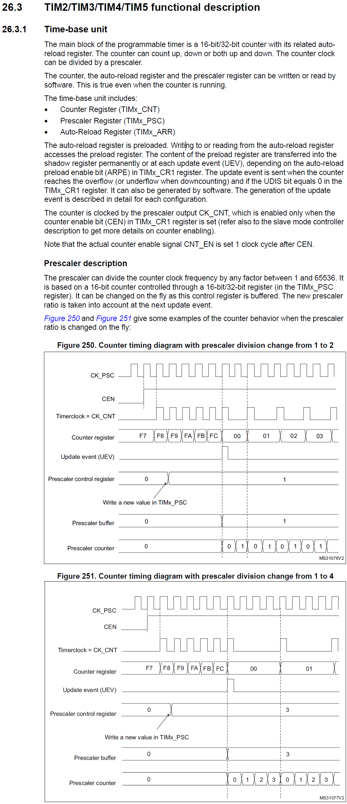
<br>
<figcaption>Fuente: Manual de referencia</figcaption>
</div>

<div align="center">
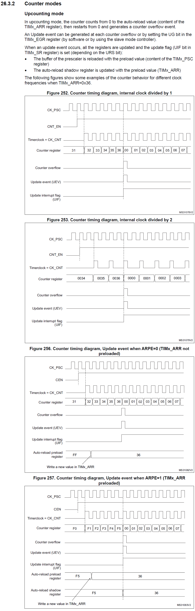
<br>
<figcaption>Fuente: Manual de referencia</figcaption>
</div>

<div align="center">
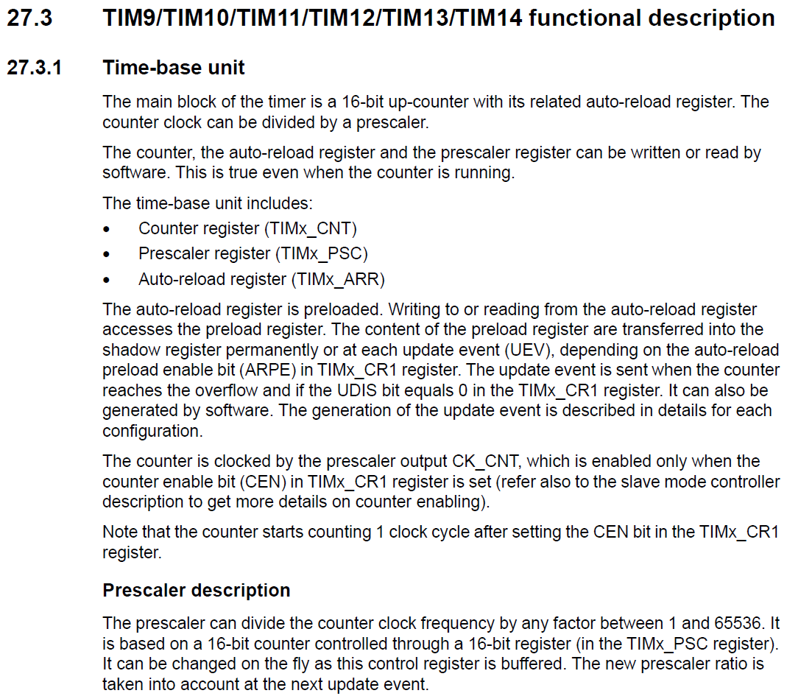
<br>
<figcaption>Fuente: Manual de referencia</figcaption>
</div>

<div align="center">
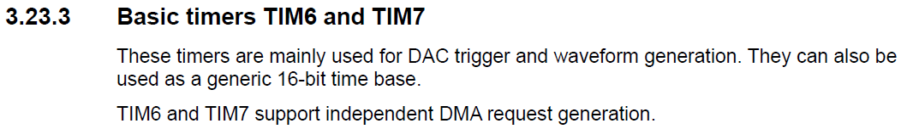
<br>
<figcaption>Fuente: Datasheet STM32F767ZI</figcaption>
</div>

<div align="center">
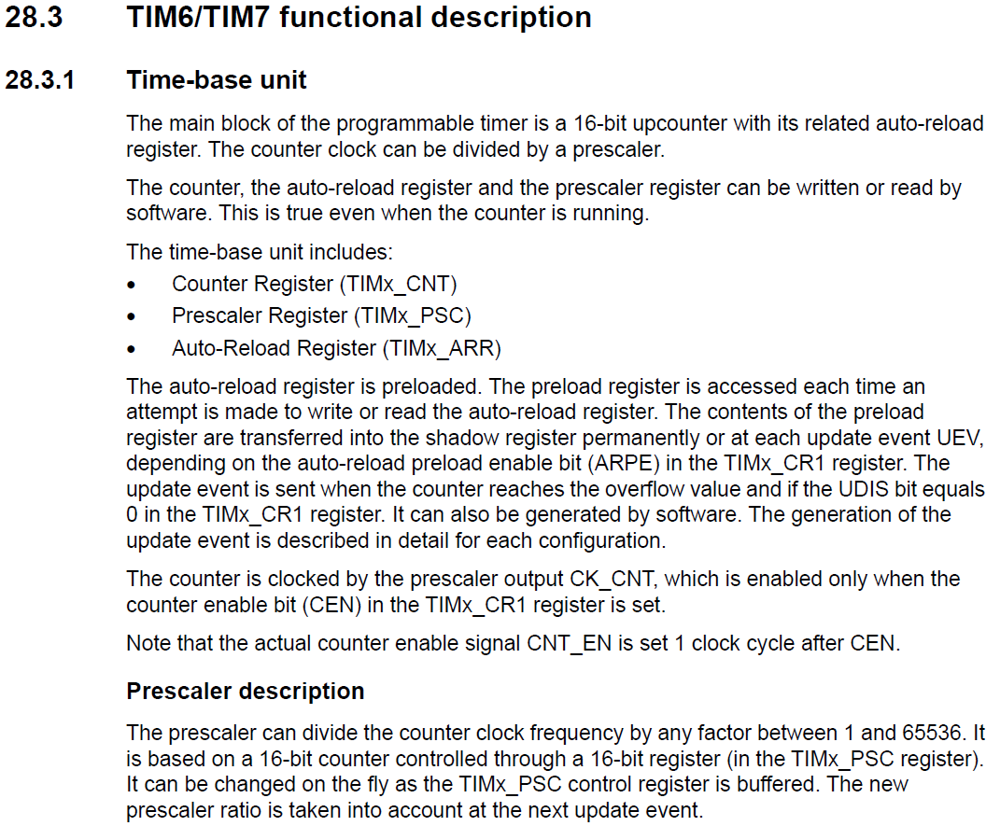
<br>
<figcaption>Fuente: Manual de referencia</figcaption>
</div>

Frecuencia de conteo

$$F_{CNT} = \frac{F_{PSC}=F_{OSC}}{PSC+1}$$

Calculo de la frecuencia para un tiempo determinado T

$$Freq_{update} = \frac{1}{T}$$

$$Freq_{update} = \frac{F_{OSC}}{(PSC+1) \cdot (ARR+1)}$$

1. Utilizar un prescaler pequeño (PSC) y sumar las interrrupciones de un tiempo pequeño (ej:1ms).
2. Buscar el tiempo aproximado (ej:100ms) para un valor de prescaler (PSC) para una interrupción y posteriormente encontrar el valor límite de conteo (ARR).

<div align="center">
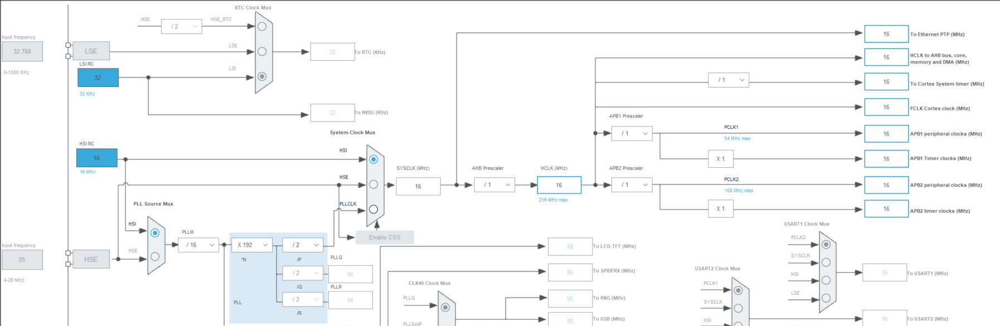
<br>
<figcaption>Fuente: Manual de referencia</figcaption>
</div>


<h3>Ejemplo</h3>

```c++
//Ejemplo TIMER
//Fabián Barrera Prieto
//Universidad ECCI
//STM32F767ZIT6U
//operation 'or' (|) for set bit and operation 'and' (&) for clear bit

#include <stdio.h>
#include "stm32f7xx.h"
#include <string.h>

uint8_t flag = 0, i, cont = 0;
unsigned char d;
char text[11];
uint16_t digital;
float voltaje;
uint32_t a, b, c;

void SysTick_Wait(uint32_t n){
    SysTick->LOAD = n - 1;
    SysTick->VAL = 0; 
    while (((SysTick->CTRL & 0x00010000) >> 16) == 0); 
}

void SysTick_ms(uint32_t x){
    for (uint32_t i = 0; i < x; i++){
        SysTick_Wait(16000); 
    }
}

extern "C"{
    void EXTI15_10_IRQHandler(void){
        EXTI->PR |= 1; 
        if(((GPIOC->IDR & (1<<13)) >> 13) == 1){
            flag = 1;
        }
    }

    void TIM3_IRQHandler(void){ // Interruption Timer 
        TIM3->SR &= ~(1<<0); // Clear the flag on TIM3 
        a = (~(GPIOB->ODR&(1<<7)));
        b = (GPIOB->ODR|(1<<7));
        c = a&b;
        GPIOB->ODR = c;
        cont += 1;
        if(cont == 50){
            cont = 0;
            flag = 1;
        }
    }


    void USART3_IRQHandler(void){ 
        if(((USART3->ISR & 0x20) >> 5) == 1){
            d = USART3->RDR;
            if(d == 'a'){
                flag = 1;
            }
        }
    }
}

int main(){
    //GPIOs
    RCC->AHB1ENR |= ((1<<1)|(1<<2)); 

    GPIOB->MODER &= ~((0b11<<0)|(0b11<<14));
    GPIOB->MODER |= ((1<<0)|(1<<14)); 
    GPIOC->MODER &= ~(0b11<<26);

    GPIOB->OTYPER &= ~((1<<0)|(1<<7));
    GPIOB->OSPEEDR |= (((1<<1)|(1<<0)|(1<<15)|(1<<14)));
    GPIOC->OSPEEDR |= ((1<<27)|(1<<26));
    GPIOB->PUPDR &= ~((0b11<<0)|(0b11<<14));
    GPIOC->PUPDR &= ~(0b11<<26);
    GPIOC->PUPDR |= (1<<27);

    //Systick
    SysTick->LOAD = 0x00FFFFFF; 
    SysTick->CTRL |= (0b101);

    //Interrupt
    RCC->APB2ENR |= (1<<14); 
    SYSCFG->EXTICR[3] &= ~(0b1111<<4); 
    SYSCFG->EXTICR[3] |= (1<<5); 
    EXTI->IMR |= (1<<13); 
    EXTI->RTSR |= (1<<13);
    NVIC_EnableIRQ(EXTI15_10_IRQn); 
            
    //UART
    RCC->AHB1ENR |= (1<<3); 
    GPIOD->MODER &= ~((0b11<<18)|(0b11<<16)); 
    GPIOD->MODER |= (1<<19)|(1<<17); 
    GPIOD->AFR[1] &= ~((0b1111<<4)|(0b1111<<0));
    GPIOD->AFR[1] |= (0b111<<4)|(0b111<<0); 
    RCC->APB1ENR |= (1<<18); 
    USART3->BRR = 0x683; 
    USART3->CR1 |= ((1<<5)|(0b11<<2)); 
    NVIC_EnableIRQ(USART3_IRQn); 

    //ADC
    GPIOC->MODER |= (0b11<<0); 
    RCC->APB2ENR |= (1<<9); 
    ADC2->CR2 |= ((1<<10)|(1<<0)); 
    ADC2->CR1 &= ~(0b11<<24); 
    ADC2->CR1 |= (1<<24); 
    ADC2->SMPR1 |= (1<<0); 
    ADC2->SQR3 &= ~(0b11111<<0); 
    ADC2->SQR3 |= (0b1010<<0); 
    
    //TIMER
    RCC->APB1ENR |= (1<<1); //Enable the TIMER3 clock 
    TIM3->PSC = 24; // Prescale factor 25 for 100ms of time
    TIM3->ARR = 63999; // Maximum count value
    TIM3->DIER |= (1<<0); //Enable IRQ on update		 
    TIM3->CR1 |= (1<<0); // Enable Counting
    NVIC_EnableIRQ(TIM3_IRQn); // Enable IRQ for TIM3 in NVIC	

    //UART
    USART3->CR1 |= (1<<0);

    while(1){
        GPIOB->ODR |= 1<<0; 
        SysTick_ms(500);
        GPIOB->ODR &= ~(1<<0);
        SysTick_ms(500);
        if(flag == 1){
            flag = 0;
            ADC2->CR2 |= (1<<30); // Start A/D conversion on ADC2 module for channel 10 on ADC2->SQR3 register
            while(((ADC2->SR & (1<<1)) >> 1) == 0){} //Check if the conversion is complete reading the EOC bit
            ADC2->SR &= ~(1<<1); //Clear the EOC bit
            digital = ADC2->DR;
            voltaje = (float)digital*(3.3/1023.0);
            sprintf(text,"pot: %.2fV\n", voltaje);
            for(i=0; i<strlen(text); i++){
                USART3->TDR = text[i]; 
                while(((USART3->ISR & 0x80) >> 7) == 0){}
            }
            //USART3->TDR = 0x0A; 
            //while((USART3->ISR & 0x80)==0){};
            USART3->TDR = 0x0D; 
            while(((USART3->ISR & 0x80) >> 7) == 0){}
        }  
    }
}
```

<div align="center">
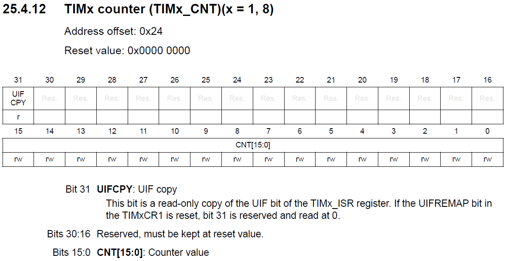
<br>
<figcaption>Fuente: Manual de referencia</figcaption>
</div>

<div align="center">
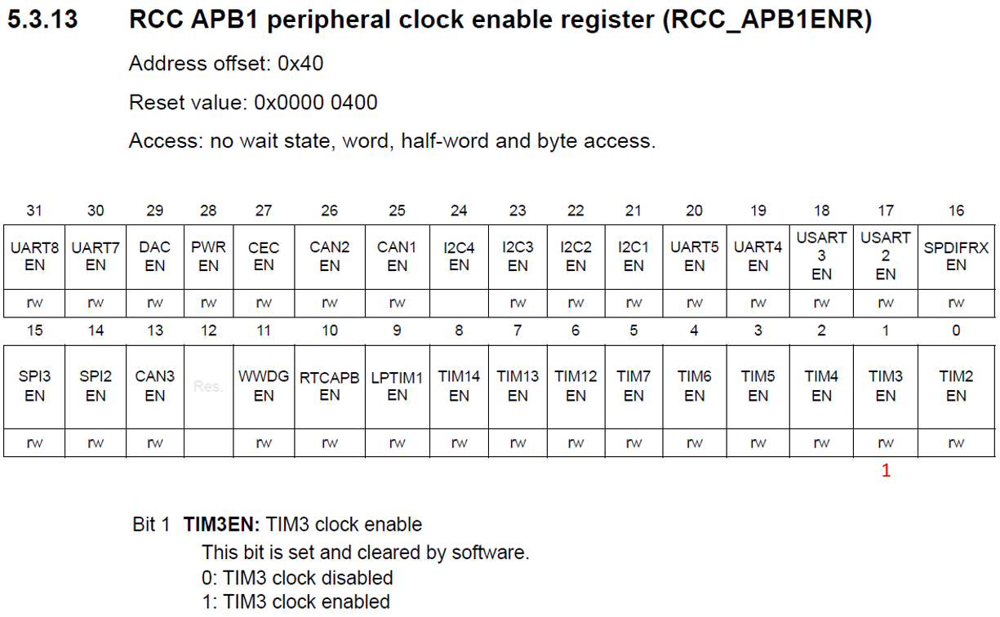
<br>
<figcaption>Fuente: Manual de referencia</figcaption>
</div>

<div align="center">
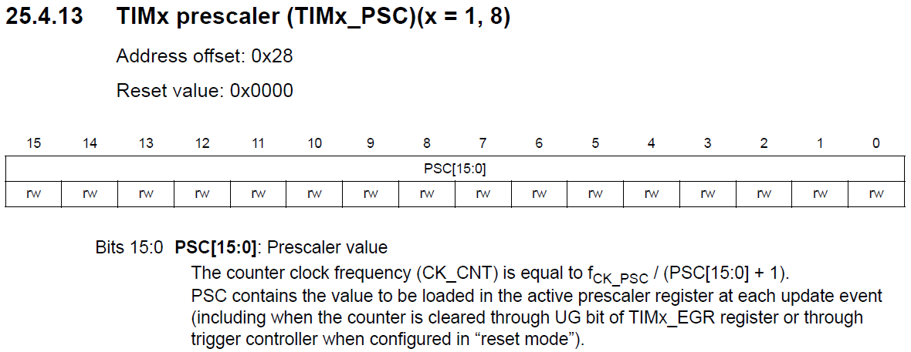
<br>
<figcaption>Fuente: Manual de referencia</figcaption>
</div>

<div align="center">
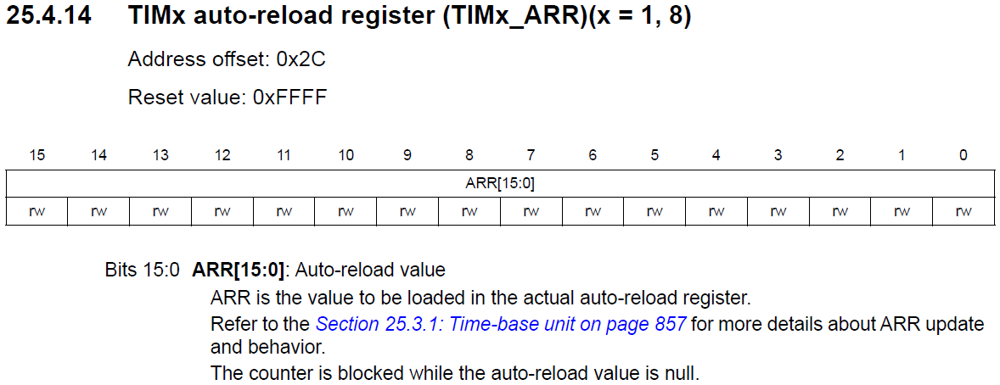
<br>
<figcaption>Fuente: Manual de referencia</figcaption>
</div>

<div align="center">
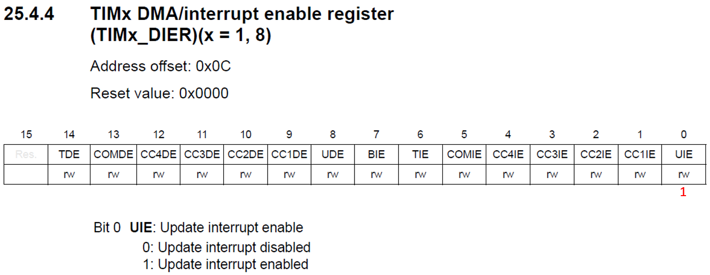
<br>
<figcaption>Fuente: Manual de referencia</figcaption>
</div>

<div align="center">
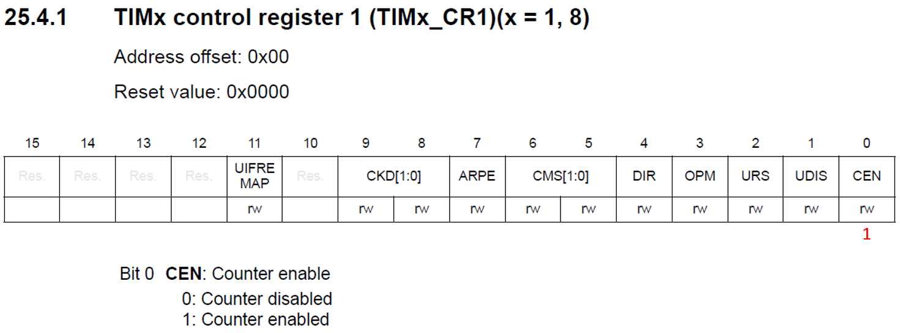
<br>
<figcaption>Fuente: Manual de referencia</figcaption>
</div>

<div align="center">
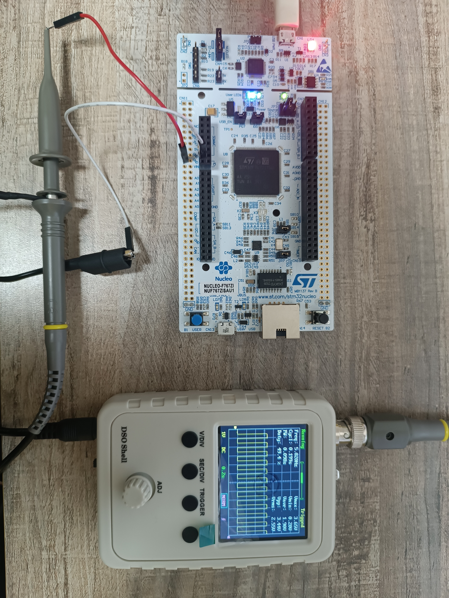
<br>
<figcaption>Fuente: Autor</figcaption>
</div>