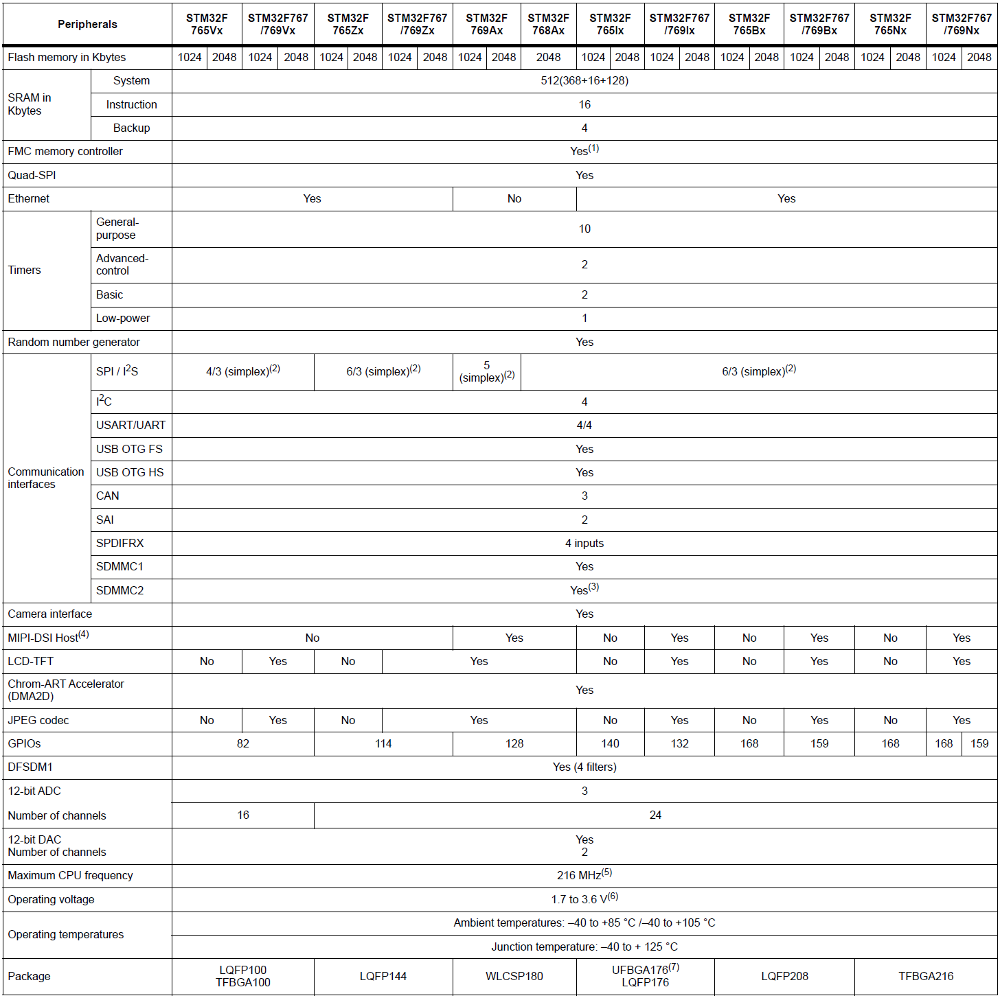
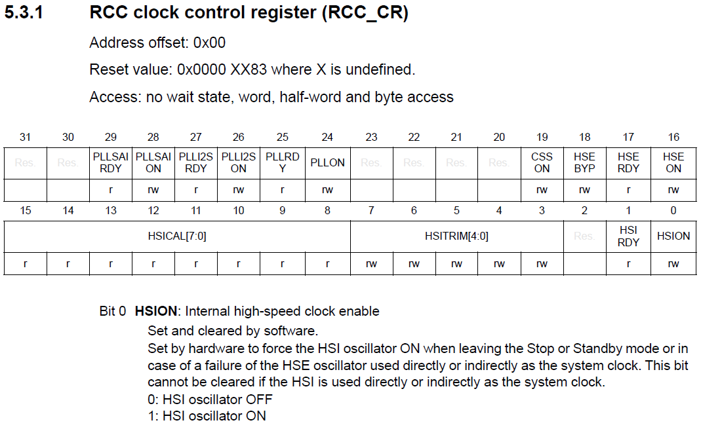
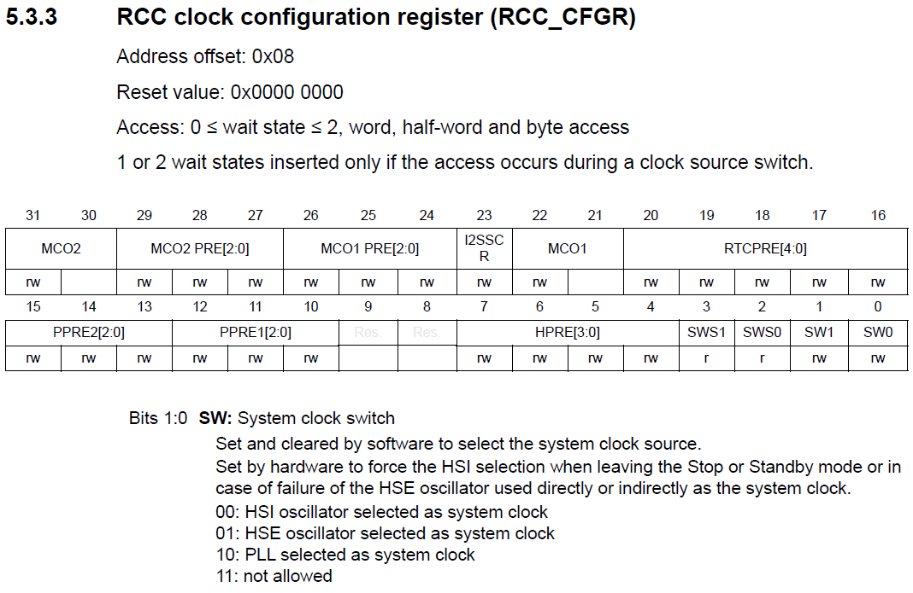
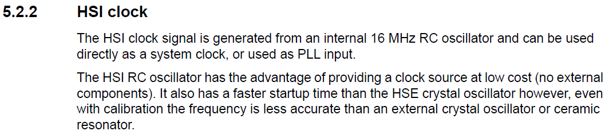
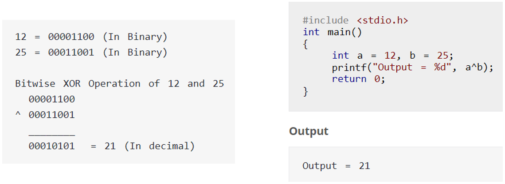
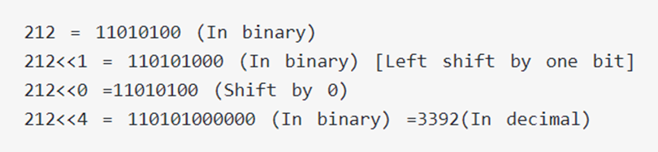

<h1>Aula 2</h1>

Esta clase consiste en realizar una introducción al microcontrolador STM32F767ZI y en repasar las operaciones bit a bit (bitwise)

<h2>Microcontrolador</h2>

El microcontrolador es un sistema programable que cuenta con una CPU (microprocesador), memorias (ROM y RAM), señal de reloj, periféricos, etc.

<div align="center">

<br>
<figcaption>Fuente: https://tecnoelite.co/que-es-un-microcontrolador-tipos-usos-y-historia/</figcaption>
</div>

<h3>Arquitectura Von Neumann</h3>

En la arquitectura Von Neumann la CPU se conecta a una única memoria central (RAM y ROM), por lo cual, se tienen únicamente tres buses para el control, las direcciones y el envío de datos e instrucciones para las dos memorias.

<div align="center">

<br>
<figcaption>Fuente: https://dianis-eliz.blogspot.com/</figcaption>
</div>

<h3>Arquitectura Harvard</h3>

En la arquitectura Harvard la CPU se conecta de manera independiente a las memorias RAM y ROM, por lo cual, se tienen tres buses para el control, las direcciones y el envío de datos e instrucciones para cada memoria, permitiendo tener acceso simultaneo a las dos.

<div align="center">

<br>
<figcaption>Fuente: https://dianis-eliz.blogspot.com/</figcaption>
</div>

<h2>Sistemas embebidos</h2>

Los sistemas embebidos son sistemas programables y diseñados para ejecutar tareas específicas, los cuales constan de un microcontrolador que está embebido o empotrado dentro de un sistema mayor, como lo es una tarjeta de desarrollo que incluye: programador, pinout de conexiones, reguladores de voltajes, acondicionamientos de salida de potencia (Push Pull y Open Drain), configuraciones de entradas (Pull Up y Pull Down).

<div align="center">

<br>
<figcaption>Fuente: https://www.sigmaelectronica.net/producto/nucleo-f767zi/</figcaption>
</div>

<h2>Introducción al micro STM32</h2>

El microcontrolador STM32F767ZI cuenta con un procesador ARM Cortex M7 de arquitectura Harvard de 32 bits de empaquetado QFP144. Entre las características más importantes de este microcontrolador se destacan:

- Operación de voltaje (1.7V a 3.6V)
- Frecuencia (máximo 216 MHz)
- GPIOs (144)
- Flash (2 MB)
- Memoria SRAM (512 KB = 368+16+128 KB)
- Interrupciones externas (25)
- Timers (15)
- Protocolos de comunicación (USART (8), SPI (6), I2C (4), I2S (2), CAN (3), USB, etc.)
- Ethernet
- Interfaz de cámara
- ADC 12 bits 24 canales (3)
- DAC 12 bits (2)
- CCP 4 canales (13)

<div align="center">

<br>
<figcaption>Fuente: Datasheet micro STM32F767ZI</figcaption>
</div>

El hardware (diagrama de bloques) del micro STM32F767ZI tiene como principal característica el uso de frecuencias diferentes para los diferentes buses de datos

<div align="center">

<br>
<figcaption>Fuente: Datasheet micro STM32F767ZI</figcaption>
</div>

La funcionalidad de los pines del microcontrolador STM32F767ZI se encuentran en la tabla 11 y 13 del datasheet.

<h2>Clock</h2>

<div align="center">

<br>
<figcaption>Fuente: Manual de referencia</figcaption>
</div>

<div align="center">

<br>
<figcaption>Fuente: Manual de referencia</figcaption>
</div>

<div align="center">

<br>
<figcaption>Fuente: Manual de referencia</figcaption>
</div>

<h2>Bitwise</h2>

Las operaciones bitwise son aquellas que permiten realizar operaciones bit a bit, tales como: suma booleana “or” (|), multiplicación booleana “and” (&), negación “not” (~), disyunción exclusiva “xor” (^) y desplazamiento (<< ó >>).

```c
uint8_t a, b, c, d, e, f, g, h, i;
a = 0b01011100; //0x5C
b = 0b10111010; //0xBA
c = a & b; //0b00011000 = 0x18
d = a | b; //0b11111110 = 0xFE
e = ~a; //0b10100011 = 0xA3
f = ~b; //0b01000101 = 0x45
g = a ^ b; //0b11100110 = 0xE6
h = a << 3; //0b11100000 = 0xE0
i = b >> 2; //0b00101110 = 0x2E
```

Uniendo diferentes operaciones bitwise

```c
uint8_t data = 0x00;

data |= (0x01<<4); //0b00000000 | 0b00010000
                   //0b00010000
data &= ~(0x01<<4); //0b00010000 & ~(0b00010000)
                    //0b00010000 & 0b11101111
                    //0b00000000
```

Las operaciones bitwise son aquellas que permiten realizar operaciones bit a bit, tales como: Suma booleana “or” (|), Multiplicación booleana “and” (&), Negación “not” (~), Disyunción exclusiva “xor” y Desplazamiento (<< ó >>).

<h3>AND</h3>

<div align="center">

<br>
<figcaption>Fuente: https://www.programiz.com/c-programming/bitwise-operators</figcaption>
</div>

```c
#include <stdio.h>

int main(){
    int a = 12, b = 25;
    printf("Output = %d", a&b);
    return 0;
}
```

<h3>OR</h3>

<div align="center">

<br>
<figcaption>Fuente: https://www.programiz.com/c-programming/bitwise-operators</figcaption>
</div>

```c
#include <stdio.h>

int main(){
    int a = 12, b = 25;
    printf("Output = %d", a|b);
    return 0;
}
```

<h3>XOR</h3>

<div align="center">

<br>
<figcaption>Fuente: https://www.programiz.com/c-programming/bitwise-operators</figcaption>
</div>

```c
#include <stdio.h>

int main(){
    int a = 12, b = 25;
    printf("Output = %d", a^b);
    return 0;
}
```

<h3>NOT</h3>

<div align="center">

<br>
<figcaption>Fuente: https://www.programiz.com/c-programming/bitwise-operators</figcaption>
</div>

```c
#include <stdio.h>

int main(){
    int a = 12, b = 25;
    printf("Output = %d \n", ~35); //signed
    printf("Output = %d \n", ~-12);
    return 0;
}
```

<h2>Corrimientos</h2>

<h3>Corrimientos a la derecha</h3>

<div align="center">

<br>
<figcaption>Fuente: https://www.programiz.com/c-programming/bitwise-operators</figcaption>
</div>

<h3>Corrimientos a la izquierda</h3>

<div align="center">

<br>
<figcaption>Fuente: https://www.programiz.com/c-programming/bitwise-operators</figcaption>
</div>

<h3>Combinación de corrimientos</h3>

<div align="center">

<br>
<figcaption>Fuente: https://www.programiz.com/c-programming/bitwise-operators</figcaption>
</div>

```c
#include <stdio.h>

int main(){
    int num=212, i;

    for(i=0; i<=2; i++){
        printf("Right shift by %d: %d \n", i, num>>i);
    }
    
    for(i=0; i<=2; i++){
        printf("Left shift by %d: %d \n", i, num<<i);
    }
    
    return 0;
}
```

