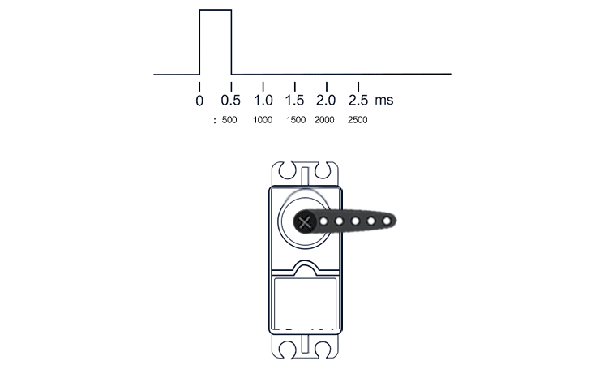
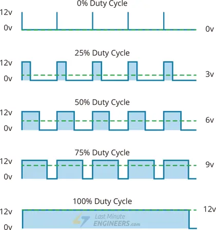
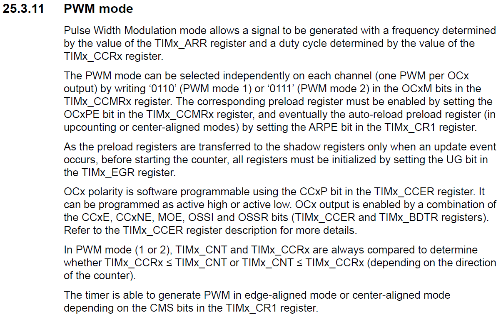
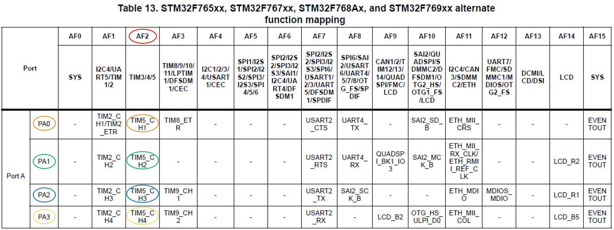

<h1>Aula 22</h1>

Esta clase consiste en comprender el PWM (Modulación por Ancho de Pulso) y utilizarlo en la tarjeta NUCLEO STM32F767ZI

<h2>PWM</h2>

Una modulación por ancho de pulso (PWM) se caracteriza por una señal que tiene una frecuencia determinada, la cual se compone por un tiempo en alto (duty cycle) y/o un tiempo en bajo. Son utilizados para variar la intensidad de luz de leds, variar velocidad de motores DC, variar la posición angular de servomotores, etc.

<div align="center">

<br>
<figcaption>Fuente: https://exploreembedded.com/wiki/LPC1768:_PWM</figcaption>
</div>

<div align="center">

<br>
<figcaption>Fuente: https://www.gie.com.my/shop.php?action=robotics/motors/ldx335</figcaption>
</div>

La variación de una señal PWM consiste la variación desde 0% hasta 100% en el ciclo útil de dicha señal, por tanto, es posible obtener diferentes valores de salida de voltaje de manera proporcional al valor máximo de voltaje.

<div align="center">

<br>
<figcaption>Fuente: https://arduinokitproject.com/l298n-dc-stepper-driver-arduino-tutorial/</figcaption>
</div>

<h2>PWM en el STM32F767ZI</h2>

Los TIMERs 1, 8, 2, 3, 4, 5, 9, 10, 11, 12, 13 y 14
Cada uno de estos puede generar hasta 4 PWMs a través de los registros CCR1, CCR2, CCR3 y CCR4

<div align="center">

<br>
<figcaption>Fuente: Manual de referencia</figcaption>
</div>


<h3>Ejemplo</h3>

```c
//Ejemplo PWM
//Fabián Barrera Prieto
//Universidad ECCI
//STM32F767ZIT6U
//operation 'or' (|) for set bit and operation 'and' (&) for clear bit

#include <stdio.h>
#include "stm32f7xx.h"

void SysTick_Wait(uint32_t n){
    SysTick->LOAD = n - 1;
    SysTick->VAL = 0; 
    while (((SysTick->CTRL & 0x00010000) >> 16) == 0); 
}

void SysTick_ms(uint32_t x){
    for (uint32_t i = 0; i < x; i++){
        SysTick_Wait(16000); 
    }
}

unsigned char i;

int main(){

    //PWM
    RCC->AHB1ENR |= (1<<0); //Enable the GPIOA clock (TIM1_CH1, TIM1_CH2, TIM1_CH3 and TIM1_CH4 are connected on PA8, PA9, PA10 and PA11, respectively)
    GPIOA->MODER |= (1<<23)|(1<<21)|(1<<19)|(1<<17); //Set 10 on pins PA11=TIM1_CH4 (bits 23:22), PA10=TIM1_CH3 (bits 21:20), PA9=TIM1_CH2 (bits 19:18)and PA9=TIM1_CH2 (bits 17:16) as alternant function
    GPIOA->AFR[1] |= (1<<12)|(1<<8)|(1<<4)|(1<<0); //Set the TIM1_CH1 on AF1, TIM1_CH2 on AF1, TIM1_CH3 on AF1 and TIM1_CH4 on AF1 alternants functions for pins PA11=TIM1_CH4 (bits 23:22), PA10=TIM1_CH3 (bits 21:20), PA9=TIM1_CH2 (bits 19:18)and PA9=TIM1_CH2 (bits 17:16)
    RCC->APB1ENR |= (1<<0); //TIM1 clock enable 
    TIM1->PSC = 4; //Prescale factor 25 for 20ms of time
    TIM1->ARR = 63999; // Maximum count value for 20ms of time
    TIM1->CR1 |= (1<<0); // Enable counting
    TIM1->CCMR1 |= (0b110<<12)|(0b110<<4); //Set PWM mode on CH2 (bits 24, 14:12) and CH1 (bits 16, 6:4)
    TIM1->CCMR2 |= (0b110<<12)|(0b110<<4); //Set PWM mode on CH4 (bits 24, 14:12) and CH3 (bits 16, 6:4)
    TIM1->CCER |= (1<<12)|(1<<8)|(1<<4)|(1<<0);//Enable CH4, CH3, CH2, CH1 channels as outputs 
    TIM1->EGR |= (1<<0); //Reinitialize the counter and generates an update of the registers

    while(1){
        for(i=0; i<=180; i++){
            TIM1->CCR1 = int((35.556*180.0)+1600.0); //Duty Cycle between 1600 (0°) and 8000 (180°)
            TIM1->CCR2 = int((35.556*180.0)+1600.0);
            TIM1->CCR3 = int((35.556*180.0)+1600.0);
            TIM1->CCR4 = int((35.556*180.0)+1600.0);
            SysTick_ms(500);
        }
    }
}
```

<div align="center">

<br>
<figcaption>Fuente: Manual de referencia</figcaption>
</div>