<h1>Aula 22</h1>

Esta clase consiste en comprender el PWM (Modulación por Ancho de Pulso) y utilizarlo en la tarjeta NUCLEO STM32F767ZI

<h2>PWM</h2>

Una modulación por ancho de pulso (PWM) se caracteriza por una señal que tiene una frecuencia determinada, la cual se compone por un tiempo en alto (duty cycle) y/o un tiempo en bajo. Son utilizados para variar la intensidad de luz de leds, variar velocidad de motores DC, variar la posición angular de servomotores, etc.

<div align="center">

<br>
<figcaption>Fuente: https://exploreembedded.com/wiki/LPC1768:_PWM</figcaption>
</div>

<div align="center">

<br>
<figcaption>Fuente: https://www.gie.com.my/shop.php?action=robotics/motors/ldx335</figcaption>
</div>

La variación de una señal PWM consiste la variación desde 0% hasta 100% en el ciclo útil de dicha señal, por tanto, es posible obtener diferentes valores de salida de voltaje de manera proporcional al valor máximo de voltaje.

<div align="center">

<br>
<figcaption>Fuente: https://arduinokitproject.com/l298n-dc-stepper-driver-arduino-tutorial/</figcaption>
</div>

<h2>PWM en el STM32F767ZI</h2>

Una de las características principales de los TIMERs en el microcontrolador STM32F767ZI es que pueden tener hasta 4 canales de salida en los GPIOs de la tarjeta NUCLEO F767ZI, por lo que se pueden llegar a tener hasta 4 salidas de PWM con un solo TIMER a través de los registros CCR1, CCR2, CCR3 y CCR4. Los TIMERs 1, 2, 3, 4, 5 y 8 cuentan con cuatro canales de salidas, mientras que los TIMERs 9 y 12 tienen dos canales de salida y los TIMERs 10, 11, 13 y 14 tienen un único canal de salida.

<div align="center">
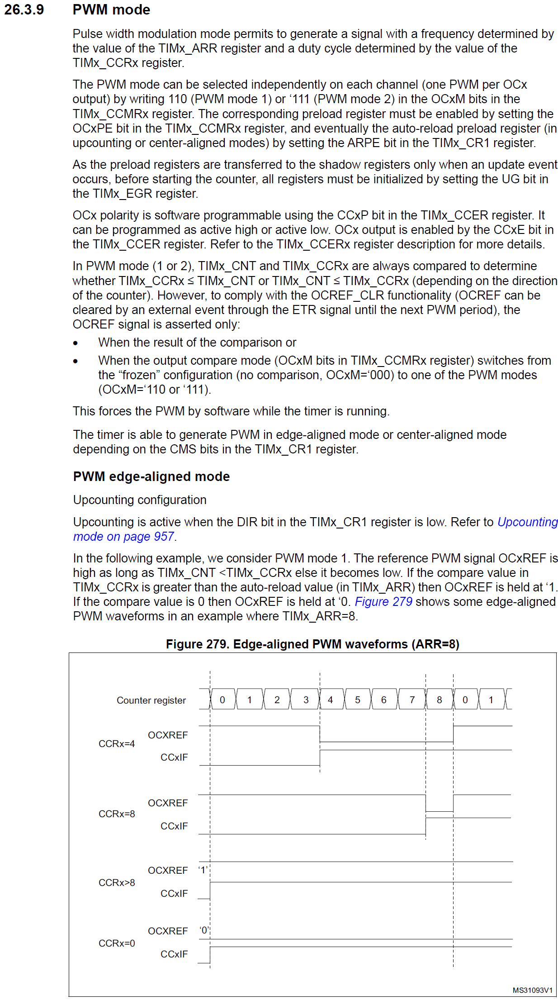
<br>
<figcaption>Fuente: Manual de referencia</figcaption>
</div>


<h3>Ejemplo</h3>

```c
//Ejemplo PWM
//Fabián Barrera Prieto
//Universidad ECCI
//STM32F767ZIT6U
//operation 'or' (|) for set bit and operation 'and' (&) for clear bit

#include <stdio.h>
#include "stm32f7xx.h"
#include <string.h>

uint8_t flag = 0, j, cont = 0;
unsigned char d;
char text[22];
uint16_t digital;
float voltaje, DC, servo;
uint32_t a, b, c;

void SysTick_Wait(uint32_t n){
    SysTick->LOAD = n - 1;
    SysTick->VAL = 0; 
    while (((SysTick->CTRL & 0x00010000) >> 16) == 0); 
}

void SysTick_ms(uint32_t x){
    for (uint32_t i = 0; i < x; i++){
        SysTick_Wait(16000); 
    }
}

extern "C"{
    void EXTI15_10_IRQHandler(void){
        EXTI->PR |= 1; 
        if(((GPIOC->IDR & (1<<13)) >> 13) == 1){
            flag = 1;
        }
    }

    void TIM3_IRQHandler(void){ 
        TIM3->SR &= ~(1<<0); 
        a = (~(GPIOB->ODR&(1<<7)));
        b = (GPIOB->ODR|(1<<7));
        c = a&b;
        GPIOB->ODR = c;
        cont += 1;
        if(cont == 50){
            cont = 0;
            flag = 1;
        }
    }


    void USART3_IRQHandler(void){ 
        if(((USART3->ISR & 0x20) >> 5) == 1){
            d = USART3->RDR;
            if(d == 'a'){
                flag = 1;
            }
        }
    }
}

int main(){

    //GPIOs
    RCC->AHB1ENR |= ((1<<1)|(1<<2)); 

    GPIOB->MODER &= ~((0b11<<0)|(0b11<<14));
    GPIOB->MODER |= ((1<<0)|(1<<14)); 
    GPIOC->MODER &= ~(0b11<<26);

    GPIOB->OTYPER &= ~((1<<0)|(1<<7));
    GPIOB->OSPEEDR |= (((1<<1)|(1<<0)|(1<<15)|(1<<14)));
    GPIOC->OSPEEDR |= ((1<<27)|(1<<26));
    GPIOB->PUPDR &= ~((0b11<<0)|(0b11<<14));
    GPIOC->PUPDR &= ~(0b11<<26);
    GPIOC->PUPDR |= (1<<27);

    //Systick
    SysTick->LOAD = 0x00FFFFFF; 
    SysTick->CTRL |= (0b101);

    //Interrupt
    RCC->APB2ENR |= (1<<14); 
    SYSCFG->EXTICR[3] &= ~(0b1111<<4); 
    SYSCFG->EXTICR[3] |= (1<<5); 
    EXTI->IMR |= (1<<13); 
    EXTI->RTSR |= (1<<13);
    NVIC_EnableIRQ(EXTI15_10_IRQn); 
            
    //UART
    RCC->AHB1ENR |= (1<<3); 
    GPIOD->MODER &= ~((0b11<<18)|(0b11<<16)); 
    GPIOD->MODER |= (1<<19)|(1<<17); 
    GPIOD->AFR[1] &= ~((0b1111<<4)|(0b1111<<0));
    GPIOD->AFR[1] |= (0b111<<4)|(0b111<<0); 
    RCC->APB1ENR |= (1<<18); 
    USART3->BRR = 0x683; 
    USART3->CR1 |= ((1<<5)|(0b11<<2)); 
    NVIC_EnableIRQ(USART3_IRQn); 

    //ADC
    GPIOC->MODER |= (0b11<<0); 
    RCC->APB2ENR |= (1<<9); 
    ADC2->CR2 |= ((1<<10)|(1<<0)); 
    ADC2->CR1 &= ~(0b11<<24); 
    ADC2->CR1 |= (1<<24); 
    ADC2->SMPR1 |= (1<<0); 
    ADC2->SQR3 &= ~(0b11111<<0); 
    ADC2->SQR3 |= (0b1010<<0); 
    
    //TIMER
    RCC->APB1ENR |= (1<<1); 
    TIM3->PSC = 24; 
    TIM3->ARR = 63999;
    TIM3->DIER |= (1<<0);
    TIM3->CR1 |= (1<<0); 
    NVIC_EnableIRQ(TIM3_IRQn); 

    //PWM
    RCC->AHB1ENR |= (1<<0); //Enable the GPIOA clock (TIM5_CH1, TIM5_CH2, TIM5_CH3 and TIM5_CH4 are connected on PA0, PA1, PA2 and PA3, respectively)
    GPIOA->MODER |= (1<<7)|(1<<5)|(1<<3)|(1<<1); //Set 10 on pins PA3=TIM5_CH4 (bits 7:6), PA2=TIM5_CH3 (bits 5:4), PA1=TIM5_CH2 (bits 3:2)and PA0=TIM5_CH1 (bits 1:0) as alternant function
    GPIOA->AFR[0] |= (1<<13)|(1<<9)|(1<<5)|(1<<1); //Set the PA3=TIM5_CH4 (bits 15:12), PA2=TIM5_CH3 (bits 11:8), PA1=TIM5_CH2 (bits 7:4) and PA0=TIM5_CH1 (bits 3:0) as AF2 alternants functions 
    RCC->APB1ENR |= (1<<3); //TIM5 clock enable 
    TIM5->PSC = 4; //Prescale factor 25 for 20ms of time
    TIM5->ARR = 63999; // Maximum count value for 20ms of time
    TIM5->CR1 |= (1<<0); // Enable counting
    TIM5->CCMR1 |= (0b110<<12)|(0b110<<4); //Set PWM mode on CH2 (bits 24, 14:12) and CH1 (bits 16, 6:4)
    TIM5->CCMR2 |= (0b110<<12)|(0b110<<4); //Set PWM mode on CH4 (bits 24, 14:12) and CH3 (bits 16, 6:4)
    TIM5->CCER |= (1<<12)|(1<<8)|(1<<4)|(1<<0);//Enable CH4, CH3, CH2, CH1 channels as outputs 
    TIM5->EGR |= (1<<0); //Reinitialize the counter and generates an update of the registers

    //UART
    USART3->CR1 |= (1<<0);

    while(1){
        GPIOB->ODR |= 1<<0; 
        SysTick_ms(500);
        GPIOB->ODR &= ~(1<<0);
        SysTick_ms(500);
        if(flag == 1){
            flag = 0;
            ADC2->CR2 |= (1<<30); 
            while(((ADC2->SR & (1<<1)) >> 1) == 0){}
            ADC2->SR &= ~(1<<1); 
            digital = ADC2->DR;
            voltaje = (float)digital*(3.3/1023.0);
            DC = ((0.6061*voltaje)+0.5);
            servo = voltaje*(180.0/3.3);
            TIM5->CCR1 = (int)((1939.48*(voltaje))+1600.0); //Duty Cycle between 1600 (0°) and 8000 (180°)
            sprintf(text,"servo: %.2f\u00B0(%.2fms)\n", servo, DC);
            for(j=0; j<strlen(text); j++){
                USART3->TDR = text[j]; 
                while(((USART3->ISR & 0x80) >> 7) == 0){}
            }
            //USART3->TDR = 0x0A; 
            //while((USART3->ISR & 0x80)==0){};
            USART3->TDR = 0x0D; 
            while(((USART3->ISR & 0x80) >> 7) == 0){}
        }  
    }
}
```

<div align="center">
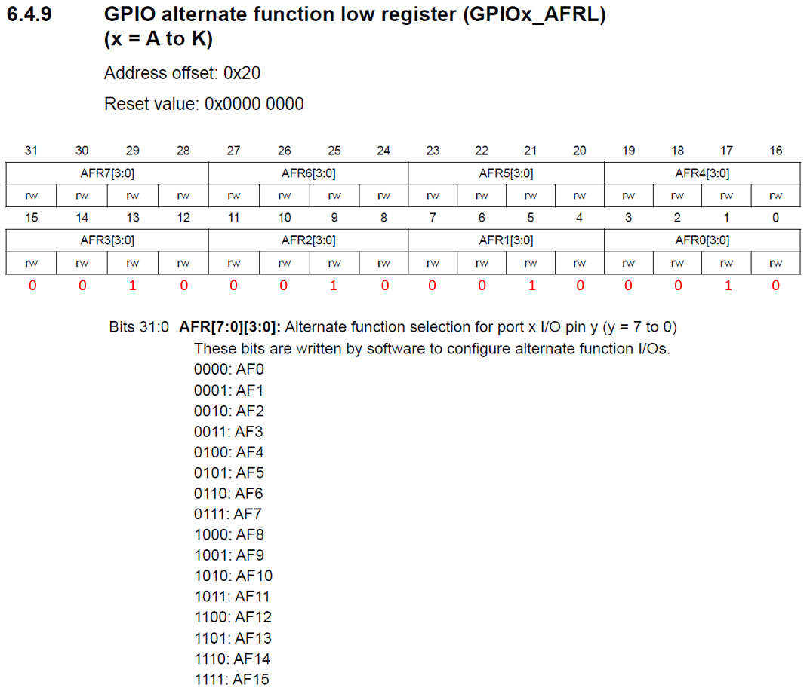
<br>
<figcaption>Fuente: Manual de referencia</figcaption>
</div>

<div align="center">
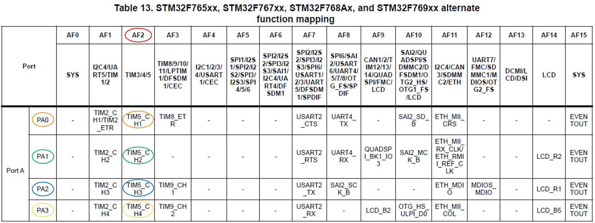
<br>
<figcaption>Fuente: Manual de referencia</figcaption>
</div>

<div align="center">
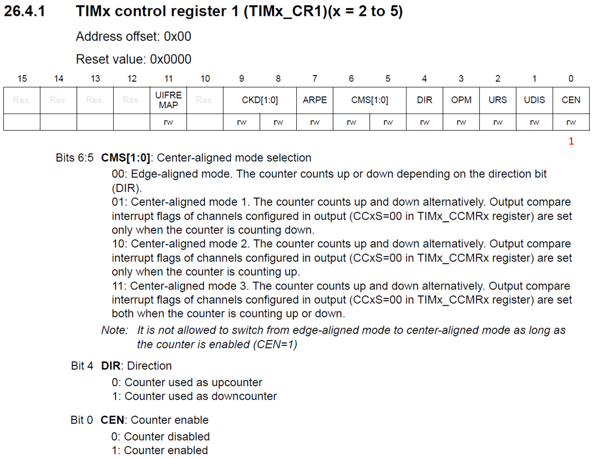
<br>
<figcaption>Fuente: Manual de referencia</figcaption>
</div>

<div align="center">
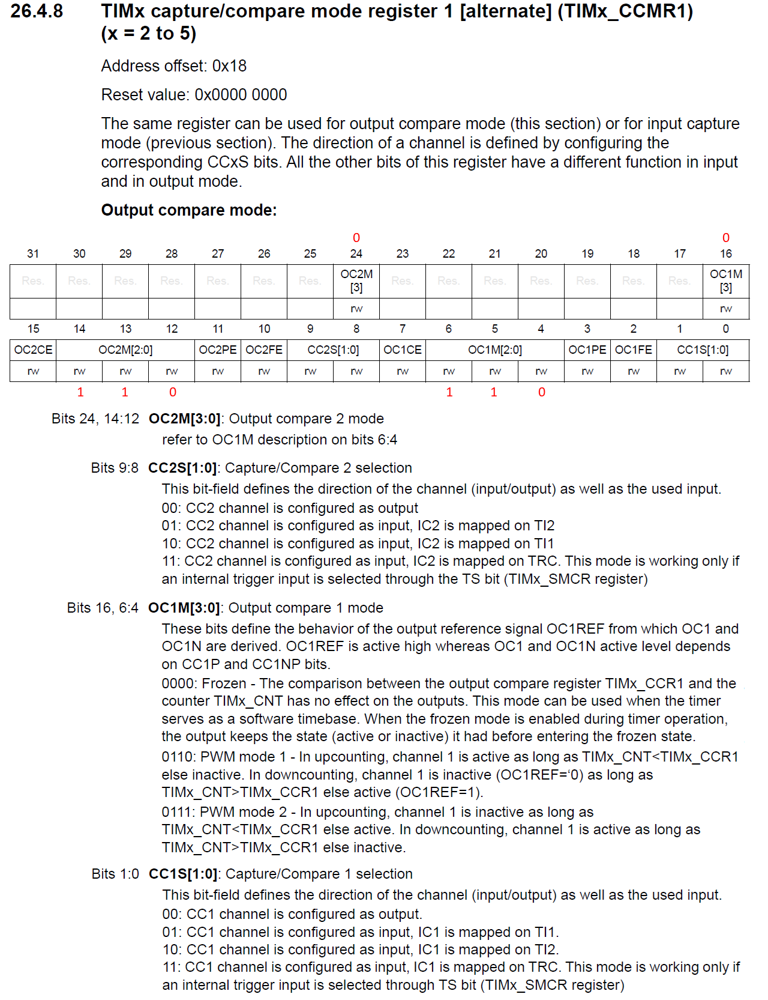
<br>
<figcaption>Fuente: Manual de referencia</figcaption>
</div>

<div align="center">
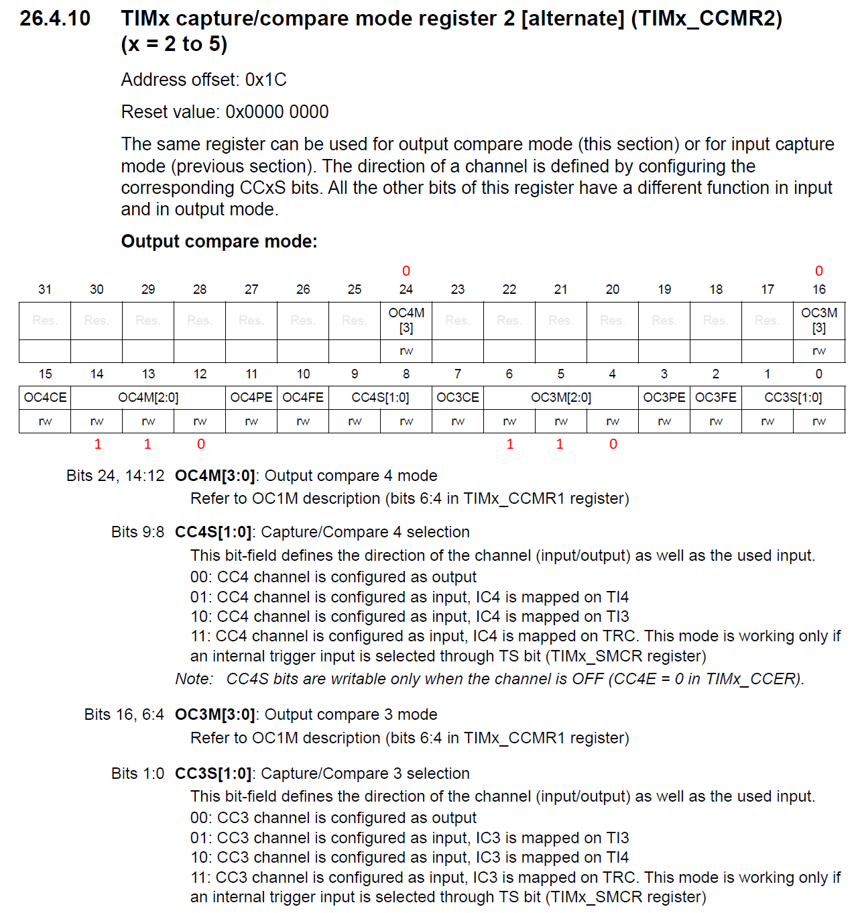
<br>
<figcaption>Fuente: Manual de referencia</figcaption>
</div>

<div align="center">
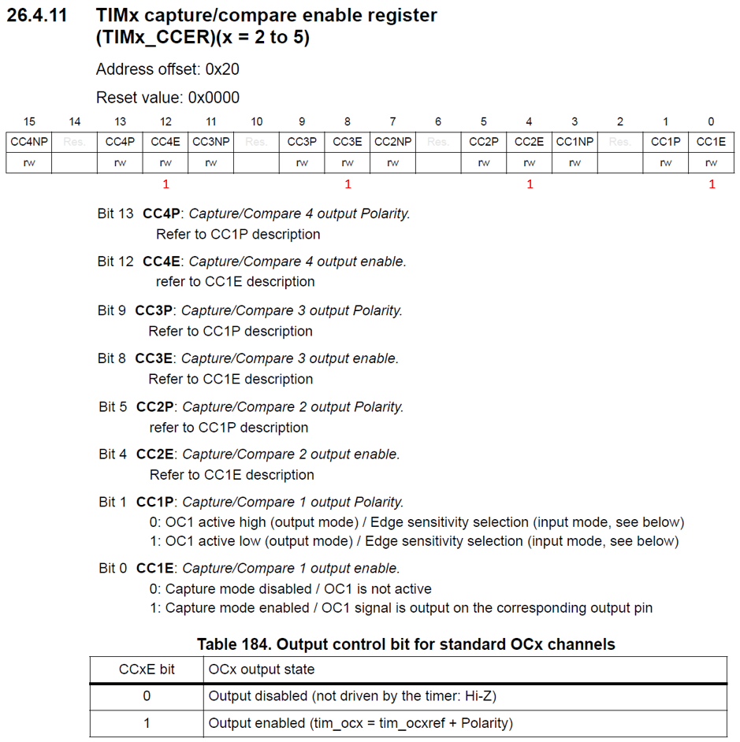
<br>
<figcaption>Fuente: Manual de referencia</figcaption>
</div>

<div align="center">
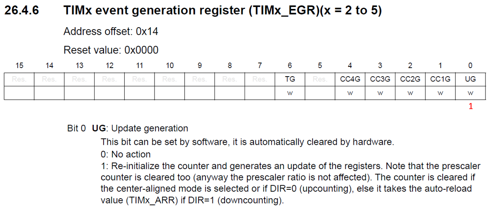
<br>
<figcaption>Fuente: Manual de referencia</figcaption>
</div>

<div align="center">
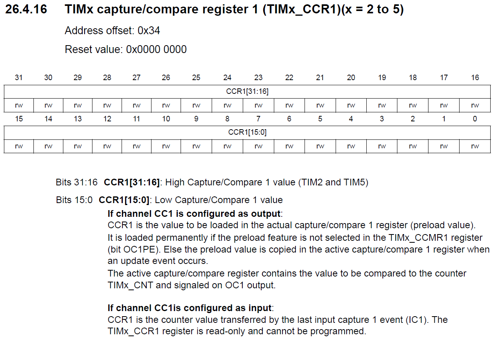
<br>
<figcaption>Fuente: Manual de referencia</figcaption>
</div>

<div align="center">
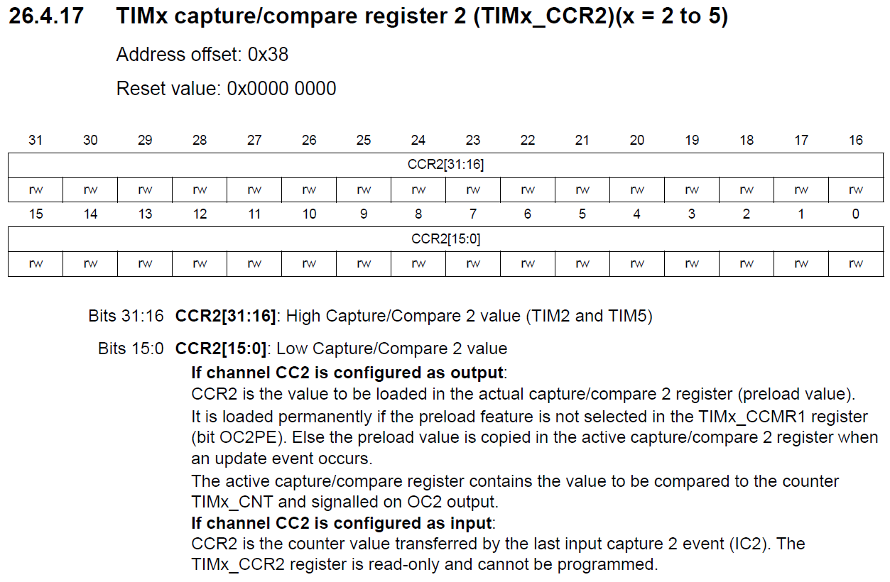
<br>
<figcaption>Fuente: Manual de referencia</figcaption>
</div>

<div align="center">
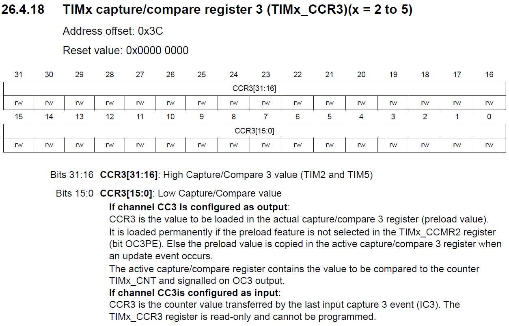
<br>
<figcaption>Fuente: Manual de referencia</figcaption>
</div>

<div align="center">
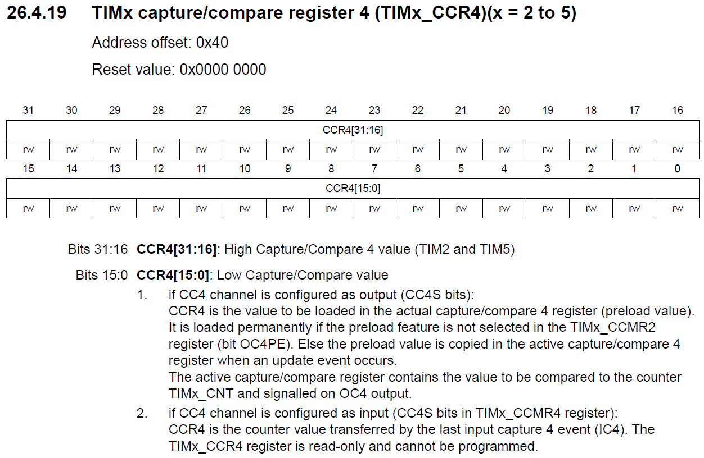
<br>
<figcaption>Fuente: Manual de referencia</figcaption>
</div>
