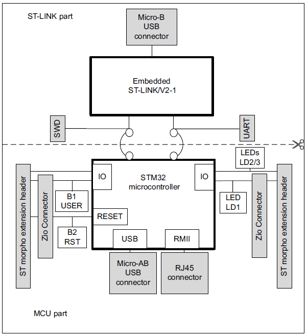
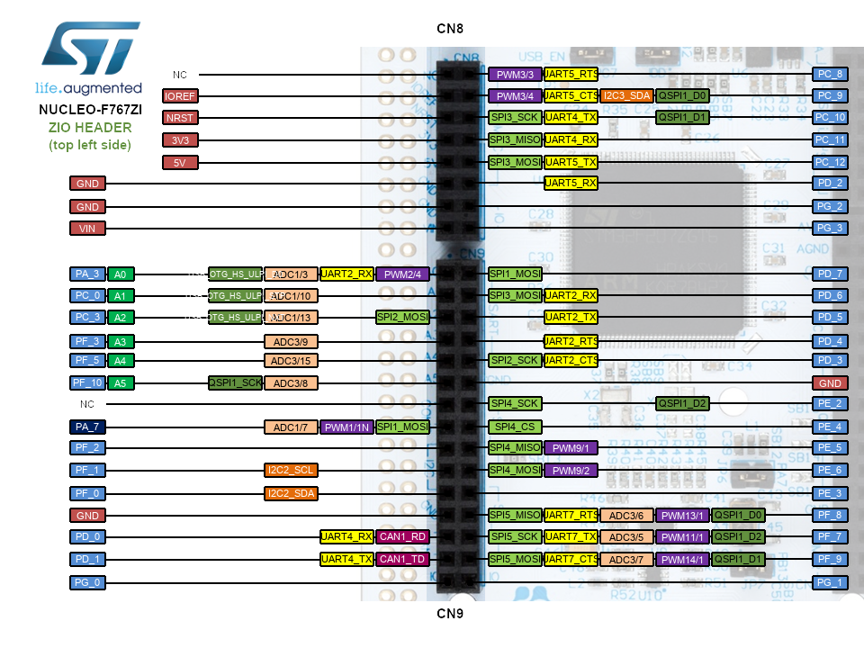

<h1>Aula 3</h1>

Esta clase consiste en entender el manual de usuario de la tarjeta NUCLEO STM32F767ZI; así mismo, se presenta un instructivo de instalación en Windows del software `ARM-Keil` para programar las tarjetas STM32, además de un hola mundo con la tarjeta NUCLEO STM32F767ZI, NUCLEO STM32F411RE y NUCLEO STM32F303K8.

<h2>Nucleo STM32F767ZI</h2>

La página oficial de STM32 para esta tarjeta está <a href="https://www.st.com/en/evaluation-tools/nucleo-f767zi.html">aquí</a>

La documentación (datasheets) requerida para la programación a descargar son:

1. Datasheet chip -> Presenta la información del microcontrolador STM32F411RE se descarga <a href="https://www.st.com/en/microcontrollers-microprocessors/stm32f767zi.html">aquí</a>
2. Manual user board -> Presenta la información de la placa (ej: pines de conexión, características eléctricas) se descarga <a href="https://www.st.com/en/evaluation-tools/nucleo-f767zi.html#documentation">aquí</a>
3. Reference manual chip -> se descarga <a href="https://www.st.com/en/microcontrollers-microprocessors/stm32f767zi.html#documentation">aquí</a>

Manual de usuario -> Diagrama St LInk

<div align="center">

<br>
<figcaption>Fuente: Manual de usuario</figcaption>
</div>

<div align="center">

<br>
<figcaption>Fuente: Manual de usuario</figcaption>
</div>

<div align="center">

<br>
<figcaption>Fuente: Manual de usuario</figcaption>
</div>

<h3>Leds</h3>

Es importante que antes de desconectar la tarjeta Nucleo STM32F767ZI del PC, se debe verificar que el LED 4 esté encendido en rojo.

<div align="center">

<br>
<figcaption>Fuente: Manual de usuario</figcaption>
</div>

<h3>Pulsadores</h3>

<div align="center">

<br>
<figcaption>Fuente: Manual de usuario</figcaption>
</div>

 <h3>Pinout</h3>

El microcontrolador STM32F767ZI cuenta con 144 pines GPIO, sin embargo la tarjeta NUCLEO F767ZI utiliza solamente 114 pines GPIO. Los pines son compatibles con +3.3V. En las tablas 19 y 21 se encuentran la asignación de pines Zio y Morpho, respectivamente, para la tarjeta NUCLEO F767ZI.

<h4>Pines Zio o Arduino</h4>

<div align="center">

<br>
<figcaption>Fuente: Manual de usuario</figcaption>
</div>

<div align="center">

<br>

<br>
Fuente: https://os.mbed.com/platforms/ST-Nucleo-F767ZI/
</div>

<h4>Pines Morphos</h4>

<div align="center">

<br>

<br>
Fuente: https://os.mbed.com/platforms/ST-Nucleo-F767ZI/
</div>

<h2>Instrucciones instalación ARM-Keil</h2>

1. Ir a la página principal <a href="https://www.keil.com/download/product/">aquí</a>
2. Seleccionar la opción <b>MDK-Arm</b> y diligenciar los datos requeridos
3. Descargar el archivo ejecutable (.exe)
4. Instalar el software `ARM-Keil` siguiendo el proceso de instalación e instalar el driver sugerido que aparece en la ventana emergente
5. Al finalizar la instalación, seleccionar la opción "OK" en la ventana emergente <i>Pack Installer</i>
6. Descargar los paquetes correspondientes al microcontrolador que se va a trabajar (ej: STM32F411RE), para lo cual se debe buscar la opción "STMIcroelectronics" en la pestaña "Devices"
7. Seleccionar el microcontrolador específico a trabajar y posteriormente instalar los paquetes requeridos, sin embargo, se recomiendan instalar y actualizar todos los paquetes para dicho microcontrolador y verificar que todos los paquetes tengan la etíqueta <i>Up to date</i>
8. Instalar y/o actualizar los paquetes seleccionados siguiendo el proceso de instalación

* Si desea instalar de manera más rápida y sencilla los paquetes para la tarjeta (ej: STM32F411RE), descargue el instalador de los paquetes  <a href="https://www.keil.arm.com/devices/stmicroelectronics-stm32f411retx/features/">aquí</a> en la opción 'CMSIS Pack'. Por tanto, omita los pasos 5 al 8 del anterior procedimiento.

<h2>Ejemplo 'hola mundo'</h2>

1. Crear un nuevo proyecto seleccionando la opción "New µVision Project" en la pestaña "Project"
2. Guardar el proyecto en la ubicación deseada y con el nombre del proyecto específico (ej: Hola_Mundo)
3. Seleccionar el dispositivo relacionado al chip (ej: STM32F411RETx)
4. En la opción de 'CMSIS' seleccionar la casilla CORE y en la opción 'device' seleccionar la casilla StartUp. En algunas tarjetas (ej: STM32F411RETx) verificar que en la misma opción 'device' esté la opción standalone
5. Crear un archivo .cpp y añadirlo al proyecto en la carpeta 'Source Group 1'
6. Posteriormente a escribir el código en C++, limpiar y compilar el proyecto en la opción 'rebuild'

NUCLEO F303K8

```cpp
//Ejemplo Hola mundo con led de usuario de la tarjeta
//Fabián Barrera Prieto
//UMNG
//STM32F303K8T6
//operation 'or' (|) for set bit and operation 'and' (&) for clear bit

#include <stdio.h>
#include "stm32f3xx.h"

void Delay (uint32_t time)
{
	//while (time--);  
	for (int t=0;t<time;t++);

}

int main(){
	
	/************** STEPS TO FOLLOW *****************
	1. Enable GPIOD clock
	2. Set the PIN PD13 as output
	3. Configure the output mode i.e state, speed, and pull
	************************************************/
	//Reference manual chip
	//Step 1
	RCC->AHBENR |= (1<<18);  // Enable the GPIOB clock (user led LD3 is connected to PB_3)
	//Step 2
	GPIOB->MODER &= ~(0b11<<6); //clear (00) pin PB_3(bits 7:6)  
	GPIOB->MODER |= (1<<6); //pin PB_3(bits 7:6) as Output (01)
	//Step 3
	GPIOB->OTYPER &= ~(1<<3);  // bit 3=0 --> Output push pull (HIGH or LOW)
	GPIOB->OSPEEDR |= ((1<<7)|(1<<6));//(0b11<<6)  // Pin PB_3 (bits 7:6) as High Speed (11)
	GPIOB->PUPDR &= ~(0b11<<6); //~((1<<7)|(1<<6)) // Pin PB_3 (bits 7:6) are 0:0 --> no pull up or pull down
	
	while(1){
		//GPIOD->BSRR |= (1<<3); // Set the Pin PB_3
		GPIOB->ODR |= 1<<3; // Set the Pin PB_3
		Delay(1000000);
		//GPIOD->BSRR |= (1<<19); // Reset the Pin PB_3
		GPIOB->ODR &= ~(1<<3); // Reset the Pin PB_3
		Delay(1000000);
	}
}
```

NUCLEO F411RET6U

```cpp
//Ejemplo Hola mundo con led de usuario de la tarjeta
//Fabián Barrera Prieto
//Universidad ECCI
//STM32F411RET6U
//operation 'or' (|) for set bit and operation 'and' (&) for clear bit

#include <stdio.h>
#include "stm32f4xx.h"

void Delay (uint32_t time)
{
	//while (time--);  
	for (int t=0;t<time;t++);

}

int main(){
	
	RCC->AHB1ENR |= (1<<0);  // Enable the GPIOA clock (user led LD2 is connected to PA_5)
	
	GPIOA->MODER &= ~(0b11<<10); //clear (00) pin PA_5(bits 7:6)  
	GPIOA->MODER |= (1<<10); //pin PA_5(bits 11:10) as Output (01)
	
	GPIOA->OTYPER &= ~(1<<5);  // bit 5=0 --> Output push pull (HIGH or LOW)
	GPIOA->OSPEEDR |= ((1<<11)|(1<<10));//(0b11<<10)  // Pin PA_5 (bits 11:10) as High Speed (11)
	GPIOA->PUPDR &= ~(0b11<<10); //~((1<<11)|(1<<10)) // Pin PA_5 (bits 11:10) are 0:0 --> no pull up or pull down
	
	while(1){
		//GPIOA->BSRR |= (1<<5); // Set the Pin PA_5
		GPIOA->ODR |= 1<<5; // Set the Pin PA_5
		Delay(1000000);
		//GPIOA->BSRR |= (1<<21); // Reset the Pin PA_5
		GPIOA->ODR &= ~(1<<5); // Reset the Pin PA_5
		Delay(1000000);
	}
}
```

NUCLEO F767ZIT6U

```cpp
//Ejemplo Hola mundo con led de usuario de la tarjeta
//Fabián Barrera Prieto
//Universidad ECCI
//STM32F767ZIT6U
//operation 'or' (|) for set bit and operation 'and' (&) for clear bit

#include <stdio.h>
#include "stm32f7xx.h"

void Delay (uint32_t time)
{
	//while (time--);  
	for (int t=0;t<time;t++);

}

int main(){

	RCC->AHB1ENR |= (1<<1); //Enable the GPIOB clock (user led LD1 is connected to PB0)
	RCC->AHB1ENR |= (1<<2); //Enable the GPIOC clock (user push button B1 is connected to PC13)
	
	GPIOB->MODER &= ~(0b11<<0); //clear (00) pin PB0(bits 1:0) and set as Input (00) for default 
	GPIOB->MODER |= (1<<0); //pin PB0(bits 1:0) as Output (01)
	GPIOC->MODER &= ~(0b11<<26); //clear (00) pin PC13(bits 27:26) and set as Input (00) for default 
	
	GPIOB->OTYPER &= ~(1<<0);  // clear (0) pin PB0 (bit 0) --> Output push pull (HIGH or LOW)
	GPIOB->OSPEEDR |= ((1<<1)|(1<<0));//(0b11<<0)  // Pin PB0 (bits 1:0) as Very High Speed (11)
	GPIOC->OSPEEDR |= ((1<<27)|(1<<26));//(0b11<<26)  // Pin PC13 (bits 27:26) as Very High Speed (11)
	GPIOB->PUPDR &= ~(0b11<<0); //~((1<<1)|(1<<0)) // Pin PB0 (bits 1:0) are 0:0 --> no pull up or pull down
	GPIOC->PUPDR &= ~(0b11<<26); //~((1<<27)|(1<<26)) // Pin PC13 (bits 27:26) are 0:0 --> no pull up or pull down
	GPIOC->PUPDR |= (1<<26); // Pin PC_13 (bits 27:26) are 0:1 --> pull up
	
	while(1){
		//GPIOB->BSRR |= (1<<0); // Set the Pin PB0
		GPIOB->ODR |= 1<<0; // Set the Pin PB0
		Delay(1000000);
		//GPIOB->BSRR |= (1<<16); // Reset the Pin PB0
		GPIOB->ODR &= ~(1<<0); // Reset the Pin PB0
		Delay(1000000);
	}
}
```

<h3>Descargar el software STM32 ST-LINK utility</h3>

1. Descargar el software del programador <a href="https://www.st.com/en/development-tools/stsw-link004.html">aquí</a> y el driver para las tarjetas para Windows <a href="https://www.st.com/en/development-tools/stsw-link009.html?dl=redirect">aquí</a>
2. Instalar el software a través del proceso de instalación

<h3>Configurar el software STM32 ST-LINK utility en Keil</h3>

1. Seleccionar la opción '<i>Options for Target</i>'
2. En la pestaña '<i>Output</i>' seleccionar la casilla '<i>Create HEX File</i>'
3. En la pestaña '<i>Debug</i>' en la opción '<i>Use</i>', entre las opciones que se despliegan, seleccionar '<i>ST-LINK Debugger</i>' y luego dar click en la opción '<i>Settings</i>'
4. Verificar que la tarjeta sea reconocida, debe aparecer el mensaje: '<i>ARM Core Sight SW-DP ...</i>' en el espacio '<i>SWDIO</i>'
5. En la misma pestaña '<i>Debug</i>' en la sección inferior '<i>Debug</i>' en la lista desplegable '<i>Connect</i>', seleccionar '<i>Under Reset</i>'
6. En la pestaña '<i>Flash Download</i>' seleccionar todas las casillas cuadradas, incluyendo la opción '<i>Reset and Run</i>'
7. Dar click en OK para aceptar las modificaciones previamente mencionadas
8. Cargar el proyecto en la tarjeta, dando click en la opción '<i>Download</i>' 

<h3>Depurar código en Keil</h3>

1. Seleccionar la opción '<i>Start/Stop Debug Session</i>'
2. Para controlar la depuración del código, se deben utilizar los botones que aparecen en la parte superior izquierda como control de la herramienta <i>debugger</i>