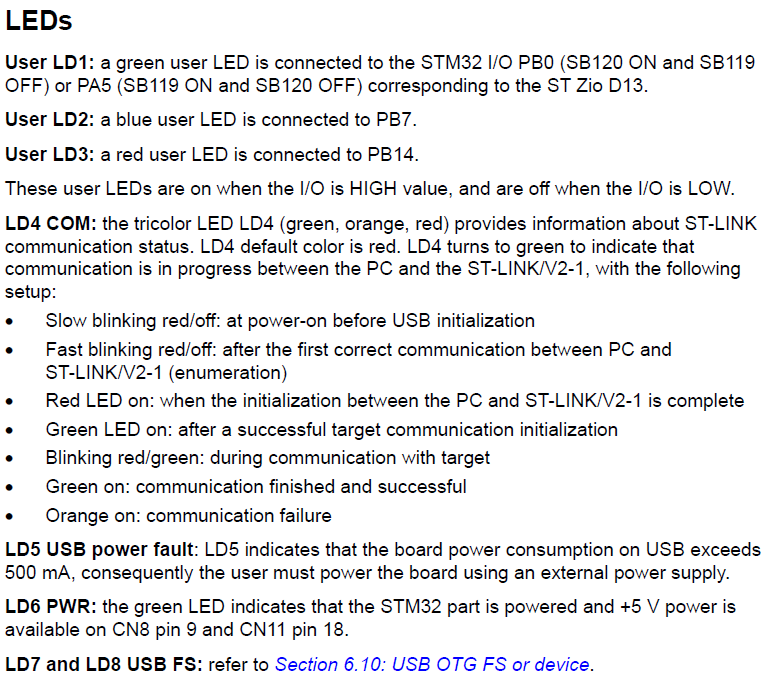
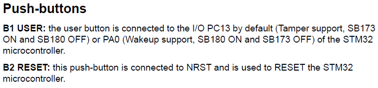

<h1>Aula 3</h1>

En esta clase se presenta un instructivo de instalación en Windows del software `ARM-Keil` para programar las tarjetas STM32, además de un hola mundo con la tarjeta NUCLEO STM32F767ZI o NUCLEO STM32F756ZG o NUCLEO STM32F746ZG o NUCLEO STM32F722ZE.

<h2>Introducción a STM32F411RE</h2>


La página oficial de STM32 para esta tarjeta está <a href="https://www.st.com/en/evaluation-tools/nucleo-f411re.html">aquí</a>


La documentación (datasheets) requerida para la programación a descargar son:

1. Datasheet chip -> Presenta la información del microcontrolador STM32F411RE se descarga <a href="https://www.st.com/en/microcontrollers-microprocessors/stm32f411/documentation.html">aquí</a>
2. Manual user board -> Presenta la información de la placa (ej: pines de conexión, características eléctricas) se descarga <a href="https://www.st.com/en/evaluation-tools/nucleo-f411re.html#documentation">aquí</a>
3. Reference manual chip -> se descarga <a href="https://www.st.com/en/microcontrollers-microprocessors/stm32f411/documentation.html">aquí</a>







Fuente: https://os.mbed.com/platforms/st-nucleo-f411re/

<h2>Instrucciones instalación ARM-Keil</h2>

1. Ir a la página principal <a href="https://www.keil.com/download/product/">aquí</a>
2. Seleccionar la opción <b>MDK-Arm</b> y diligenciar los datos requeridos
3. Descargar el archivo ejecutable (.exe)
4. Instalar el software `ARM-Keil` siguiendo el proceso de instalación e instalar el driver sugerido que aparece en la ventana emergente
5. Al finalizar la instalación, seleccionar la opción "OK" en la ventana emergente <i>Pack Installer</i>
6. Descargar los paquetes correspondientes al microcontrolador que se va a trabajar (ej: STM32F411RE), para lo cual se debe buscar la opción "STMIcroelectronics" en la pestaña "Devices"
7. Seleccionar el microcontrolador específico a trabajar y posteriormente instalar los paquetes requeridos, sin embargo, se recomiendan instalar y actualizar todos los paquetes para dicho microcontrolador y verificar que todos los paquetes tengan la etíqueta <i>Up to date</i>
8. Instalar y/o actualizar los paquetes seleccionados siguiendo el proceso de instalación

* Si desea instalar de manera más rápida y sencilla los paquetes para la tarjeta (ej: STM32F411RE), descargue el instalador de los paquetes  <a href="https://www.keil.arm.com/devices/stmicroelectronics-stm32f411retx/features/">aquí</a> en la opción 'CMSIS Pack'. Por tanto, omita los pasos 5 al 8 del anterior procedimiento.

<h2>Ejemplo 'hola mundo'</h2>

1. Crear un nuevo proyecto seleccionando la opción "New µVision Project" en la pestaña "Project"
2. Guardar el proyecto en la ubicación deseada y con el nombre del proyecto específico (ej: Hola_Mundo)
3. Seleccionar el dispositivo relacionado al chip (ej: STM32F411RETx)
4. En la opción de 'CMSIS' seleccionar la casilla CORE y en la opción 'device' seleccionar la casilla StartUp. En algunas tarjetas (ej: STM32F411RETx) verificar que en la misma opción 'device' esté la opción standalone
5. Crear un archivo .cpp y añadirlo al proyecto en la carpeta 'Source Group 1'
6. Posteriormente a escribir el código en C++, limpiar y compilar el proyecto en la opción 'rebuild'

```cpp
//Ejemplo Hola mundo con led de usuario de la tarjeta
//Fabián Barrera Prieto
//Universidad ECCI
//STM32F411RET6U
//operation 'or' (|) for set bit and operation 'and' (&) for clear bit

#include <stdio.h>
#include "stm32f4xx.h"

void Delay (uint32_t time)
{
	//while (time--);  
	for (int t=0;t<time;t++);

}

int main(){
	
	RCC->AHB1ENR |= (1<<0);  // Enable the GPIOA clock (user led LD2 is connected to PA_5)
	
    GPIOA->MODER &= ~(0b11<<10); //clear (00) pin PA_5(bits 7:6)  
	GPIOA->MODER |= (1<<10); //pin PA_5(bits 11:10) as Output (01)
	
	GPIOA->OTYPER &= ~(1<<5);  // bit 5=0 --> Output push pull (HIGH or LOW)
	GPIOA->OSPEEDR |= ((1<<11)|(1<<10));//(0b11<<10)  // Pin PA_5 (bits 11:10) as High Speed (11)
	GPIOA->PUPDR &= ~(0b11<<10); //~((1<<11)|(1<<10)) // Pin PA_5 (bits 11:10) are 0:0 --> no pull up or pull down
	
	while(1){
		//GPIOA->BSRR |= (1<<5); // Set the Pin PA_5
		GPIOA->ODR |= 1<<5; // Set the Pin PA_5
		Delay(1000000);
		//GPIOA->BSRR |= (1<<21); // Reset the Pin PA_5
		GPIOA->ODR &= ~(1<<5); // Reset the Pin PA_5
		Delay(1000000);
	}
}
```

<h3>Descargar el software STM32 ST-LINK utility</h3>

1. Descargar el software del programador <a href="https://www.st.com/en/development-tools/stsw-link004.html">aquí</a> y el driver para las tarjetas para Windows <a href="https://www.st.com/en/development-tools/stsw-link009.html?dl=redirect">aquí</a>
2. Instalar el software a través del proceso de instalación

<h3>Configurar el software STM32 ST-LINK utility en Keil</h3>

1. Seleccionar la opción 'Options for Target'
2. En la pestaña 'Output' seleccionar la casilla 'Create HEX File'
3. En la pestaña 'Debug' en la opción 'use', entre las opciones que se despliegan, seleccionar 'ST-LINK Debugger' y luego dar click en la opción 'Settings'
4. Verificar que la tarjeta sea reconocida, debe aparecer el mensaje: 'ARM Core Sight SW-DP ...' en el espacio SWDIO
5. En la misma pestaña 'Debug' en la parte inferior 'Debug' de la lista desplegable, seleccionar 'under Reset'
6. En la pestaña 'Flash Download' seleccionar todas las casillas cuadradas, incluyendo la opción 'Reset and Run'
7. Dar click en OK para aceptar las modificaciones previamente mencionadas
8. Cargar el proyecto en la tarjeta, dando click en la opción 'Download' 

<h3>Depurar código en Keil</h3>

1. Seleccionar la opción 'Start/Stop Debug Session'
2. Para controlar la depuración del código, se deben utilizar los botones que aparecen en la parte izquierda como control de la herramienta <i>debugger</i>