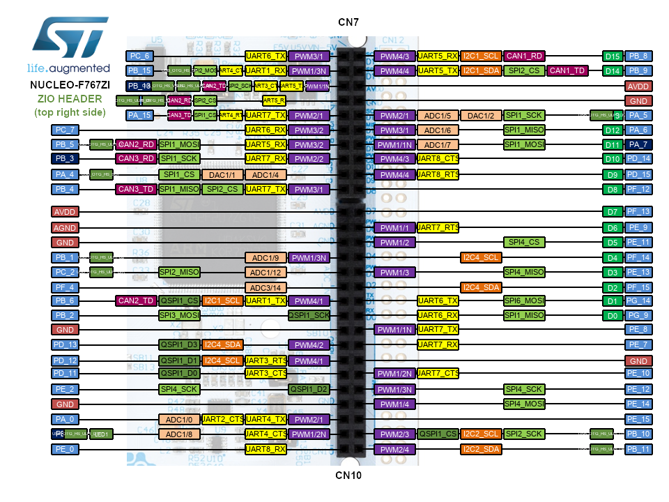

<h1>Aula 3</h1>

Esta clase consiste en

<h2>Introducción a STM32F411RE</h2>



La página oficial de STM32 para esta tarjeta está <a url:"https://www.st.com/en/evaluation-tools/nucleo-f411re.html">aquí</a>


La documentación (datasheets) requerida para la programación a descargar son:

1. Datasheet chip -> Presenta la información del microcontrolador STM32F411RE se descarga <a url:"https://www.st.com/en/microcontrollers-microprocessors/stm32f411/documentation.html">aquí</a>
2. Manual user board -> Presenta la información de la placa (ej: pines de conexión, características eléctricas) se descarga <a url:"https://www.st.com/en/evaluation-tools/nucleo-f411re.html#documentation">aquí</a>
3. Reference manual chip -> se descarga <a url:"https://www.st.com/en/microcontrollers-microprocessors/stm32f411/documentation.html">aquí</a>


Fuente: https://os.mbed.com/platforms/st-nucleo-f411re/

<h2>Instrucciones instalación ARM-Keil</h2>

1. Ir a la página https://www.keil.com/download/product/
2. Seleccionar la opción <b>MDK-Arm</b> y diligenciar los datos requeridos
3. Descargar el archivo ejecutable (.exe)
4. Instalar el software `ARM-Keil` siguiendo el proceso de instalación e instalar el driver sugerido que aparece en la ventana emergente
5. Al finalizar la instalación, seleccionar la opción "OK" en la ventana emergente <i>Pack Installer</i>
6. Descargar los paquetes correspondientes al microcontrolador que se va a trabajar (ej: STM32F411RE), para lo cual se debe buscar la opción "STMIcroelectronics" en la pestaña "Devices"
7. Seleccionar el microcontrolador específico a trabajar y posteriormente instalar los paquetes requeridos, sin embargo, se recomiendan instalar y actualizar todos los paquetes para dicho microcontrolador y verificar que todos los paquetes tengan la etíqueta <i>Up to date</i>
8. Instalar y/o actualizar los paquetes seleccionados siguiendo el proceso de instalación

* Si desea instalar de manera más rápida y sencilla los paquetes para la tarjeta (ej: STM32F411RE), descargue el instalador de los paquetes  <a url:"https://www.keil.arm.com/devices/stmicroelectronics-stm32f411retx/features/">aquí</a> en la opción 'CMSIS Pack'. Por tanto, omita los pasos 5 al 8 del anterior procedimiento.

<h2>Ejemplo 'hola mundo'</h2>

1. Crear un nuevo proyecto seleccionando la opción "New µVision Project" en la pestaña "Project"
2. Guardar el proyecto en la ubicación deseada y con el nombre del proyecto específico (ej: Hola_Mundo)
3. Seleccionar el dispositivo relacionado al chip (ej: STM32F411RETx)
4. En la opción de 'CMSIS' seleccionar la casilla CORE y en la opción 'device' seleccionar la casilla StartUp. En algunas tarjetas (ej: STM32F411RETx) verificar que en la misma opción 'device' esté la opción standalone
5. Crear un archivo .cpp y añadirlo al proyecto en la carpeta 'Source Group 1'
6. Posteriormente a escribir el código en C++, limpiar y compilar el proyecto en la opción 'rebuild'

```cpp
//Ejemplo Hola mundo con led de usuario de la tarjeta
//Fabián Barrera Prieto
//ECCI
//STM32F303K8T6
//operation 'or' (|) for set bit and operation 'and' (&) for clear bit

#include <stdio.h>
#include "stm32f3xx.h"

void Delay (uint32_t time)
{
	//while (time--);  
	for (int t=0;t<time;t++);

}

int main(){
	
	/************** STEPS TO FOLLOW *****************
	1. Enable GPIOD clock
	2. Set the PIN PD13 as output
	3. Configure the output mode i.e state, speed, and pull
	************************************************/
	//Reference manual chip
	//Step 1
	RCC->AHBENR |= (1<<18);  // Enable the GPIOB clock (user led LD3 is connected to PB_3)
	//Step 2
	GPIOB->MODER &= ~(0b11<<6); //clear (00) pin PB_3(bits 7:6)  
	GPIOB->MODER |= (1<<6); //pin PB_3(bits 7:6) as Output (01)
	//Step 3
	GPIOB->OTYPER &= ~(1<<3);  // bit 3=0 --> Output push pull (HIGH or LOW)
	GPIOB->OSPEEDR |= ((1<<7)|(1<<6));//(0b11<<26)  // Pin PB_3 (bits 7:6) as High Speed (11)
	GPIOB->PUPDR &= ~((1<<7)|(1<<6)); //~(0b11<<26) // Pin PB_3 (bits 7:6) are 0:0 --> no pull up or pull down
	
	while(1){
		//GPIOD->BSRR |= (1<<13); // Set the Pin PB_3
		GPIOB->ODR |= 1<<3; // Set the Pin PB_3
		Delay(1000000);
		//GPIOD->BSRR |= (1<<29); // Reset the Pin PB_3
		GPIOB->ODR &= ~(1<<3); // Reset the Pin PB_3
		Delay(1000000);
	}
}
```