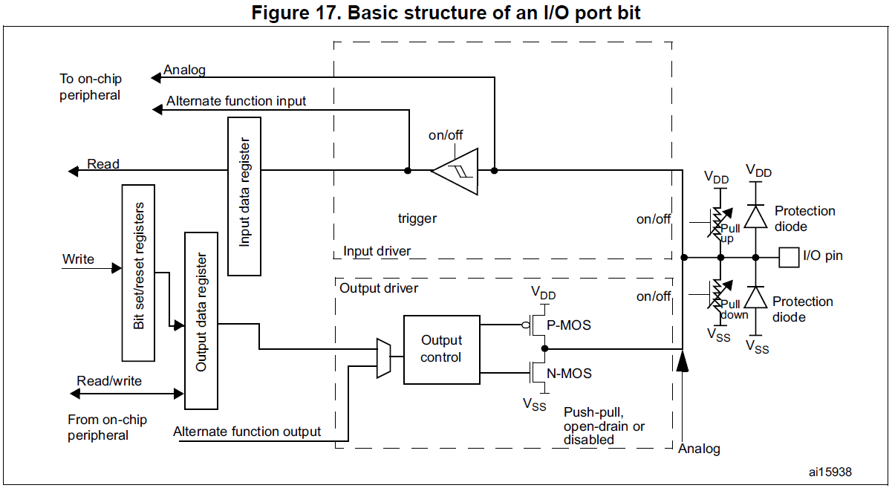
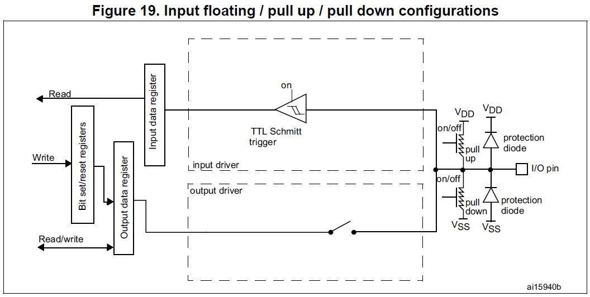
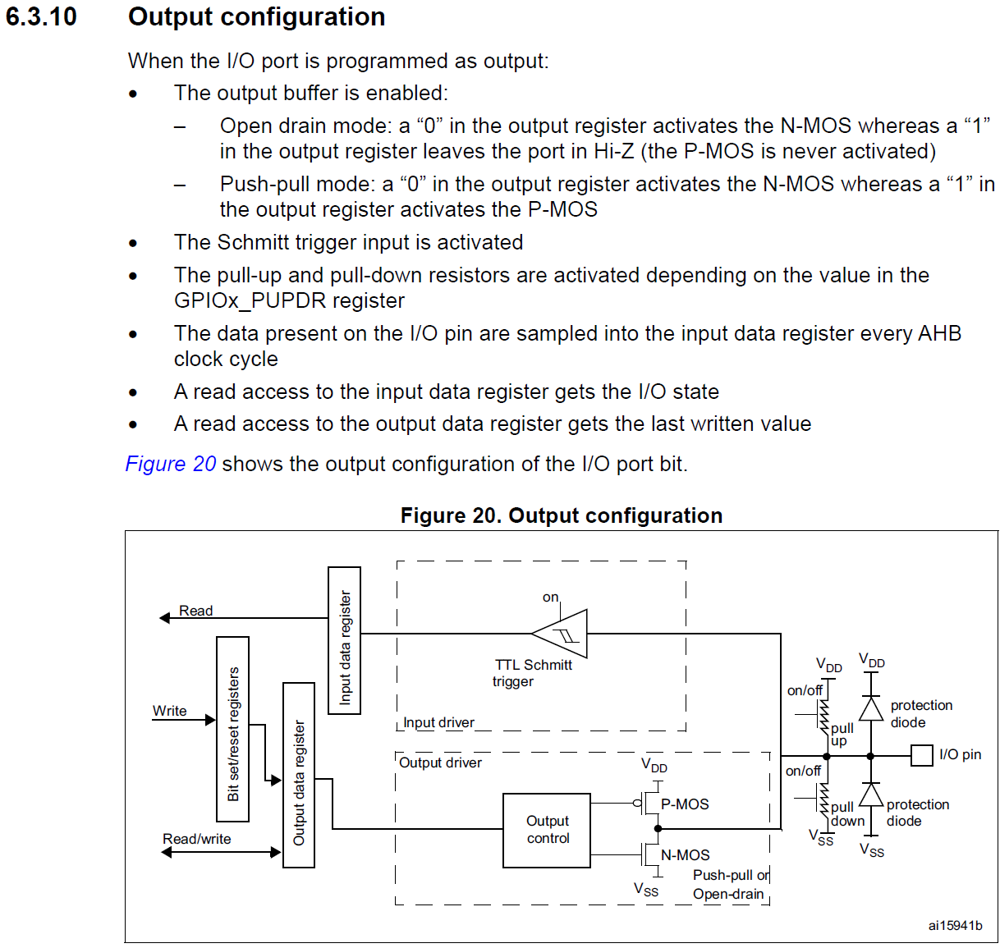
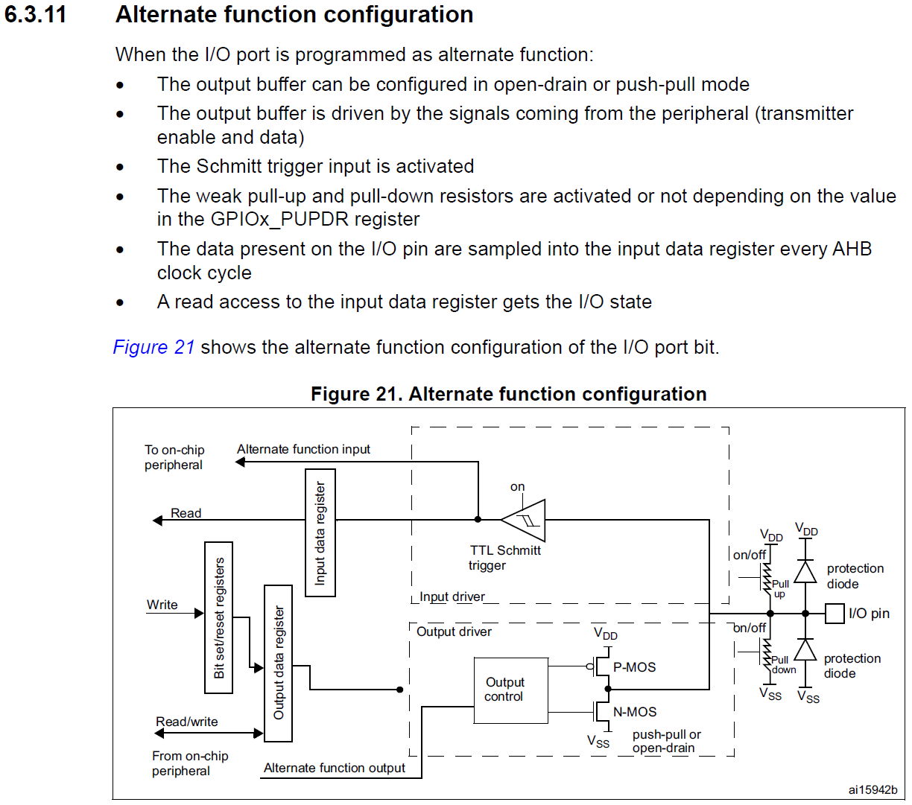
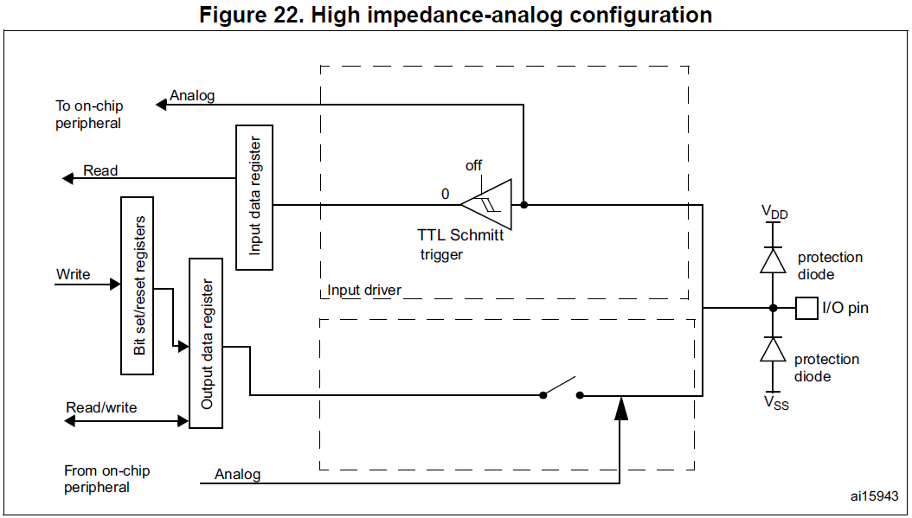

<h1>Aula 4</h1>

Esta clase consiste en entender las diferentes configuraciones de las entradas y salidas de los GPIOs de la tarjeta NUCLEO F767ZI.

<h2>GPIO</h2>

Los GPIOs pueden ser configurado en diferentes modos:

- Entrada flotante
- Entrada Pull Up
- Entrada Pull Down
- Análogo
- Salida Push Pull
- Salida Open Drain
- Función alternante (Timers, PWM, SPI, I2C, USART, etc.)

A través de los siguientes registros: 

- GPIOx_MODER -> Registro de configuración del pin (análogos/in/out/AF)
- GPIOx_OTYPER -> Registro de selección del tipo de salida (Push-Pull o Open-Drain)
- GPIOx_PUPDR -> Registro de selección de Pull Up o Pull Down
- GPIOx_OSPEEDER -> Registro de configuración de velocidad del pin
- GPIOx_IDR -> Registro de salida de datos en el pin (Leer)
- GPIOx_ODR	-> Registro de salida de datos en el pin (Escribir)

 
<figcaption>Fuente: Manual de usuario</figcaption>

<h3>Entradas digitales</h3>

- El búfer de salida está desactivado
- La entrada de disparo Schmitt- Trigger está activada
- Las resistencias pull-up y pull-down se activan en función del valor en el registro GPIOx_PUPDR
- El dato presente en el pin de I/O se muestrea en el registro de entrada de datos cada ciclo de reloj AHB
- Un acceso de lectura al registro de entrada de dator proporciona el estado de I/O

 
<figcaption>Fuente: Manual de usuario</figcaption>

<h3>Salidas digitales</h3>

<ul>
  <dt>- El búfer de salida está habilitado:</dt>
  <dd>- Modo Open Drain: un "0" en el registro de salida activa el N-MOS, mientras que un "1" en el registro de salida deja el puerto en alta impedancia (el P-MOS nunca se activa)</dd>
  <dd>– Modo Push-Pull: un "0" en el registro de salida activa el N-MOS, mientras que un "1" en el registro de salida activa el P-MOS</dd>
  <dt>- La entrada de disparo Schmitt-Trigger está activada</dt>
  <dt>- Las resistencias Pull-Up y Pull-Down se activan en función del valor en el registro GPIOx_PUPDR</dt>
  <dt>- Los datos presentes en el pin de I/O se muestrean en el registro de datos de entrada cada ciclo de reloj AHB</dt>
  <dt>- Un acceso de lectura al registro de entrada de datos obtiene el estado de I/O</dt>
  <dt>- Un acceso de lectura al registro de salida de datos obtiene el último valor escrito</dt>
</ul>

 
<figcaption>Fuente: Manual de usuario</figcaption>

<h3>Función alternante</h3>

• El búfer de salida se puede configurar en modo de Open-Drain o Push-Pull
• El búfer de salida es accionado por las señales procedentes del periférico (habilitación del transmisor y datos)
• La entrada de disparo Schmitt-Trigger está activada
• Las resistencias Pull-Up y Pull-Down se activan o no dependiendo del valor en el registro GPIOx_PUPDR
• Los datos presentes en el pin de E/S se muestrean en el registro de datos de entrada cada ciclo de reloj AHB
• Un acceso de lectura al registro de entrada de datos obtiene el estado de I/O

 
<figcaption>Fuente: Manual de usuario</figcaption>

<h3>Análogo</h3>

• El búfer de salida está desactivado
• La entrada de disparo Schmitt-Trigger está desactivada, lo que proporciona un consumo cero para cada valor analógico del pin de I/O. La salida del disparador Schmitt se fuerza a un valor constante (0).
• Las resistencias Pull-Up y Pull-Down están desactivadas por hardware
• El acceso de lectura al registro de entrada de datos obtiene el valor "0"

 
<figcaption>Fuente: Manual de usuario</figcaption>

<h2>GPIO</h2>

