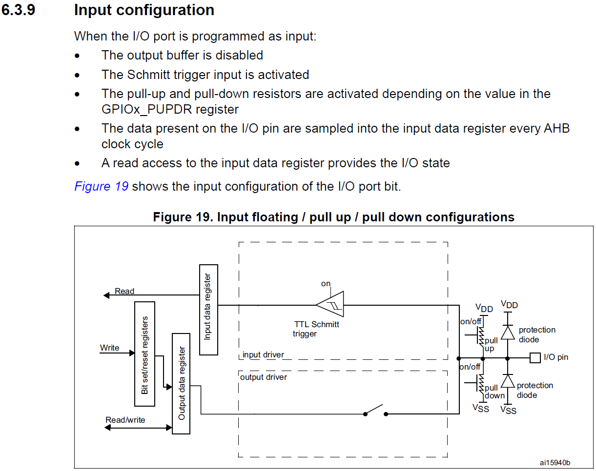
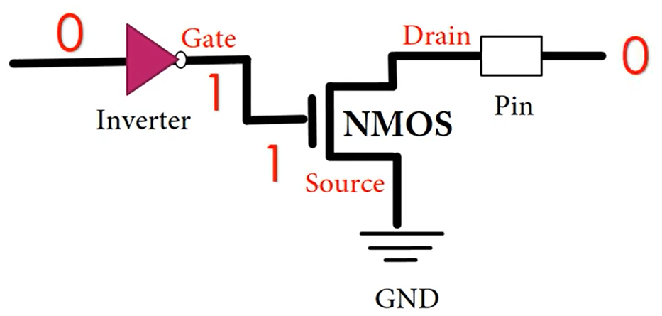
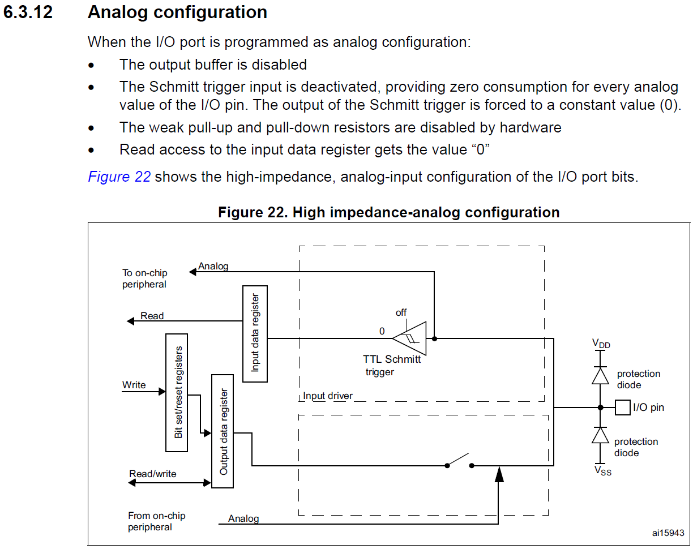

<h1>Aula 4</h1>

Esta clase consiste en entender las diferentes configuraciones de las entradas y salidas de los GPIOs de la tarjeta NUCLEO F767ZI.

<h2>GPIO</h2>

Los GPIOs pueden ser configurado en diferentes modos:

- Entrada flotante
- Entrada Pull Up
- Entrada Pull Down
- Análogo
- Salida Push Pull
- Salida Open Drain
- Función alternante (Timers, PWM, SPI, I2C, USART, etc.)

A través de los siguientes registros: 

- GPIOx_MODER -> Registro de configuración del pin (análogos/in/out/AF)
- GPIOx_OTYPER -> Registro de selección del tipo de salida (Push-Pull o Open-Drain)
- GPIOx_PUPDR -> Registro de selección de Pull Up o Pull Down
- GPIOx_OSPEEDER -> Registro de configuración de velocidad del pin
- GPIOx_IDR -> Registro de salida de datos en el pin (Leer)
- GPIOx_ODR	-> Registro de salida de datos en el pin (Escribir)

<div align="center">

<br>
<figcaption>Fuente: Manual de referencia</figcaption>
</div>

<h3>Entradas digitales</h3>

<div align="center">

<br>
<figcaption>Fuente: Manual de referencia</figcaption>
</div>

<h4>Entrada flotante</h4>

<h4>Entrada Pull-Up y Pull-Down</h4>

<div align="center">

<br>
<figcaption>Fuente: http://nosinmiarduino.blogspot.com/2014/07/resistencias-de-pull-up-y-pull-down.html</figcaption>
</div>

<h3>Salidas digitales</h3>


<div align="center">

<br>
<figcaption>Fuente: Manual de referencia</figcaption>
</div>

<h4>Push-Pull</h4>

Las configuraciones Push-Pull garantizan dos niveles de voltaje (alto y bajo) de salida a través del flujo de la corriente.

<div align="center">

<br>
<figcaption>Fuente: https://www.hardwareinterviews.fyi/t/what-does-open-drain-push-pull-mean/556/2</figcaption>
</div>

<div align="center">

<br>
<figcaption>Fuente: </figcaption>
</div>

<div align="center">

<br>
<figcaption>Fuente: </figcaption>
</div>

<h4>Open-Drain</h4>

La configuración Open-Drain consiste en dejar el pin "Drain" del transistor MOSFET (canal N o P) al "aire" como salida para conectar a la carga, por tanto, el pin "Source" va conectado a GND y el pin "Gate" está polarizado.

<div align="center">

<br>
<figcaption>Fuente: </figcaption>
</div>

<div align="center">

<br>
<figcaption>Fuente: </figcaption>
</div>

<h5>Open-Drain con Pull-Up</h5>

<div align="center">

<br>
<figcaption>Fuente: </figcaption>
</div>

<div align="center">

<br>
<figcaption>Fuente: </figcaption>
</div>

<div align="center">

<br>
<figcaption>Fuente: </figcaption>
</div>

<h3>Función alternante</h3>

<div align="center">

<br>
<figcaption>Fuente: Manual de referencia</figcaption>
</div>

<h3>Análogo</h3>

<div align="center">

<br>
<figcaption>Fuente: Manual de referencia</figcaption>
</div>

<h2>Registros STM32F767ZI</h2>

```cpp
//Ejemplo Hola mundo con led de usuario de la tarjeta
//Fabián Barrera Prieto
//Universidad ECCI
//STM32F767ZIT6U
//operation 'or' (|) for set bit and operation 'and' (&) for clear bit

#include <stdio.h>
#include "stm32f7xx.h"

void Delay (uint32_t time)
{
	//while (time--);  
	for (int t=0;t<time;t++);

}

int main(){

	RCC->AHB1ENR |= (1<<1); //Enable the GPIOB clock (user led LD1 is connected to PB0)
	//RCC->AHB1ENR |= (1<<2); //Enable the GPIOC clock (user push button B1 is connected to PC13)
	
	GPIOB->MODER &= ~(0b11<<0); //clear (00) pin PB0(bits 1:0) and set as Input (00) for default 
	GPIOB->MODER |= (1<<0); //pin PB0(bits 1:0) as Output (01)
	//GPIOC->MODER &= ~(0b11<<26); //clear (00) pin PC13(bits 27:26) and set as Input (00) for default 
	
	GPIOB->OTYPER &= ~(1<<0);  // clear (0) pin PB0 (bit 0) --> Output push pull (HIGH or LOW)
	GPIOB->OSPEEDR |= ((1<<1)|(1<<0));//(0b11<<0)  // Pin PB0 (bits 1:0) as Very High Speed (11)
	//GPIOC->OSPEEDR |= ((1<<27)|(1<<26));//(0b11<<26)  // Pin PC13 (bits 27:26) as Very High Speed (11)
	GPIOB->PUPDR &= ~(0b11<<0); //~((1<<1)|(1<<0)) // Pin PB0 (bits 1:0) are 0:0 --> no pull up or pull down
	//GPIOC->PUPDR &= ~(0b11<<26); //~((1<<27)|(1<<26)) // Pin PC13 (bits 27:26) are 0:0 --> no pull up or pull down
	//GPIOC->PUPDR |= (1<<26); // Pin PC_13 (bits 27:26) are 0:1 --> pull up
	
	while(1){
    //if(((GPIOC->IDR & (1<<13)) >> 13) == 0){//Read PC13 pin
      //GPIOB->BSRR |= (1<<0); // Set the Pin PB0
      GPIOB->ODR |= 1<<0; // Set the Pin PB0
      Delay(1000000);
      //GPIOB->BSRR |= (1<<16); // Reset the Pin PB0
      GPIOB->ODR &= ~(1<<0); // Reset the Pin PB0
      Delay(1000000);
    //}
	}
}
```

<h3>RCC_AHB1ENR</h3>

<div align="center">

<br>
<figcaption>Fuente: Manual de referencia</figcaption>
</div>

<h3>GPIOx_MODER</h3>

<div align="center">

<br>
<figcaption>Fuente: Manual de referencia</figcaption>
</div>

<h3>GPIOx_OTYPER</h3>

<div align="center">

<br>
<figcaption>Fuente: Manual de referencia</figcaption>
</div>

<h3>GPIOx_OSPEEDR</h3>

<div align="center">

<br>
<figcaption>Fuente: Manual de referencia</figcaption>
</div>

<h3>GPIOx_PUPDR</h3>

<div align="center">

<br>
<figcaption>Fuente: Manual de referencia</figcaption>
</div>

<h3>GPIOx_IDR</h3>

<div align="center">

<br>
<figcaption>Fuente: Manual de referencia</figcaption>
</div>

<h3>GPIOx_ODR</h3>

<div align="center">

<br>
<figcaption>Fuente: Manual de referencia</figcaption>
</div>


