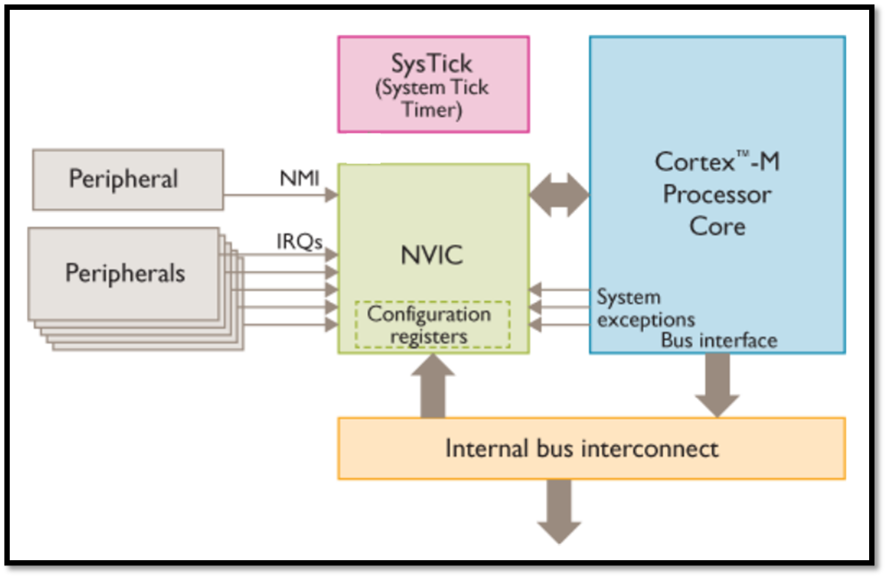
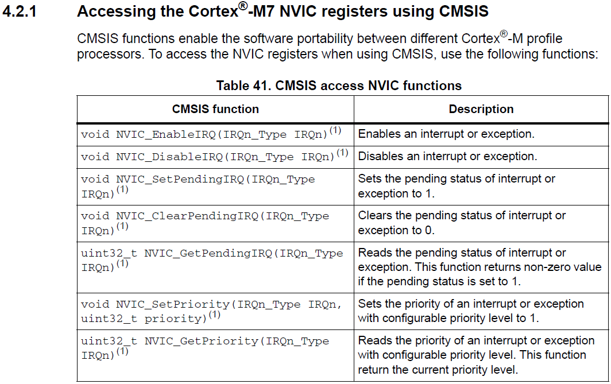
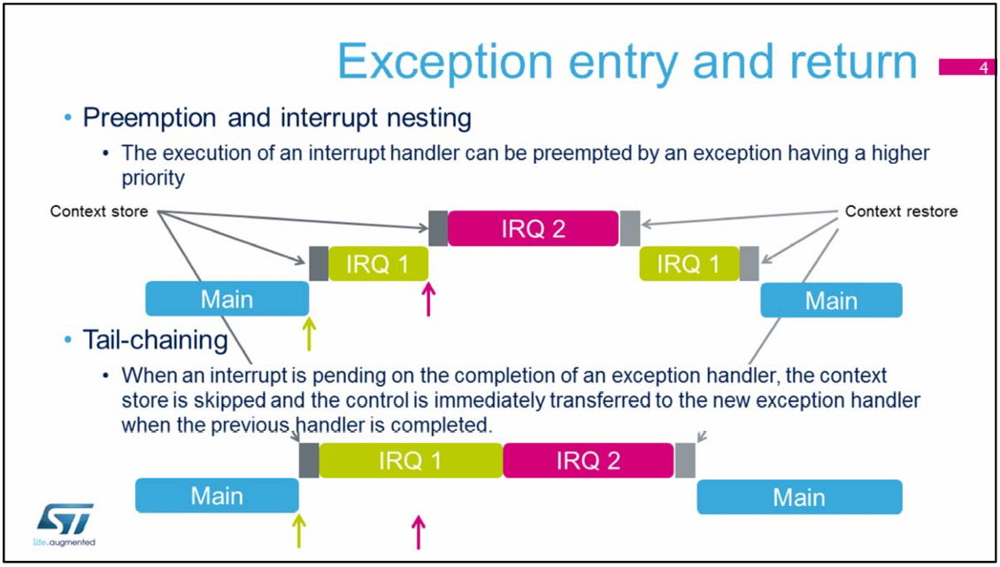
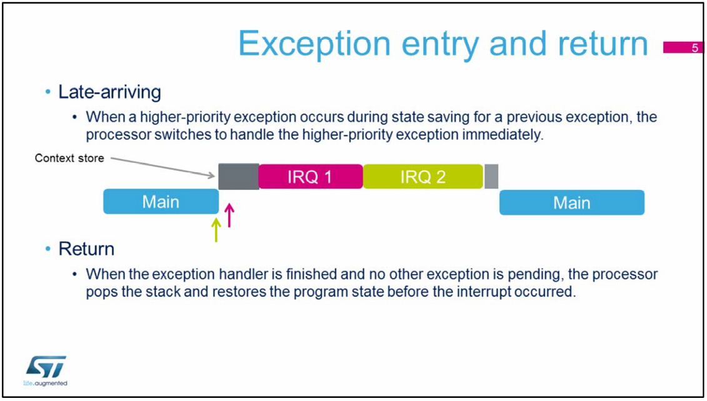
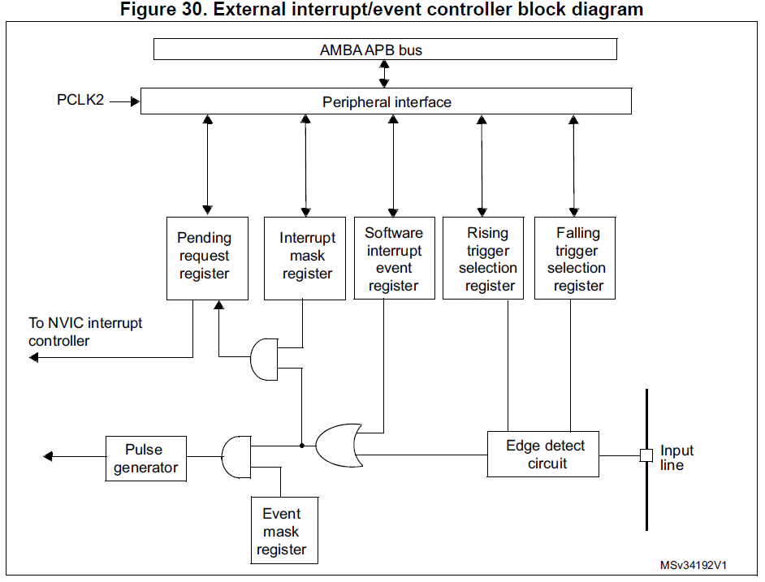
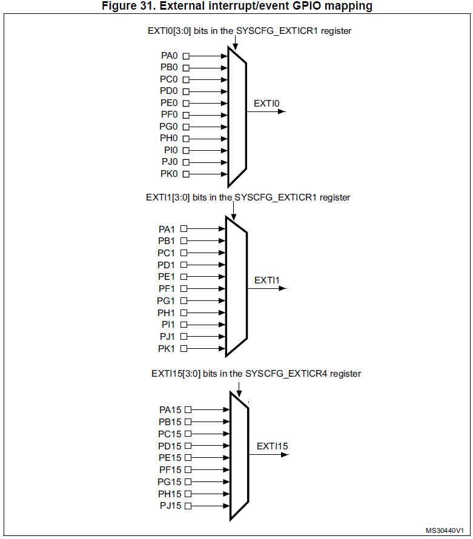

<h1>Aula 6</h1>

Esta clase consiste en realizar la programación de interrupciones

<h2>Interrupciones</h2>

Las insterrupciones en un sistema microprogramable se conocen como <i>Interrupt Service Routine</i> (ISR) indican una interrupción a la ejecución de la función "main", siendo que dicha función queda en pause mientras se ejecuta la tarea programada en la interrupción y posteriormente retorna a la línea de código que quedó pausada en la función "main".

El (NVIC) es el encargado de procesar todas las interrupciones en los procesadores Cortex-M. Además, se tienen 16 niveles de prioridad para las insterrupciones. 

- Las interrupciones son totalmente independientes en un bit de estado para cada una
- Son 25 interrupciones que pueden ser configuradas como flanco de subida, flanco de bajada o ambos y 


<div align="center">

<br>
<figcaption>Fuente: </figcaption>
</div>


<div align="center">

<br>
<figcaption>Fuente: </figcaption>
</div>

<div align="center">

<br>
<figcaption>Fuente: Documento STM32F7 - NVIC</figcaption>
</div>

<div align="center">

<br>
<figcaption>Fuente: Documento STM32F7 - NVIC</figcaption>
</div>

<div align="center">

<br>
<figcaption>Fuente: Manual de referencia</figcaption>
</div>

<div align="center">

<br>
<figcaption>Fuente: Manual de referencia</figcaption>
</div>


<h3>Ejemplo 1</h3>

```cpp

```


