<h1>Aula 6</h1>

Esta clase consiste en realizar la programación de interrupciones

<h2>Interrupciones</h2>

Las insterrupciones en un sistema microprogramable se conocen como <i>Interrupt Service Routine</i> (ISR) indican una interrupción a la ejecución de la función "main", siendo que dicha función queda en pause mientras se ejecuta la tarea programada en la interrupción y posteriormente retorna a la línea de código que quedó pausada en la función "main".

El (NVIC) es el encargado de procesar todas las interrupciones en los procesadores Cortex-M. Además, se tienen 16 niveles de prioridad para las insterrupciones. Las interrupciones son totalmente independientes en un bit de estado para cada una. Son 25 interrupciones que pueden ser configuradas como flanco de subida, flanco de bajada o ambos.

<div align="center">
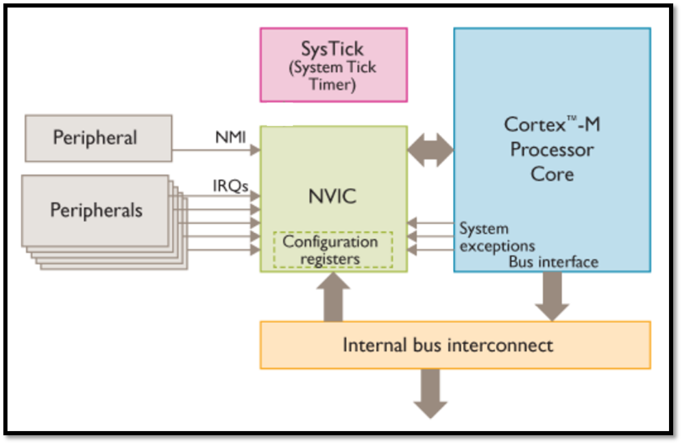
<br>
<figcaption>Fuente: </figcaption>
</div>

<h3>Controlador interrupciones</h3>

<div align="center">
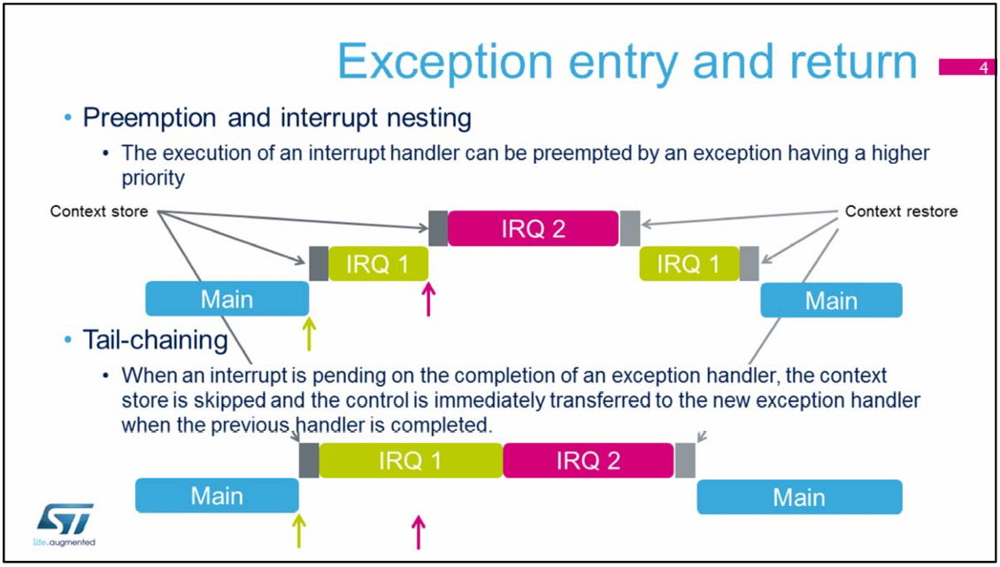
<br>
<figcaption>Fuente: Documento STM32F7 - NVIC</figcaption>
</div>

<div align="center">

<br>
<figcaption>Fuente: Documento STM32F7 - NVIC</figcaption>
</div>

<h3>EXTI</h3>

<div align="center">
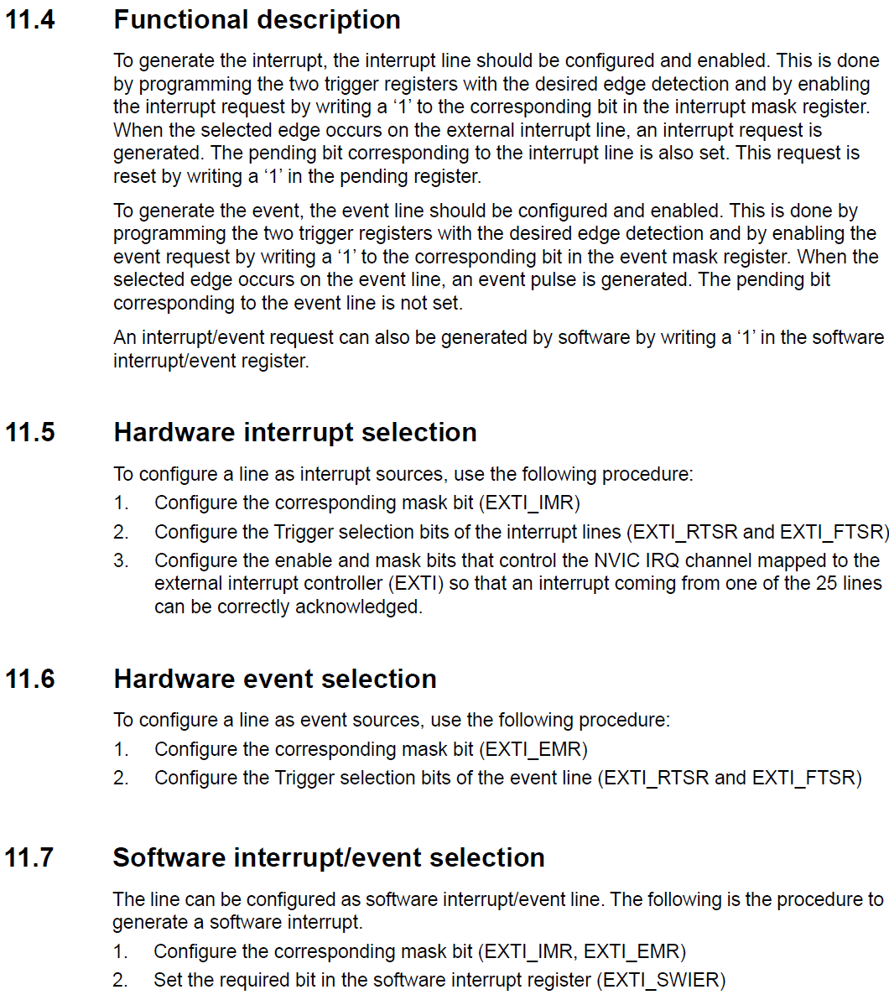
<br>
<figcaption>Fuente: Manual de referencia</figcaption>
</div>

<div align="center">
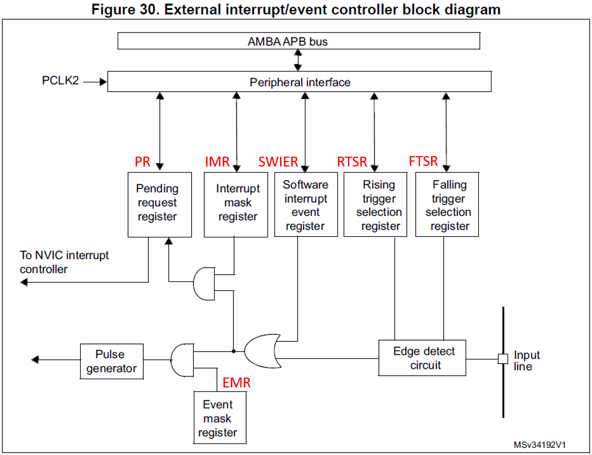
<br>
<figcaption>Fuente: Manual de referencia</figcaption>
</div>

<div align="center">
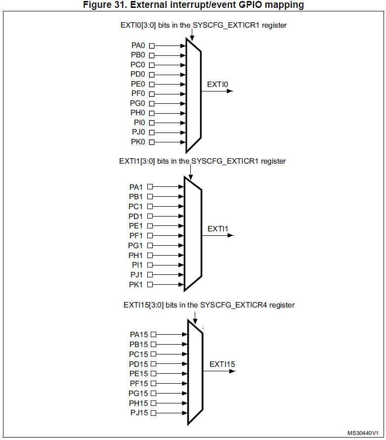
<br>
<figcaption>Fuente: Manual de referencia</figcaption>
</div>

<div align="center">
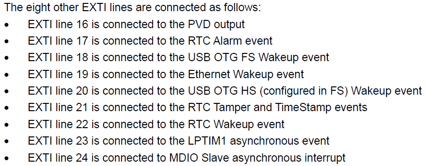
<br>
<figcaption>Fuente: Manual de referencia</figcaption>
</div>

<div align="center">
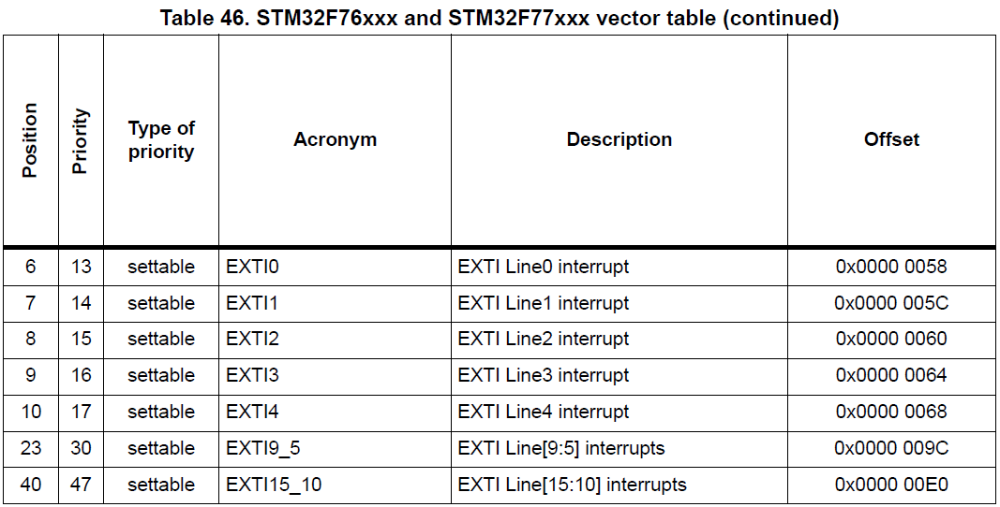
<br>
<figcaption>Fuente: Manual de referencia</figcaption>
</div>

<div align="center">
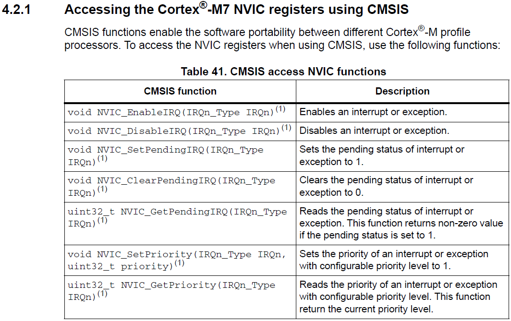
<br>
<figcaption>Fuente: Manual de programación</figcaption>
</div>

<h3>Ejemplo</h3>

```cpp
//Ejemplo Interrupciones con led de usuario de la tarjeta
//Fabián Barrera Prieto
//Universidad ECCI
//STM32F767ZIT6U
//operation 'or' (|) for set bit and operation 'and' (&) for clear bit

#include <stdio.h>
#include "stm32f7xx.h"

uint8_t cont = 0;
uint32_t a, b, c;

extern "C"{
	void EXTI15_10_IRQHandler(void){
		EXTI->PR |= (1<<13); //Down flag
		if(((GPIOC->IDR & (1<<13)) >> 13) == 1){//Read PC13 pin
			cont += 1;
		}
	}
}

int main(){
	//GPIOs
	RCC->AHB1ENR |= ((1<<1)|(1<<2)); 
	
	GPIOB->MODER &= ~(0b11<<0);
	GPIOB->MODER |= (1<<0); 
	GPIOB->MODER &= ~(0b11<<14);
	GPIOB->MODER |= (1<<14);
	GPIOC->MODER &= ~(0b11<<26);
	
	GPIOB->OTYPER &= ~(1<<0);  
	GPIOB->OTYPER &= ~(1<<7);
	GPIOB->OSPEEDR |= ((1<<1)|(1<<0));
	GPIOB->OSPEEDR |= ((1<<15)|(1<<14));
	GPIOC->OSPEEDR |= ((1<<27)|(1<<26));
	GPIOB->PUPDR &= ~(0b11<<0);
	GPIOB->PUPDR &= ~(0b11<<14);
	GPIOC->PUPDR &= ~(0b11<<26);
	GPIOC->PUPDR |= (1<<27);
	
	//Interrupt
	RCC->APB2ENR |= (1<<14); //Enable the SYSCFG clock (EXTI)
	SYSCFG->EXTICR[3] &= ~(0b1111<<4); //Clear bits [7:0] (Px13)
	SYSCFG->EXTICR[3] |= (1<<5); //Select the pin 13 on port C like interrupt [7:0]=0010 (PC13)
	EXTI->IMR |= (1<<13); //Enable the interrupt on pin 13
	EXTI->RTSR |= (1<<13); //Select rising edge for interrupt
	NVIC_EnableIRQ(EXTI15_10_IRQn); //Enable the interrupt function on the NVIC module
		
	while(1){
		for (int t=0;t<1000000;t++){
			GPIOB->ODR |= 1<<0;
		}
		for (int t=0;t<1000000;t++){
			GPIOB->ODR &= ~(1<<0);
		}
		if(cont == 5){
			cont = 0;
			a = (~(GPIOB->ODR&(1<<7)));
			b = (GPIOB->ODR|(1<<7));
			c = a&b;
			GPIOB->ODR = c;
		}
	}
}
```

<h3>Registro RCC_APB2ENR</h3>

<div align="center">
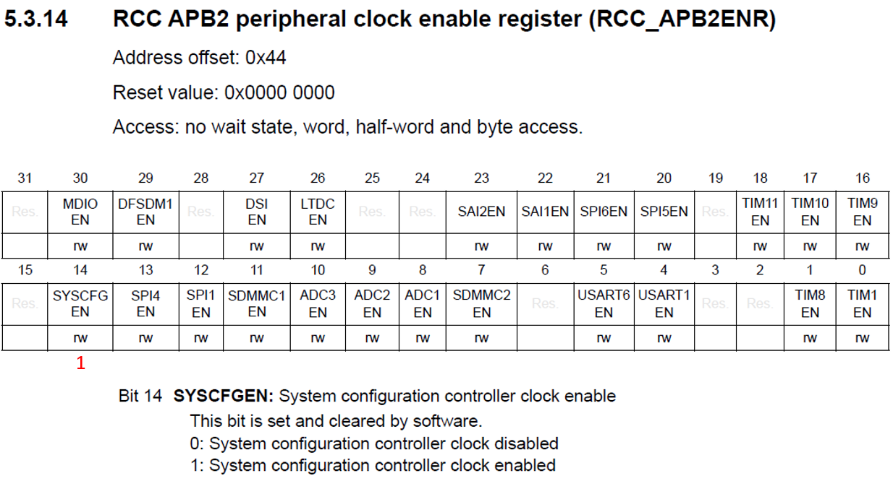
<br>
<figcaption>Fuente: Manual de referencia</figcaption>
<br>
</div>

<h3>Registro SYSCFG_EXTICR1</h3>

<div align="center">
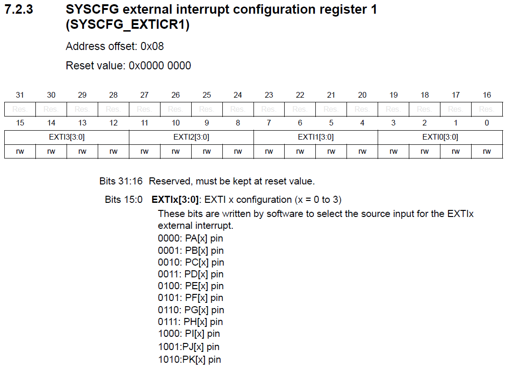
<br>
<figcaption>Fuente: Manual de referencia</figcaption>
<br>
</div>

<h3>Registro SYSCFG_EXTICR2</h3>

<div align="center">
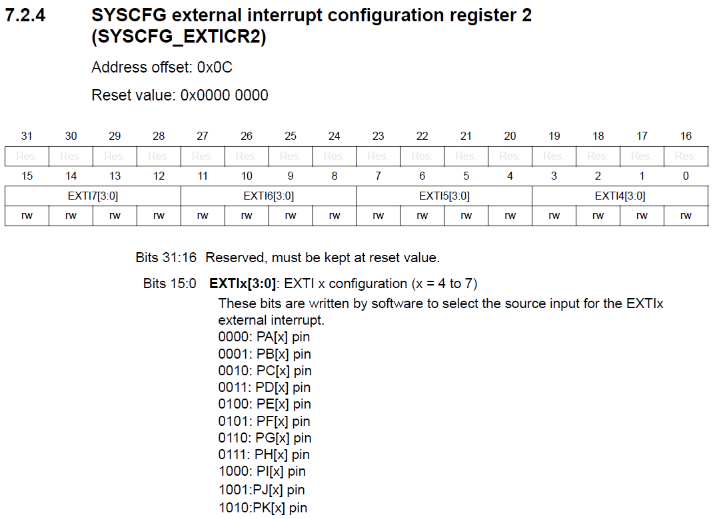
<br>
<figcaption>Fuente: Manual de referencia</figcaption>
<br>
</div>

<h3>Registro SYSCFG_EXTICR3</h3>

<div align="center">
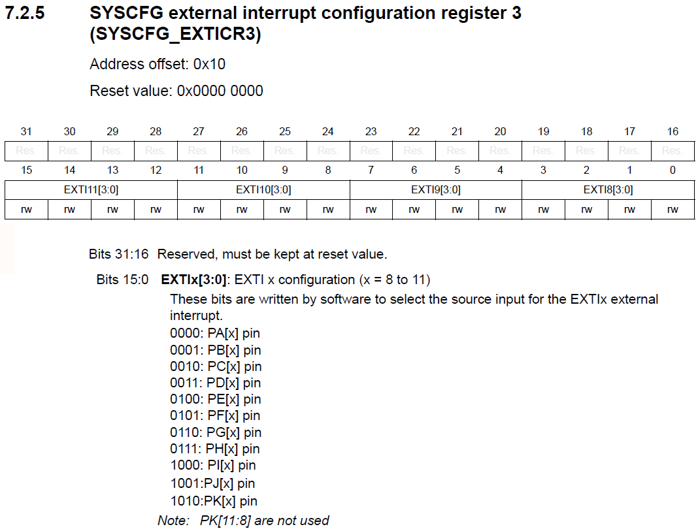
<br>
<figcaption>Fuente: Manual de referencia</figcaption>
<br>
</div>

<h3>Registro SYSCFG_EXTICR4</h3>

<div align="center">
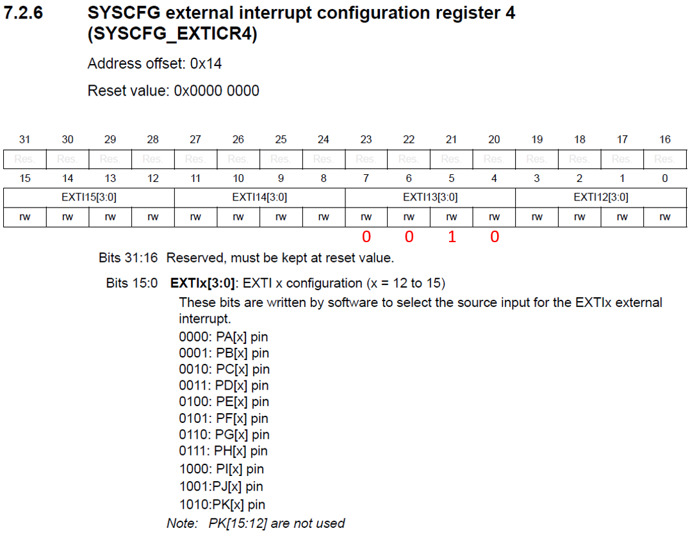
<br>
<figcaption>Fuente: Manual de referencia</figcaption>
<br>
</div>

<h3>Registro EXTI_IMR</h3>

<div align="center">
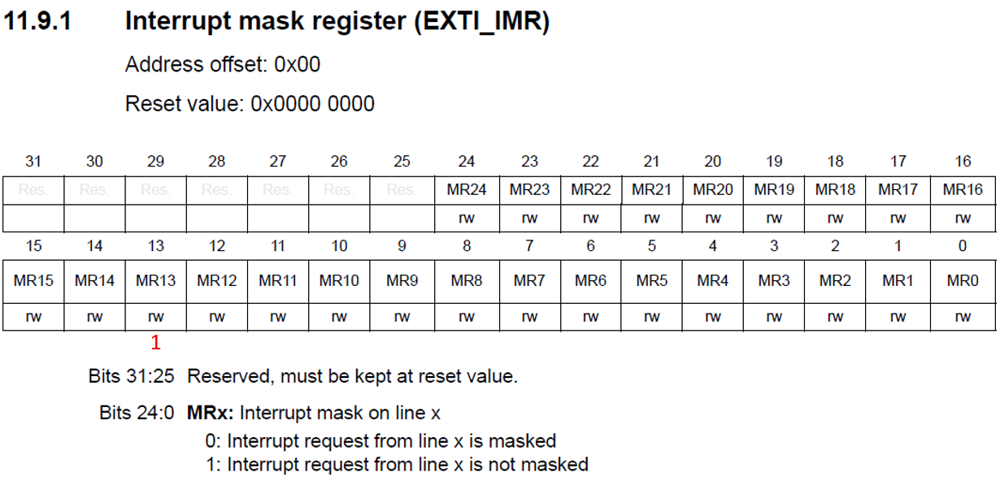
<br>
<figcaption>Fuente: Manual de referencia</figcaption>
<br>
</div>

<h3>Registro EXTI_EMR</h3>

<div align="center">
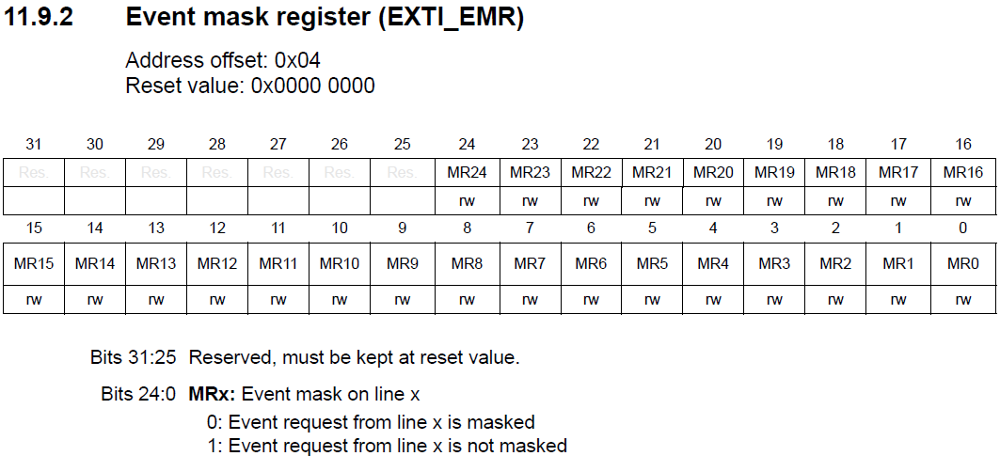
<br>
<figcaption>Fuente: Manual de referencia</figcaption>
<br>
</div>

<h3>Registro EXTI_RTSR</h3>

<div align="center">
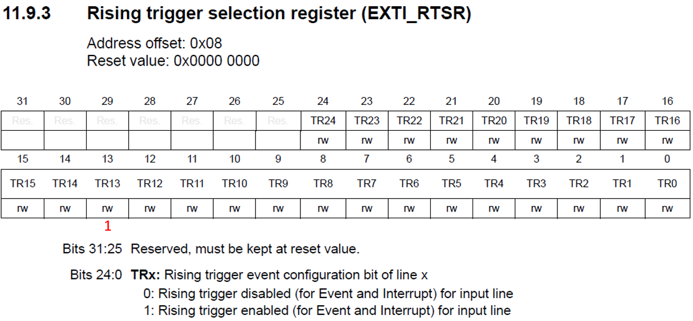
<br>
<figcaption>Fuente: Manual de referencia</figcaption>
<br>
</div>

<h3>Registro EXTI_FTSR</h3>

<div align="center">
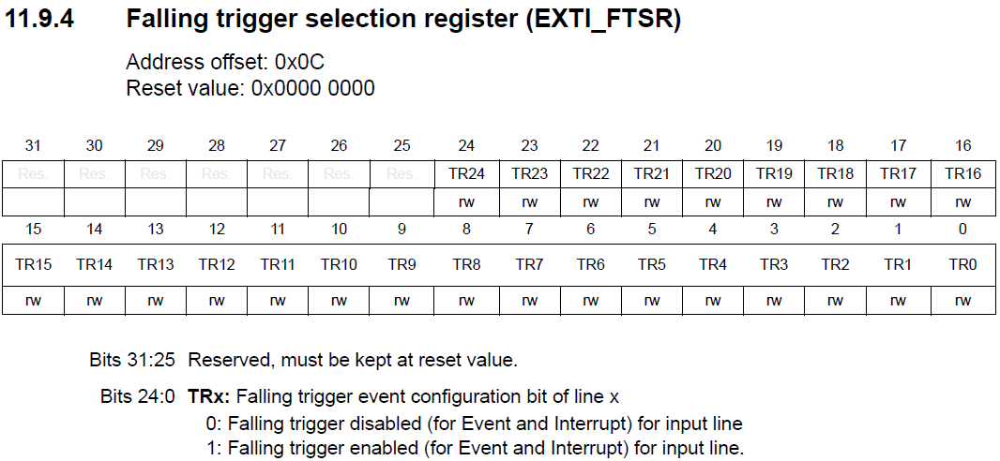
<br>
<figcaption>Fuente: Manual de referencia</figcaption>
<br>
</div>

<h3>Registro EXTI_SWIER</h3>

<div align="center">
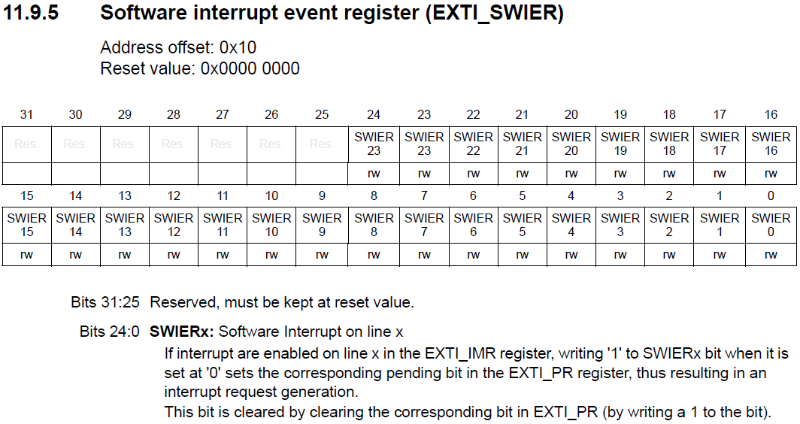
<br>
<figcaption>Fuente: Manual de referencia</figcaption>
<br>
</div>

<h3>Registro EXTI_PR</h3>

<div align="center">
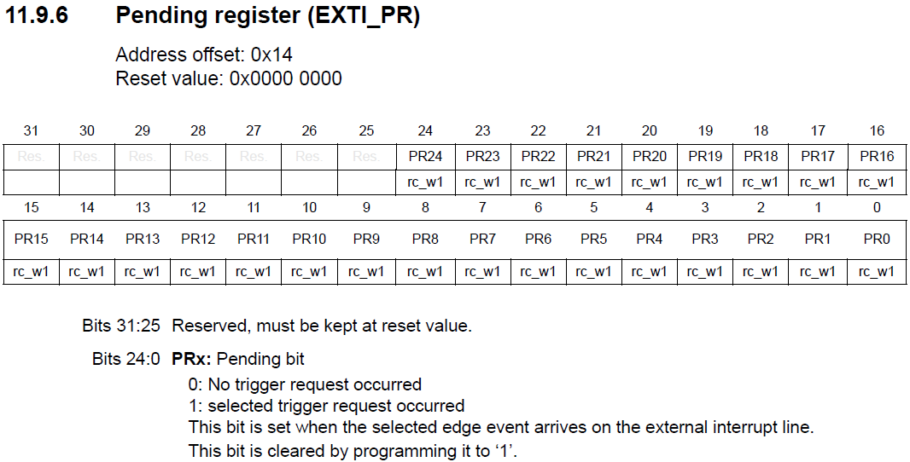
<br>
<figcaption>Fuente: Manual de referencia</figcaption>
<br>
</div>